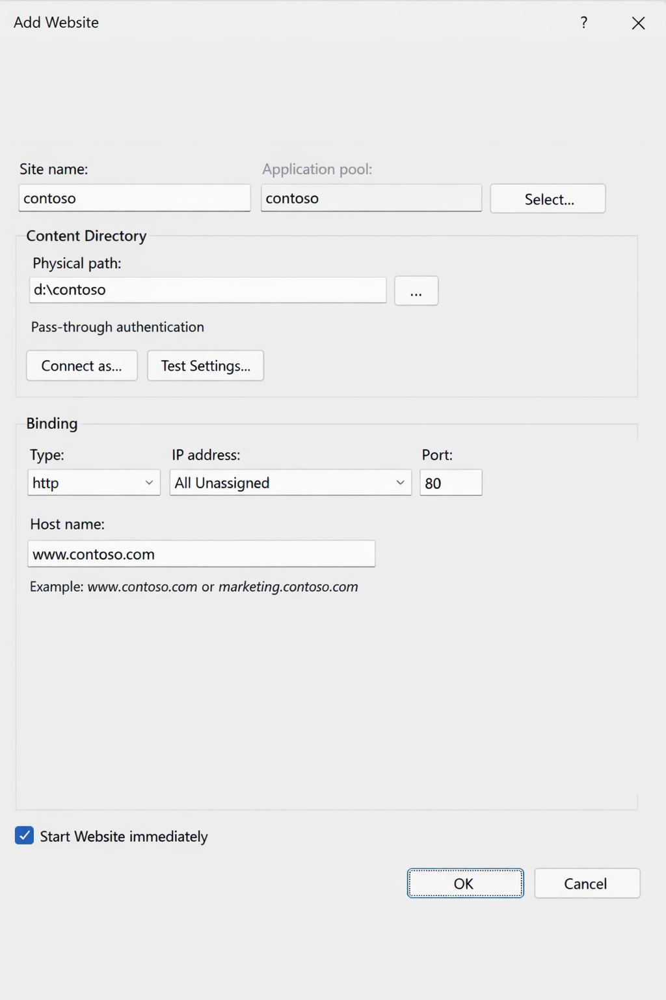
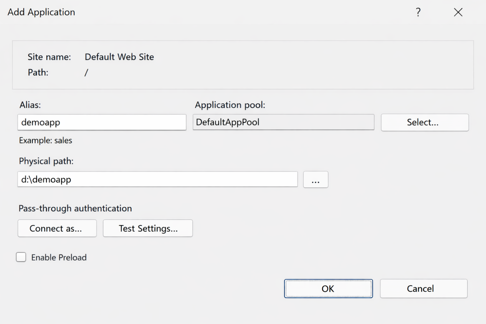

IIS organizes web content through a hierarchy of sites, applications, and virtual directories. In this unit, you learn to understand and create new websites, configure web applications within those sites, and set up virtual directories using both the IIS Manager graphical interface and PowerShell.

## The IIS content hierarchy

IIS structures web content in a three-tier hierarchy:

1. **Website (Site).** The top-level container. Each site has at least one binding (IP address, port, and optional host name) that identifies incoming requests. A site maps to a physical root directory on disk.
1. **Web Application.** A child container within a site. Applications have their own application pool assignment and can have separate configuration settings from the parent site. Use applications when you need isolated configuration, a different .NET runtime, or a dedicated worker process identity for a portion of a site.
1. **Virtual Directory.** A pointer from a URL path to a physical directory on disk (which may be on a different volume or UNC path). Virtual directories don't have their own application pool and inherit the parent application's settings.

> [!NOTE]
> This hierarchy is stored in the central IIS configuration file, ApplicationHost.config, located at %windir%\system32\inetsrv\config\.

The following table lists the differences between IIS Web Applications and IIS Virtual Directories.

| **Feature** | **Web application** | **Virtual directory** |
|---|---|---|
| **Has own application pool** | Yes | No (inherits parent app's pool) |
| **Isolated configuration** | Yes | No |
| **Separate .NET runtime** | Yes | No |
| **Physical path** | Local or UNC | Local or UNC |
| **Typical use** | Separate component with own identity/runtime | Alias for supplementary content directory |

## Creating a new website

To add a new site in IIS manager:

1. Open IIS Manager.
1. In the Connections pane on the left, expand the server node, then right-click Sites.
1. Select Add Website.
1. In the Add Website dialog, fill in the following fields:
   - Site name: Enter a descriptive name, for example Contoso.
   - Application pool: IIS creates a new pool with the same name as the site by default. Accept this or select Select to assign an existing pool.
   - Physical path: Enter `C:\inetpub\contoso` or browse to the directory.
   - Binding type: Select http.
   - IP address: Select All Unassigned unless restricting the site to a specific IP address.
   - Port: Enter 80 (or another port if 80 is already in use and you're hosting multiple sites on the same IP address but differentiating based on port).
   - Host name: Enter the FQDN for this site, for example www.contoso.com. Host names are required when multiple sites share port 80 or 443 on the same IP address. The sites are differentiated by IIS using the HTTP host header value in each incoming request.

   

1. Leave Start Website immediately checked unless you want to configure the site before it begins serving requests.
1. Select OK.

You can create a site with the `New-Website` cmdlet, which will be installed with the web server role management tools. For example, to create a site named Contoso with the path `D:\contoso` on port 80 that uses the fully qualified domain name www.contoso.com and has a new application pool named Contoso, run the command:

```powershell
New-Website -Name "Contoso" `
            -PhysicalPath "D:\contoso" `
            -Port 80 `
            -HostHeader "www.contoso.com" `
            -ApplicationPool "Contoso"
```

You can verify website creation with the `Get-Website` command. For example, to verify the contoso website was created, run the following command:

```powershell
Get-Website -Name "Contoso"
```

## NTFS permissions for web content

When creating a website, configure the directory that hosts the content directory and ensure appropriate NTFS permissions are set. Remember that NTFS permissions are often inherited. Best practice is to use a separate volume for website content rather than storing it on the system volume. Using a separate volume for the website allows you to separate the content from operating system files, it also makes it simpler to back up and restore. You might repartition free space on your existing volume to implement this configuration.

The worker process runs under the application pool identity. For example, a pool named Contoso runs as `IIS AppPool\Contoso`. Application pool identities are:

- Local only
- Noninteractive
- Automatically managed
- Not usable for logon

You should grant the application pool identity `Read and Execute` access to the content folder:

```powershell
$acl = Get-Acl "D:\contoso"
$permission = "IIS AppPool\Contoso", "ReadAndExecute",
              "ContainerInherit,ObjectInherit", "None", "Allow"
$accessRule = New-Object System.Security.AccessControl.FileSystemAccessRule $permission
$acl.SetAccessRule($accessRule)
Set-Acl "D:\contoso" $acl
```

Granting permissions directly to that identity ensures:

- Only that specific app can access the files
- Other application pools on the same server can't read or execute the content
- You avoid using broad identities like Everyone, Users, or IIS_IUSRS

Granting `Read and Execute` adheres to the principle of least privilege as IIS only needs read access to serve static content and load assemblies, and execute is require for binaries such as ASP.NET and native modules. You shouldn't assign the Write privilege as this will limit attacks such as:

- Web shell uploads
- Defacement attacks
- Runtime modification of binaries or config files

## Creating web applications

To add a Web Application within a Site

1. In the Connections pane, expand Sites, then select on the Contoso site.
1. Right-click the site and select Add Application.
1. In the Add Application dialog, configure:
   - Alias: The URL path segment, for example demoapp (accessible at www.contoso.com/demoapp).
   - Application pool: Select or create a dedicated pool.
   - Physical path: Enter the path to the application's files, for example d:\demoapp.
1. Select OK.



You can accomplish this with the following PowerShell command:

```powershell
New-WebApplication -Name "api" `
                   -Site "Contoso" `
                   -PhysicalPath "C:\inetpub\contoso-api" `
                   -ApplicationPool "Contoso-API"
```

## Adding a virtual directory within a site

To add a virtual directory within a site using IIS Manager, perform the following steps:

1. In the Connections pane, right-click the Contoso site (or an application within it) and select Add Virtual Directory.
1. In the Add Virtual Directory dialog, configure:
   - Alias: The URL segment, for example downloads.
   - Physical path: Enter the directory path, for example D:\shared\downloads.
1. Select OK.

To add a virtual directory using PowerShell, perform the following steps:

```powershell
New-WebVirtualDirectory -Site "Contoso" `
                        -Name "downloads" `
                        -PhysicalPath "D:\shared\downloads"
```
