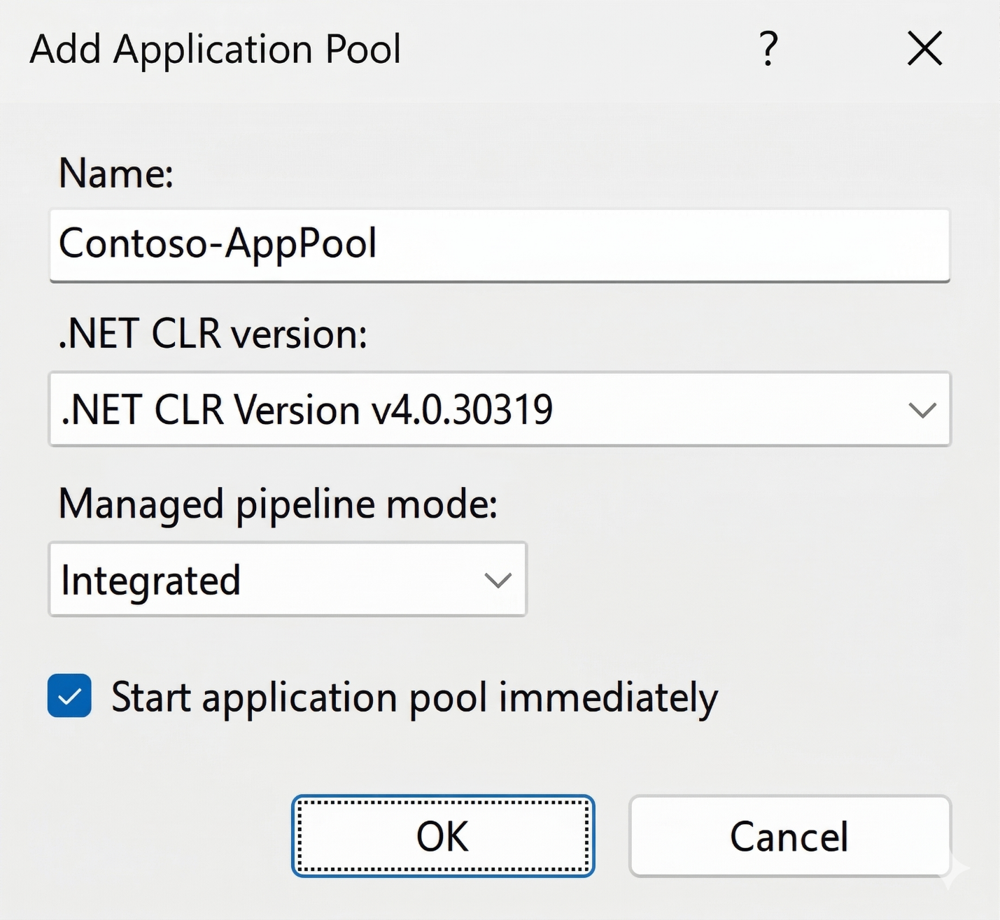
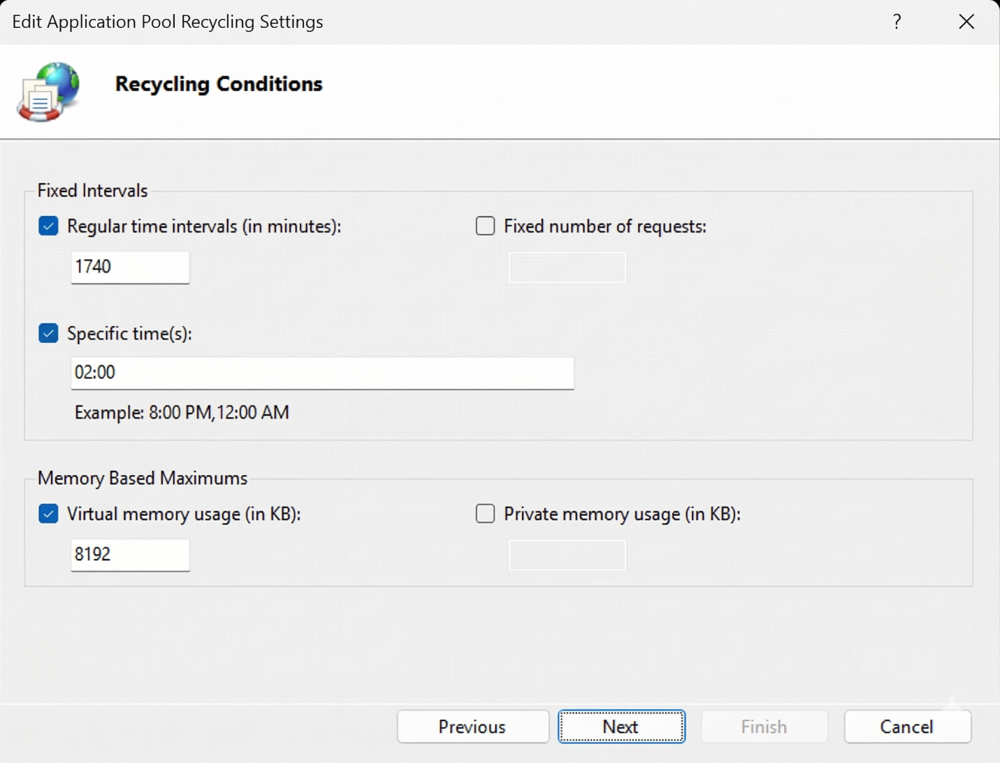

Application pools are one of the most important isolation and stability mechanisms in IIS. Each application pool runs one or more worker processes (w3wp.exe) that serve requests for the applications assigned to that pool. When one pool fails or is recycled, other pools continue unaffected. 

When IIS receives a request, it routes it to the worker process belonging to the application pool assigned to the target application. Because each pool runs in its own process space:

- A crash or memory leak in one pool doesn't affect other pools.
- Each pool can run under a different Windows identity, enabling least-privilege service accounts.
- Each pool can target a different .NET CLR version or pipeline mode.

> [!TIP]
> Assign a dedicated application pool to each website or application in production. Never share application pools between sites with different security or stability requirements.

## Creating an application pool

To create an application pool using IIS Manager, perform the following steps:

1. In the Connections pane, select Application Pools.
1. In the Actions pane on the right, select Add Application Pool.
1. In the Add Application Pool dialog, configure:
   - Name: Enter a descriptive name, for example Contoso-AppPool.
   - .NET CLR version: Select v4.0 for .NET Framework apps, or No Managed Code for non-.NET apps.
   - Managed pipeline mode: Select Integrated.
1. Select OK.



To edit an existing pool, double-click it or select it and select Basic Settings in the Actions pane.

You can create a new application pool using the `New-WebAppPool` PowerShell cmdlet. For example, to create a new application pool named Contoso-AppPool, run the following command:

```powershell
# Create a new application pool
New-WebAppPool -Name "Contoso-AppPool"
# Set .NET CLR version (use "" for No Managed Code)
Set-ItemProperty "IIS:\AppPools\Contoso-AppPool" managedRuntimeVersion "v4.0"
# Set pipeline mode (0 = Integrated, 1 = Classic)
Set-ItemProperty "IIS:\AppPools\Contoso-AppPool" managedPipelineMode 0
```

## Configuring application pool recycling

Recycling replaces the worker process at defined intervals or thresholds, helping to recover memory and resources that may accumulate over time. IIS starts a new worker process before shutting down the old one (overlapping recycling), so recycling is typically transparent to users.

To configure application pool recycling in IIS Manager, perform the following steps:

1. Select the application pool in the Application Pools list.
1. In the Actions pane, select Recycling.
1. In the Edit Application Pool Recycling Settings wizard, configure:
   - Regular time intervals: Set the interval in minutes. The default is 1,740 minutes (29 hours). Consider aligning this with off-peak hours, or disable time-based recycling and rely on memory-based recycling instead.
   - Specific times: Recycle at a fixed time each day (for example, 02:00) to ensure recycling occurs during low-traffic periods.
   - Memory-based recycling: Set virtual memory and private memory limits (in KB) to trigger recycling if the worker process exceeds those thresholds.
1. Select Next to configure recycling event log settings, then select Finish.



You use the `Set-ItemProperty` cmdlet to configure application pool recycling using PowerShell. For example, to configure a regular interval, run the following command:

```powershell
$poolName = "Contoso-AppPool"
# Set regular time interval recycling (TimeSpan; 00:00:00 = disabled)
Set-ItemProperty "IIS:\AppPools\$poolName" `
    recycling.periodicRestart.time "29:00:00"
# Add a specific-time recycle trigger (e.g., 2:00 AM daily)
$recycleTime = New-Object System.TimeSpan 2,0,0
Add-WebConfiguration -Filter "system.applicationHost/applicationPools/add[@name='$poolName']/recycling/periodicRestart/schedule" -Value @{value = $recycleTime}
# Set private memory limit in KB (0 = unlimited)
Set-ItemProperty "IIS:\AppPools\$poolName" `
    recycling.periodicRestart.privateMemory 512000
```

## Configuring the idle timeout

The idle timeout setting stops the worker process after it has been idle (no requests) for the specified period. This frees server resources but means the first request after the timeout incurs a cold-start delay.

```powershell
# Set idle timeout to 20 minutes (the default value)
Set-ItemProperty "IIS:\AppPools\Contoso-AppPool" `
    processModel.idleTimeout "00:20:00"
# Disable idle timeout for always-on applications
Set-ItemProperty "IIS:\AppPools\Contoso-AppPool" `
    processModel.idleTimeout "00:00:00"
```

> [!NOTE]
> In IIS Manager, find the idle timeout in the application pool's Advanced Settings (select the pool, select Advanced Settings in the Actions pane), under the Process Model section.

## Application initialization and always-on start mode

In production environments where minimizing cold-start latency is critical, it's recommended to configure IIS to proactively start application pools and preload applications. This ensures that the worker process is initialized and ready to serve requests immediately after a server restart or application pool recycle, rather than waiting for the first incoming request.

To achieve this, configure the following:

- **Application Pool Start Mode:** Set the application pool's `startMode` to `AlwaysRunning`. This instructs IIS to start the worker process as soon as the application pool is created or the server starts.
- **Application Initialization Module:** Enable the Application Initialization feature in Windows Server (if not already installed) and configure the application to preload content.

You can install the application initialization feature by running the following PowerShell command:

```powershell
Install-WindowsFeature Web-AppIn
```

You can configure application pool start mode with the `Set-ItemProperty` cmdlet. For example, to configure the start mode of the `Contoso-AppPool` application pool, run the following command:

```powershell
Set-ItemProperty "IIS:\AppPools\Contoso-AppPool" -Name startMode -Value "AlwaysRunning"
```

## Application pool identity

The identity under which a worker process runs determines what Windows resources (files, network shares, databases) it can access. IIS supports four built-in identity types plus custom service accounts:

| **Identity Type** | **Description** | **Recommended Use** |
|---|---|---|
| **ApplicationPoolIdentity** | Autogenerated virtual account per pool (IIS AppPool\PoolName). Least privilege. | Default for most sites |
| **NetworkService** | Built-in account with network access. | Legacy scenarios only |
| **LocalSystem** | Full local administrator. Highest privilege. | Never recommended |
| **LocalService** | Limited local account, no network access. | Rarely needed |
| **Custom account** | Domain or local service account. | Required for network resource access (file shares, SQL Server) |

To configure a custom identity in IIS Manager, perform the following steps:

1. Select the application pool, then select Advanced Settings in the Actions pane.
1. Under Process Model, select the Identity field, then select the ellipsis (...) button.
1. In the Application Pool Identity dialog, select Custom account and select Set.
1. Enter the domain account credentials (for example, `CONTOSO\svc-webapp`), then select OK.

You use the `Set-ItemProperty` cmdlet to configure a Custom Identity with PowerShell. For example, to set the identity to `CONTOSO\svc-webapp`, run the following command:

```powershell
$poolName = "Contoso-AppPool"
$username  = "CONTOSO\svc-webapp"
$password  = Read-Host -Prompt "Enter service account password" -AsSecureString
$plain     = [Runtime.InteropServices.Marshal]::PtrToStringAuto(
    [Runtime.InteropServices.Marshal]::SecureStringToBSTR($password))
Set-ItemProperty "IIS:\AppPools\$poolName" processModel.userName     $username
Set-ItemProperty "IIS:\AppPools\$poolName" processModel.password     $plain
Set-ItemProperty "IIS:\AppPools\$poolName" processModel.identityType 3
```

> [!NOTE]
> When using custom service accounts, follow the principle of least privilege. Grant the account only the NTFS permissions required (typically read and execute on the web content directory) and avoid making the account a member of local Administrators. Consider using managed service accounts, which don't require as much administrative effort.

## Managing application pool state

You can use the WebAppPool PowerShell cmdlets to manage application pool states.

```powershell
Stop-WebAppPool    -Name "Contoso-AppPool"   # Stop
Start-WebAppPool   -Name "Contoso-AppPool"   # Start
Restart-WebAppPool -Name "Contoso-AppPool"   # Recycle worker process
Get-WebAppPoolState -Name "Contoso-AppPool"  # Check current state
```

> [!NOTE]
> In IIS Manager, select the pool and use the Start, Stop, or Recycle links in the Actions pane.

## Application pool .NET CLR version and pipeline mode

When configuring an application pool, you need to set the .NET CLR version and pipeline mode. The .NET CLR version setting controls whether and which version of the .NET runtime is loaded in the worker process. Your options are:

- No Managed Code. The pool doesn't load the .NET runtime. Use this for static sites or applications built on non-.NET frameworks.
- v4.0: Loads the .NET Framework 4.x runtime. Required for ASP.NET Web Forms, ASP.NET MVC, and Web API applications targeting .NET Framework.

> [!NOTE]
> ASP.NET Core applications don't use the IIS-managed .NET CLR. For out-of-process hosting, set the pool to No Managed Code. The ASP.NET Core Module forwards requests to the application's own Kestrel process.

The pipeline mode determines how IIS processes incoming HTTP requests. Specifically it determines how ASP.NET code integrates with the IIS request-handling pipeline. The options are:

- Integrated (recommended): The ASP.NET request pipeline is fully integrated with the IIS pipeline, enabling features like authentication and output caching to apply to all content types.
- Classic: Legacy mode for older ASP.NET applications incompatible with Integrated mode. Avoid unless required for application compatibility.

## Supporting 32-bit applications in application pools

By default, IIS application pools on 64-bit versions of Windows Server run in 64-bit mode. However, some legacy web applications may depend on 32-bit components or libraries that are incompatible with 64-bit execution. In such cases, you can enable 32-bit support for the application pool.

To enable 32-bit applications in IIS Manager:

1. Open IIS Manager and select **Application Pools** in the Connections pane.
2. Select the target application pool and select **Advanced Settings** in the Actions pane.
3. Set **Enable 32-Bit Applications** to **True**.
4. Select **OK** to apply the change.

To enable 32-bit support using PowerShell, use the `Set-ItemProperty` cmdlet. For example, to set 32-bit support on `Contoso-AppPool`, run the following command:

```powershell
Set-ItemProperty "IIS:\AppPools\Contoso-AppPool" -Name enable32BitAppOnWin64 -Value $true
```
