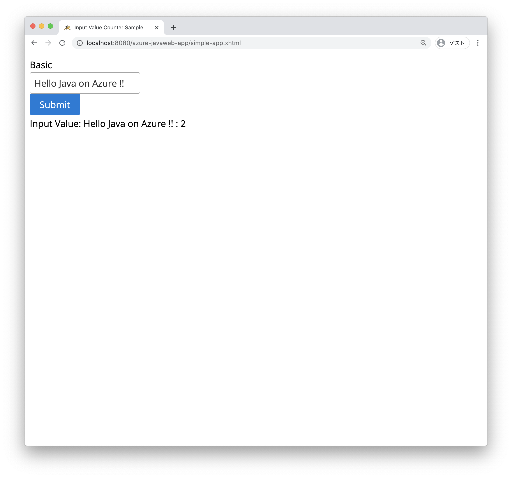

JSF のアプリケーションは、大きく分けて下記の２つの機能から構成されています。

- **Facelets** : Facelets は画面レイアウトを記述する XHTML ベースのテンプレートエンジン
- **BakingBean** : Facelets とバインドし、値の設定や処理を行う Java クラス

`Facelets` は画面レイアウトを記述する XHTML ベースのテンプレートエンジンで、XHTML で記述します。XHTML は W3C に定義されている、Document Type Definition (DTD) に準拠し、xhtml の拡張子を持つファイルで記載します。
Jakarta EE 8 ベースのアプリケーションでは、JSF 2.3 ベースが利用可能です。

`BackingBean` は Facelets  とバインドし、値の設定や処理を行う Java クラスです。サーバ側で処理を実装するためには、Facelets と対応するバッキング・ビーンを実装する必要があります。

## JSF Page Creation with PrimeFaces

JSF は独自に拡張した Web コンポーネントを作成する事ができます。
今回は、3rd Party が提供する JSF のコンポーネントとして PrimeFaces を利用し、より簡単にリッチな Web アプリケーションを作成します。  
PrimeFaces を利用するためには HTML に下記のように専用の XML ネーム・スペース (`xmlns:p`) を記述します。これにより PrimeFaces の様々な UI コンポーネントを利用できるようになります。  

下記の例では、ラベル、入力フィールド、ボタンを表示するためにそれぞれ　`p:outputLabel`, `p:inputText`, `p:commandButton` タグを利用しています。

```xml
<?xml version='1.0' encoding='UTF-8' ?>
<!DOCTYPE html PUBLIC "-//W3C//DTD XHTML 1.0 Transitional//EN" "http://www.w3.org/TR/xhtml1/DTD/xhtml1-transitional.dtd">
<html xmlns="http://www.w3.org/1999/xhtml"
      xmlns:h="http://xmlns.jcp.org/jsf/html" 
      xmlns:p="http://primefaces.org/ui" >
    <h:head>
        <title>Input Value Counter Sample</title>
    </h:head>
    <h:body>
        <h:form>
            <p:outputLabel value="Basic"/><br/>
            <p:inputText value="#{indexcontroller.inputValue}"/><br/>
            <p:commandButton value="Submit" action="#{indexcontroller.submitButtonAction()}"/><br/>
        </h:form>
    </h:body>
</html>
```

上記の XHTML を記述する事で下記の画面が表示されます。


### PrimeFaces Ajax 対応

JSF はデフォルトで Ajax のアプリケーション作成に対応しています。そこで画面のリフレッシュ無しで、画面の一部を動的に更新する事が可能になっています。  
PrimeFaces では JSF で提供する Ajax 対応をより簡単に実装できるように `update` 属性を利用します。どのコンポーネントに対して更新を行うか、対象の ID で指定します。下記の例では `p:commandButton` に `update="ajaxUpdateText"` 属性を追加しているため、ボタンが押された際に `<div id="ajaxUpdateText">` の部分が更新されます。ここで指定する `id` は任意の HTML コンポーネントに対して指定できます。

```xml
<div id="ajaxUpdateText">
...
</div>

<p:commandButton update="ajaxUpdateText" 
   value="Submit" action="#{indexcontroller.submitButtonAction()}"/>
```

## JSF Backing Bean

バッキング・ビーンは JSF の View に紐づくバックエンドの処理を実装する Java クラスです。  
ここでは、上記の XHTML に対応するバッキング・ビーン (IndexCtontroller) を作成します。バッキング・ビーンの実装クラスに `@Named` のアノテーションを付加することで、JSF の Facelets (XHTML) から参照できるようになります。

Facelets で`<p:inputText value="#{indexcontroller.inputValue}"/>`を記述すると Input Text フィールドを画面に表示します。入力された値はバッキング・ビーンの `IndexController` クラスに定義された `inputValue ` にバインドします。

また `<p:commandButton value="Submit" action="#{indexController.submitButtonAction()}"/>` を記述すると、HTMLのボタンを表示します。ボタンが押された時に、`IndexController` クラスに定義された `submitButtonAction()` メソッドを呼び出します。

```java
import java.io.Serializable;

import javax.faces.view.ViewScoped;
import javax.inject.Named;
import lombok.Getter;
import lombok.Setter;

@Named("indexcontroller")
@ViewScoped
public class IndexController implements Serializable{

	private static final long serialVersionUID = 8485377386286855408L;

	@Setter @Getter 
    private String inputValue;
    
    private int counter;
    
    public void submitButtonAction(){
        inputValue = inputValue + " : " + counter;
        counter++;
    }
}
```

このように、JSF では画面を構成する View (Facelets) と Controller (Backing Bean) を切り離して実装する事ができるようになっています。


## JSF に関する情報

JSF は上記のほかにも、データのバリデーションやコンバージョン、複数のコンポーネントを組み合わせたり、テンプレート機能、Ajax や WebSocket に対応するなど豊富な便利な機能を持っています。  
より詳しい情報を入手したい場合、`http://www.javaserverfaces.org/` をご覧ください。
