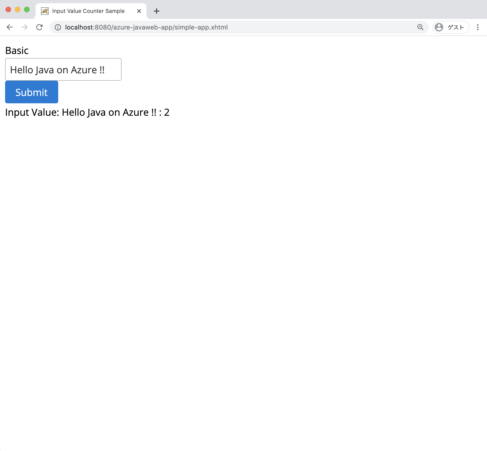

Java は誕生依頼様々な環境で動作してきました。特に、サーバ・サイドで Java は幅広く多くの場所で使われてきました。これに併せて、Java Web アプリケーションのフレーム・ワークも様々提供されてきました。たとえば JavaServer Pages(JSP)、Java Servlet, Struts, [JavaServer Faces(JSF)](http://www.javaserverfaces.org/), Spring MVC のような Web フレームワークが今まで数多く提供されてきました。

また実行環境として、Apache Tomcat は、1998年11月にプロジェクトを開始し、 Servlet, JSP の参照実装かつ OSS として提供され、多くの利用者から使われてきました。

このモジュールは、簡単な Java Web アプリケーションとして、Todo アプリケーションを作成し、[Azure App Service](https://docs.microsoft.com/azure/app-service/) 上で動かします。

Todo アプリケーションは、MVC フレームワークとして JSF を利用し、内部的にはリッチな画面を作成するため、[PrimeFaces](https://www.primefaces.org/) を利用します。  
JSF はコンポーネント・ベースのフレームワークで、ユーザ・インタエース(UI)のコンポーネントを xhtml に記載し、ユーザ・インタフェース側で発行されたイベント（ボタンを押すなど）を、バッキング・Bean と呼ぶ実装クラスで実装し処理を行います。  
PrimeFaces は JSF の拡張 UI コンポーネントを提供し、これを利用する事で簡単に Single Page Application (SPA) など Ajax に対応したリッチな画面を作成する事ができます。

## Learning objectives(学習の目的)

By the end of this module, you’ll be able to:

- Java(JSF) Web Application の作成
- JSF アプリケーションを Tomcat で稼働
- Azure App Services の Tomcat でアプリケーションを稼働

## Prerequisites

- [Azure CLI](https://docs.microsoft.com/cli/azure/install-azure-cli?view=azure-cli-latest&WT.mc_id=java-9121-yoterada) installed on your computer
- [JDK 11](https://docs.microsoft.com/azure/developer/java/fundamentals/java-jdk-long-term-support) and [Tomcat 9.0.x](https://tomcat.apache.org/download-90.cgi) installed on your computer
- Familiarity with editing text and code files in any text editor
- Basic familiarity with the HTTP protocol

## Java ServerFaces アプリケーション作成の概要

JSF のアプリケーションは、大きく分けて下記の２つの機能から構成されています。

- **Facelets** : Facelets は画面レイアウトを記述する XHTML ベースのテンプレートエンジン
- **BakingBean** : Facelets とバインドし、値の設定や処理を行う Java クラス

`Facelets` は画面レイアウトを記述する XHTML ベースのテンプレートエンジンで、XHTML で記述します。XHTML は [W3C](http://www.w3.org/TR/xhtml1/#a_dtd_XHTML-1.0-Transitional) に定義されている、Document Type Definition (DTD) に準拠し、xhtml の拡張子を持つファイルで記載します。
Jakarta EE 8 ベースのアプリケーションでは、[JSF 2.3](https://jakarta.ee/specifications/faces/2.3/) ベースが利用可能です。

`BackingBean` は Facelets  とバインドし、値の設定や処理を行う Java クラスです。サーバ側で処理を実装するためには、Facelets と対応するバッキング・ビーンを実装する必要があります。

## PrimeFaces : JSF Rich UI Component Libraries

JSF は独自に拡張したリッチな Web コンポーネントを作成する事ができます。有名な 3rd Party の JSF のコンポーネント・ライブラリとして下記が存在します。

- [PrimeFaces](https://www.primefaces.org/documentation/)
- [OmniFaces](https://omnifaces.org/)
- [IceFaces](http://www.icesoft.org/java/projects/ICEfaces/overview.jsf)

今回は、これらの中から PrimeFaces を利用してリッチな JSF の Web ページを作成します。  
PrimeFaces を利用するためには `xmlns:p="http://primefaces.org/ui` の XML ネーム・スペースを HTML タグ内に記入します。これにより [PrimeFaces の showcase](https://www.primefaces.org/showcase/) に記載されているコンポーネントを利用できるようになります。  
下記の例では、基本的な入力フィールドを表示するためのタグ `p:inputText` タグを利用しています。

```xml
<?xml version='1.0' encoding='UTF-8' ?>
<!DOCTYPE html PUBLIC "-//W3C//DTD XHTML 1.0 Transitional//EN" "http://www.w3.org/TR/xhtml1/DTD/xhtml1-transitional.dtd">
<html xmlns="http://www.w3.org/1999/xhtml"
      xmlns:h="http://xmlns.jcp.org/jsf/html" 
      xmlns:p="http://primefaces.org/ui" >
    <h:head>
        <title>Input Value Counter Sample</title>
    </h:head>
    <h:body>
        <h:form>
            <p:outputLabel value="Basic"/><br/>
            <p:inputText value="#{indexcontroller.inputValue}"/><br/>
            <p:commandButton value="Submit" action="#{indexcontroller.submitButtonAction()}"/><br/>
        </h:form>
    </h:body>
</html>
```

上記の XHTML を記述する事で下記の画面が表示されます。


### PrimeFaces Ajax 対応

JSF はデフォルトで Ajax のアプリケーション作成に対応しています。そこで画面のリフレッシュ無しで、画面の一部を動的に更新する事が可能になっています。  
PrimeFaces では JSF で提供する Ajax 対応をより簡単に実装できるように `update` 属性を利用します。どのコンポーネントに対して更新を行うか、対象の ID で指定します。下記の例では `p:commandButton` に `update="ajaxUpdateText"` 属性を追加しているため、ボタンが押された際に `<div id="ajaxUpdateText">` の部分を更新するよう指定しています。指定する `id` は任意の HTML コンポーネントに対して設定できます。

```xml
<div id="ajaxUpdateText">
...
</div>

<p:commandButton update="ajaxUpdateText" 
   value="Submit" action="#{indexcontroller.submitButtonAction()}"/>
```

## JSF Backing Bean

バッキング・ビーンは JSF の View に紐づくバックエンドの処理を実装する Java クラスです。  
ここでは、上記の XHTML に対応するバッキング・ビーン (IndexCtontroller) を作成します。バッキング・ビーンの実装クラスに `@Named` のアノテーションを付加することで、JSF の Facelets (XHTML) から参照できるようになります。

上記、Facelets で`<p:inputText value="#{indexcontroller.inputValue}"/>`を定義しました。これは HTML の Input Text フィールドを表示します。入力された値は、下記の `IndexController` クラスに定義された `inputValue ` の値にバインドします。

また、`<h:commandButton value="Submit" action="#{indexController.submitButtonAction()}"/>` の定義は、HTMLのボタンを表示し、ボタンが押された時に、`IndexController` クラスに定義された `submitButtonAction()` メソッドを呼び出します。

**Note**  
`#{indexcontroller.inputValue}` の表現を [Expression Language (EL 式)](https://jakarta.ee/specifications/expression-language/3.0/) と呼びます。

```java
import java.io.Serializable;

import javax.faces.view.ViewScoped;
import javax.inject.Named;
import lombok.Getter;
import lombok.Setter;

@Named("indexcontroller")
@ViewScoped
public class IndexController implements Serializable{

	private static final long serialVersionUID = 8485377386286855408L;

	@Setter @Getter 
    private String inputValue;
    
    private int counter;
    
    public void submitButtonAction(){
        inputValue = inputValue + " : " + counter;
        counter++;
    }
}
```

アプリケーションの用途に応じて Scope の範囲を変更したい場合は `@ViewScoped` の代わりに、下記のアノテーションを指定することで変更できます。

* ***@Application*** (javax.enterprise.context.ApplicationScoped): Application scope persists across all users' interactions with a web application.
* ***@Session*** (javax.enterprise.context.SessionScoped): Session scope persists across multiple HTTP requests in a web application.
* ***@Flow*** (javax.faces.flows.FlowScoped): Flow scope persists during a user’s interaction with a specific flow of a web application. See Using Faces Flows for more information.
* ***@Request*** (javax.enterprise.context.RequestScoped): Request scope persists during a single HTTP request in a web application.
* ***@Dependent*** (javax.enterprise.context.Dependent): Indicates that the bean depends on some other bean.

## JSF に関する情報

上記のほか、JSF はデータのバリデーションやコンバージョン、複数のコンポーネントを組み合わせたり、テンプレート機能、Ajax や WebSocket に対応するなど豊富な便利な機能を持っています。  
より詳しい情報を入手したい場合、[http://www.javaserverfaces.org/](http://www.javaserverfaces.org/) をご覧ください。
