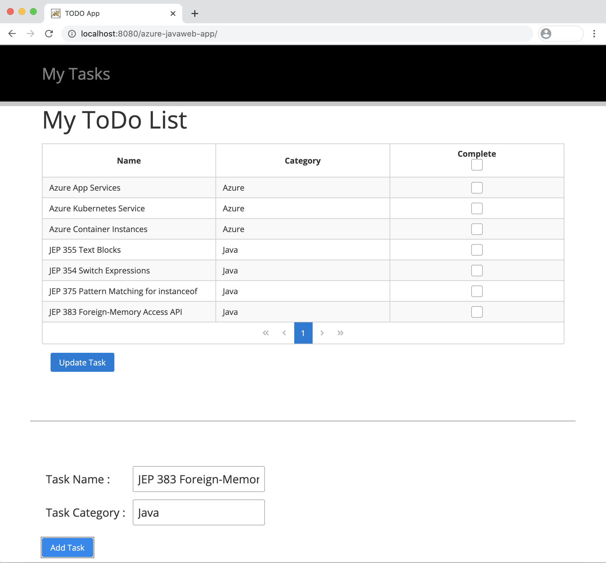

You've been tasked with creating a simple Aapplication using the JavaServer Facess framework. The TODO application can add the new tasks and you can see the lists of all tasks and finaly you can mark the task as finished.
As part of that evaluation, you will build a web application and deploy it to Linux on Azure App Services Tomcat. 




## Create Todo web app with PrimeFaces

下記の手順に従って JavaServer Faces の Web アプリケーションを構築し動作させます。

1.  JSF Web Page の作成
1.  Create DataModel Class
1. Create DAO Class
1. Create Controller Class
1. ローカルの Tomcat 環境で実行

### 1. JSF Web Page の作成

TODO: Write Explanation (Basically COPY & PASTE)
Todo アプリケーションの View を作成するために、index.xhtml ファイルに下記のコードをコピー＆ペーストで貼り付けてください。  

この View では前節で説明した `p:layout`, `p:layoutUnit`, `p:outputLabel`, `p:inputText`, `p:commandButton`, `p:dataTable` のコンポーネントを利用しています。  

本ページは Ajax に対応し、`Add Task` のボタンが押すと、`p:commandButton` の `update="itemTables"` の参照先である、DataTable の `p:dataTable id="itemTables"` を更新します。

また、DataTable に、新たに `selection="#{todocontroller.selectedItems}"` という属性を追加しています。これは表の項目をチェックボックスで選択できるようにしており、チェックボックスを選択し `Updata Task` のボタンを押すと、タスクの完了ができるようになっています。

   ```xml
<!DOCTYPE html>
<html xmlns="http://www.w3.org/1999/xhtml" xmlns:f="http://xmlns.jcp.org/jsf/core"
      xmlns:h="http://xmlns.jcp.org/jsf/html" xmlns:ui="http://xmlns.jcp.org/jsf/facelets"
      xmlns:p="http://primefaces.org/ui">

<h:head>
    <title>TODO App</title>
</h:head>
<h:body>

    <p:layout fullPage="true">
        <p:layoutUnit style="background-color: black; position: relative; height: 100px;" position="north" size="100"
                      resizable="false" closable="false" collapsible="true">
            <div class="header-task" style="margin: 50px; padding: 20px;">
                <p:outputLabel
                        style="color: #808080; font-size: 2em; position: absolute;top: 50%; -webkit-transform : translateY(-50%); transform : translateY(-50%);"
                        value="My Tasks"/>
            </div>
        </p:layoutUnit>

        <p:layoutUnit position="center">
            <h:form id="updateForm">
                <div class="task-lists" style="margin: 50px; padding: 20px;">
                    <p:outputLabel value="My ToDo List" style="font-size: 3em;"/>
                    <p/>

                    <p:dataTable id="itemTables" var="item" value="#{todocontroller.todoItems}"
                                 disabledSelection="#{item.complete == true}"
                                 selection="#{todocontroller.selectedItems}" rowKey="#{item.name}" paginator="true"
                                 paginatorPosition="bottom" rows="20">

                        <p:column headerText="Name">
                            <h:outputText value="#{item.name}"/>
                        </p:column>
                        <p:column headerText="Category">
                            <h:outputText value="#{item.category}"/>
                        </p:column>
                        <p:column headerText="Complete" selectionMode="multiple" style="text-align:center"/>
                    </p:dataTable>

                    <div class="updatataks" style="margin: 15px">
                        <p:commandButton value="Update Task" id="updatatask" update="itemTables"
                                         action="#{todocontroller.buttonUpdateAction()}" style="margin-right:20px;"
                                         styleClass="ui-priority-primary"/>
                    </div>
                </div>


                <hr style="margin: 50px;"/>


                <div class="task-add" style="margin: 50px; padding: 20px;">
                    <h:panelGrid columns="2" cellpadding="5">
                        <p:outputLabel style="font-size: 1.4em;" value="Task Name :"/>
                        <p:inputText style="font-size: 1.4em;" id="name" value="#{todocontroller.name}"/>


                        <p:outputLabel style="font-size: 1.4em;" value="Task Category : "/>
                        <p:inputText style="font-size: 1.4em;" id="category" value="#{todocontroller.category}"/>
                    </h:panelGrid>
                    <p/>
                    <p:commandButton update="itemTables" value="Add Task" id="addtask"
                                     action="#{todocontroller.buttonAddAction()}"
                                     style="margin-right:20px;" styleClass="ui-priority-primary"/>
                </div>
            </h:form>
        </p:layoutUnit>
    </p:layout>
</h:body>
</html>
   ```

### 2. Create DataModel Class

まず、データ・モデルのクラスを `com.microsoft.samples.model` パッケージ内に実装します。   
下記のコマンドを実行しパッケージ用のディレクトリを作成してください。

```bash
mkdir src/main/java/com/microsoft/samples/model
```

次に、`com.microsoft.samples.model` パッケージ内に `TodoItem.java` ファイルを作成し、下記のコードをコピー＆ペーストで貼り付けてください。

   ```java
package com.microsoft.samples.model;

import java.io.Serializable;
import lombok.Data;

@Data
public class TodoItem implements Serializable {

	private static final long serialVersionUID = -8967340396649549045L;
	private Long id;
    private String category;
    private String name;
    private boolean complete;

    public TodoItem() {}

    public TodoItem( String name, String category) {
        this.category = category;
        this.name = name;
        this.complete = false;
    }

    public TodoItem(String name, String category, boolean complete) {
        this.name = name;
        this.category = category;
        this.complete = complete;
    }

    @Override
    public String toString() {
        return String.format(
                "TodoItem[id=%d, category='%s', name='%s', complete='%b']",
                id, category, name, complete);
    }
}
   ```

### 3. Create DAO Class

次に Data Access 用のクラスを `com.microsoft.samples.dao` パッケージ内に実装します。   
下記のコマンドを実行しパッケージ用のディレクトリを作成してください。

```bash
mkdir src/main/java/com/microsoft/samples/dao
```

次に、`com.microsoft.samples.dao` パッケージ内に `TodoItemManagement.java` ファイルを作成し、下記のコードをコピー＆ペーストで貼り付けてください。

通常、ここの実装は DataBase やインメモリ・グリッド、ドキュメント DB 等に対して、データを参照・更新・格納したりします。しかし、今回は、アプリケーションをできるだけ簡単に実装するために外部参照を行わずプログラム内で完結するため、Java の List にデータを持たせるように実装します。  

このクラスには `@ApplicationScoped` アノテーションを付加しています。Application 全体で有効なスコープであるため、ここで扱う `todoItems ` のデータは アプリケーションの開始から終了まで通して利用可能になります。

```java
package com.microsoft.azure.samples.dao;

import com.microsoft.azure.samples.model.TodoItem;
import javax.enterprise.context.ApplicationScoped;
import java.util.List;
import java.util.concurrent.CopyOnWriteArrayList;

@ApplicationScoped
public class TodoItemManagement {

    private CopyOnWriteArrayList<TodoItem> todoItems  = new CopyOnWriteArrayList<TodoItem>();

    public  CopyOnWriteArrayList<TodoItem> getTodoItems() {
        return todoItems;
    }

    public  void setTodoItems(CopyOnWriteArrayList<TodoItem> todoItems) {
        this.todoItems = todoItems;
    }

    public void addTodoItem(TodoItem item) {
        synchronized (this){
            int size = todoItems.size();
            long id = 0;
            if(size != 0){
                id = todoItems.get(size - 1).getId();
                id++;
            }
            item.setId(id);
            todoItems.add(item);
        }
    }

    public void updateTodoItem(List<TodoItem> items){
        items.stream().forEach(item -> {
            item.setComplete(true);
            synchronized (this) {
                todoItems.set(item.getId().intValue(), item);
            }
        });
    }

}
```

### 4. Create Controller Class

最後に、コントローラ用のクラスを `com.microsoft.samples.controller` パッケージ内に実装します。   
下記のコマンドを実行しパッケージ用のディレクトリを作成してください。

```bash
mkdir src/main/java/com/microsoft/samples/controller
```

次に、`com.microsoft.samples.controller` パッケージ内に `TodoListController.java` ファイルを作成し、下記のコードをコピー＆ペーストで貼り付けてください。  

本クラスには `@ViewScoped` と `@Named` のアノテーションを付加しています。`@ViewScoped` は画面がリロードされたり画面遷移が行われるまで有効なスコープで SPA の Web ページを作成する際に有効です。また、`@Named` アノテーションを付加する事で Facelets (XHTML) から、EL 式を利用して本クラスを参照できるようになります。  

実装内では `@Inject` で `TodoItemManagement` のインスタンスを注入し、データの追加 (`buttonAddAction()`)、参照 (`getTodoItems()`)、更新用 (`buttonUpdateAction()`) の各メソッドから、DAO の `TodoItemManagement` クラスの各メソッドを呼び出しています。

また、表の各行を選択できるようにするため、`selectedItem` と `selectedItems` のフィールドを追加し、`onRowSelect(SelectEvent<TodoItem> event)` と `onRowUnselect(UnselectEvent<TodoItem> event)` のメソッドを記述しています。各メソッドは、表が選択された際、もしくは非選択された場合のイベントに応じて処理を行う事ができます。今回の実装では特に処理は行っていませんが、このメソッドを定義しない場合、コンパイル・エラーになってしまいますので、この２つのメソッドは必ず実装してください。

```java
package com.microsoft.azure.controller;

import com.microsoft.samples.dao.TodoItemManagement;
import com.microsoft.samples.model.TodoItem;
import org.primefaces.event.SelectEvent;
import org.primefaces.event.UnselectEvent;

import lombok.Getter;
import lombok.Setter;

import javax.annotation.PostConstruct;
import javax.faces.application.FacesMessage;
import javax.faces.context.FacesContext;
import javax.faces.view.ViewScoped;
import javax.inject.Inject;
import javax.inject.Named;
import java.io.Serializable;
import java.util.List;

@Named("todocontroller")
@ViewScoped
public class TodoListController implements Serializable {

	private static final long serialVersionUID = -1945255472338540370L;

	@Inject
    TodoItemManagement todoManagement;

    private List<TodoItem> todoItems;
    @Setter @Getter
    private TodoItem selectedItem;
    @Setter @Getter
    private List<TodoItem> selectedItems;
    @Setter @Getter
    private String name;
    @Setter @Getter
    private String category;


    public List<TodoItem> getTodoItems() {
        return todoManagement.getTodoItems();
    }

    public void buttonUpdateAction(){
        todoManagement.updateTodoItem(selectedItems);
    }

    public void buttonAddAction(){
        TodoItem addItem = new TodoItem(name, category, false);
        todoManagement.addTodoItem(addItem);
    }

    public void onRowSelect(SelectEvent<TodoItem> event) {
        FacesMessage msg = new FacesMessage("TodoItem Selected", event.getObject().getId().toString());
        FacesContext.getCurrentInstance().addMessage(null, msg);
    }

    public void onRowUnselect(UnselectEvent<TodoItem> event) {
        FacesMessage msg = new FacesMessage("Car Unselected", event.getObject().getId().toString());
        FacesContext.getCurrentInstance().addMessage(null, msg);
    }
}
```

### 5. ローカルの Tomcat 環境で実行

以上で、プログラムの実装は完了しました。  
プログラムをコンパイルした後、アプリケーションをデプロイし動作確認を行いましょう。  
下記のコマンドを実行してください。

#### 5.1 Compile and Package the Java Project

```bash
mvn clean package
```

#### 5.2 Copy the artifact to the Deployment Directory on Tomcat

```bash
cp target/azure-javaweb-app.war /$INSTALL_DIR/apache-tomcat-9.0.38/webapps/
```

#### 5.3 Start the Tomcat Server

```bash
$INSTALL_DIR/apache-tomcat-9.0.38/bin/startup.sh
```
Tomcat を実行した後、`http://localhost:8080/azure-javaweb-app/` にアクセスすると下記の画面が表示されます。
`Add Task` ボタンでタスクを追加したり、`Update Task` でタスクを更新してみましょう。


上記で、ローカルの Tomcat 環境で PrimeFaces で実装した Todo Web アプリケーションを実行できました。
