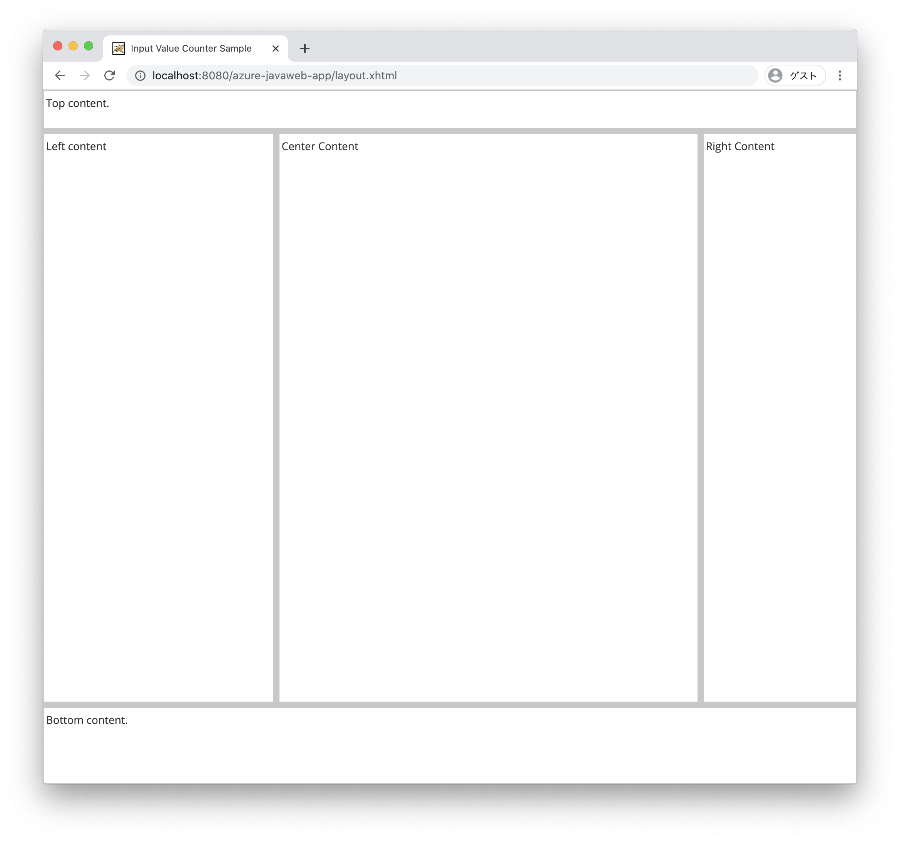
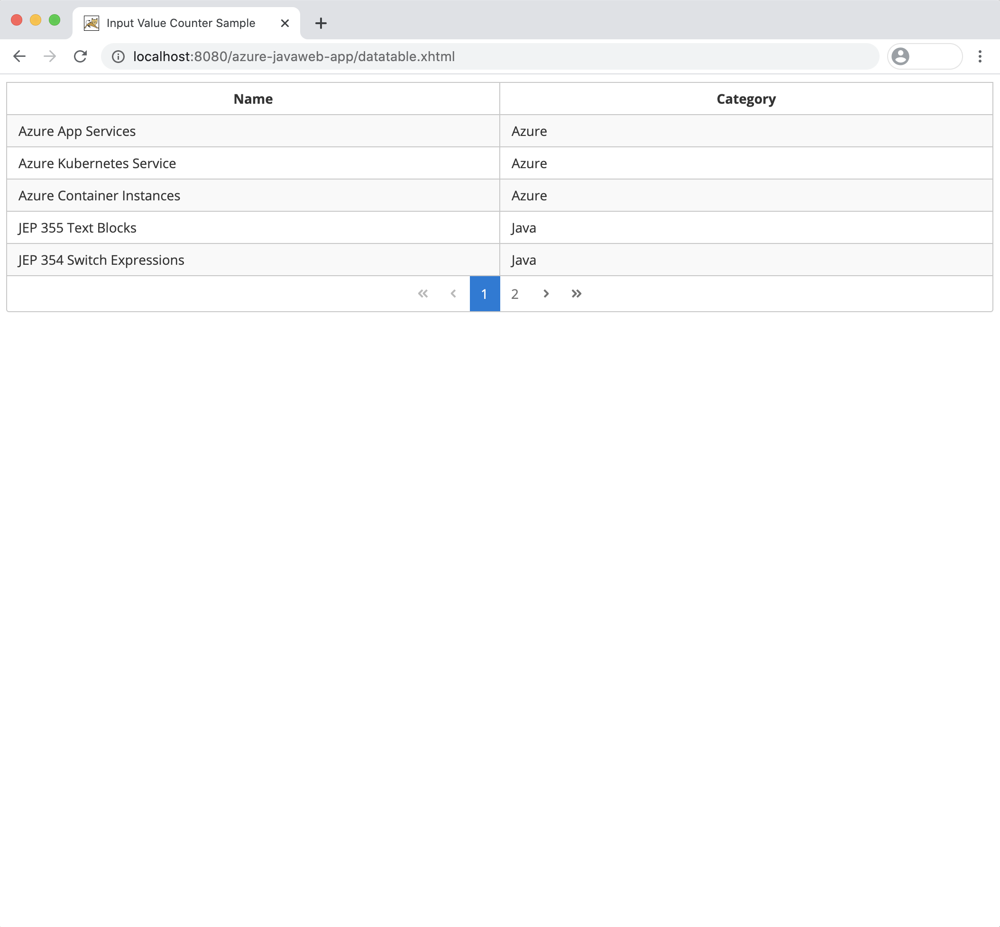

PrimeFaces is one of the most popular UI Component libraries in JavaServer Faces and widely used by many global companies. If you use the framework, you can create rich Web Application with very easily.  
In this module, we will create Simple Todo List application like follows. And in this section, we will learn the PrimeFaces component which we will use in the Application.


## PrimeFaces Component in the Application

This section introduces the typical components of PrimeFaces used to create Todo applications.
The list of components provided by PrifeFaces (https://www.primefaces.org/showcase/) is detailed with sample code, so if you want to use components other than those covered in this section, `showcase` Please refer.

### PrimeFaces Layout

`PrimeFaces Layout` creates a layout for the entire screen. PrimeFaces allows you to configure various layouts. For example, if you want to create headers, footers, menus, etc. that you often see in general, you can easily configure the screen layout by using the `p:layout`, `p:layoutUnit` tags below.
The Todo app uses `position ="north"` and `position="center"`.

```xml
<p:layout fullPage="true">
    <p:layoutUnit position="north" size="50">
        <h:outputText value="Top content." />
    </p:layoutUnit>
    <p:layoutUnit position="south" size="100">
        <h:outputText value="Bottom content." />
    </p:layoutUnit>
    <p:layoutUnit position="west" size="300">
        <h:outputText value="Left content" />
    </p:layoutUnit>
    <p:layoutUnit position="east" size="200">
        <h:outputText value="Right Content" />
    </p:layoutUnit>
    <p:layoutUnit position="center">
        <h:outputText value="Center Content" />
    </p:layoutUnit>
</p:layout>
```



### PrimeFaces OutputLabel, InputText, CommandButton

Next, I will introduce `p:outputLabel`,`p:inputText`, `p:commandButton`.

   ```xml
    <h:form>
        <p:outputLabel id="out" value="My Tasks" />
        <p:inputText id="name" value="#{todocontroller.name}" />
        <p:commandButton id="addtask" value="Add Task"  
            action="#{todocontroller.buttonAddAction()}"
            styleClass="ui-priority-primary" />
    </h:form>
   ```

#### p:outputLabel

`p:outputLabel` is a component for displaying text and is an extension of the standard outputLabel. Since `value ="My Tasks"` and a static character string are described here, `My Tasks` is also displayed on the screen, but if you want to change the character string to be output dynamically, below It is also possible to display a dynamic string by replacing it with the EL expression `#{todocontroller.name}` and binding it to the backing bean field as described in `p:inputText`.

#### p:inputText

`p:inputText` is a component for working with inputtable text fields and extends the standard inputText.
The EL expression `#s{todocontroller.name}` binds the value to the field defined in the corresponding backing bean (TodoListController) class, and the value entered by the user can now be referenced by `name`. I will.

#### p:commandButton

`p:commandButton` はボタンを表示するためのコンポーネントで、標準で提供されている commandButton を拡張しています。ボタンが押された時、`action` に記載する EL 式 `#{todocontroller.buttonAddAction()` が実行されます。具体定期には対応するバッキング・ビーン (TodoListController) のクラスで定義されている `buttonAddAction()` メソッドが呼び出されます。
また、`update="target-id"` をボタンの属性に追加する事で Ajax で処理を実行する事もできます。

#### JSF ページに対応するバッキング・ビーン

上記の Facelets (XHTML) に対応するバッキング・ビーンの実装例を下記に記載します。  
`p:inputText` に入力された内容は、`TodoListController` クラスの `name` にバインドし、プログラム内で扱う事ができます。また、`p:commandButton` でボタンが押されると、`TodoListController` クラスの `buttonAddAction()` メソッドが呼び出され、ユーザが `name` に入力した値を、標準出力に表示します。

   ```
import lombok.Getter;
import lombok.Setter;
import javax.faces.view.ViewScoped;
import javax.inject.Named;
import java.io.Serializable;

@Named("todocontroller")
@ViewScoped
public class TodoListController implements Serializable {

    @Setter @Getter
    private String name;

    public void buttonAddAction(){
        System.out.println("Input Value is " name);
        // write some command action
    }
}
   ```

If you create the XHTML and Backing Bean, you can  see like the followign screen.


### PrimeFaces DataTable

`p:dataTable` is a component for displaying HTML tables, which is an extension of the standard table. You can easily use the Paginator function by adding the `paginator` attribute. Here, the Transition function of Paginator is placed at the bottom of the table and is set with `paginatorPosition=" bottom"`, and 5 items that can be displayed on one screen are set with `rows ="5"`.
The display items in the table use `todoItems` of the `TodoListController` class. `todoItems` refers to `List <TodoItem>`, and each element in List (`TodoItem`) is available in `var ="item"`.
In other words, `#{item.name}` and `#{item.category}` are used to display each value of the `TodoItem` instance.

```xml
    <h:form>
        <p:dataTable id="itemTables" var="item" 
            value="#{todocontroller.todoItems}" paginator="true"
            paginatorPosition="bottom" rows="5">

            <p:column headerText="Name">
                <h:outputText value="#{item.name}" />
            </p:column>
            <p:column headerText="Category">
                <h:outputText value="#{item.category}" />
            </p:column>

        </p:dataTable>
    </h:form>
```

The implementation example of the `TodoListController` class is described below.
In this example, the `@PostConstruct init()` method is used to generate dummy `List <TodoItem>` data when this instance is created.
In other words, dummy data is generated at startup, so this content is displayed.

```java
import com.microsoft.samples.model.TodoItem;
import lombok.Getter;
import lombok.Setter;
import javax.annotation.PostConstruct;
import javax.faces.view.ViewScoped;
import javax.inject.Named;
import java.io.Serializable;
import java.util.ArrayList;
import java.util.List;

@Named("todocontroller")
@ViewScoped
public class TodoListController implements Serializable {

	private static final long serialVersionUID = 8118071083254011575L;

    @Setter @Getter
    private List<TodoItem> todoItems;

    @PostConstruct
    public void init(){
        TodoItem item1 = new TodoItem("App Services","Azure",false);
        TodoItem item2 = new TodoItem("Azure Kubernetes Service","Azure",false);
        TodoItem item3 = new TodoItem("JEP 359","Java",false);
        TodoItem item4 = new TodoItem("JEP 368","Java",false);
        TodoItem item5 = new TodoItem("MicroProfile","Java",false);
        TodoItem item6 = new TodoItem("Spring Boot","Java",false);
        TodoItem item7 = new TodoItem("Jakarta EE","Java",false);

        todoItems = new ArrayList<>();
        todoItems.add(item1);
        todoItems.add(item2);
        todoItems.add(item3);
        todoItems.add(item4);        
        todoItems.add(item5);
        todoItems.add(item6);        
        todoItems.add(item7);
    }
}
```

The implementation of the `TodoItem` class is described below.
Use this class as a data model for display.
Since the `@Data` annotation of `Project Lombok` is added, the Setter/Getter method is automatically added for all fields and `toString()`, `equals (Object o)`,`hashCode()` Methods will be override.

```java
import java.io.Serializable;
import lombok.Data;

@Data
public class TodoItem implements Serializable {

    private static final long serialVersionUID = -8967340396649549045L;
    private Long id;
    private String category;
    private String name;
    private boolean complete;

    public TodoItem() {}

    public TodoItem(String name, String category, boolean complete) {
        this.name = name;
        this.category = category;
        this.complete = complete;
    }

    public TodoItem( String name, String category) {
        this.category = category;
        this.name = name;
        this.complete = false;
    }

    @Override
    public String toString() {
        return String.format(
                "TodoItem[id=%d, category='%s', name='%s', complete='%b']",
                id, category, name, complete);
    }
}
```

If you write and execute the above DataTable, the following screen will be displayed.


