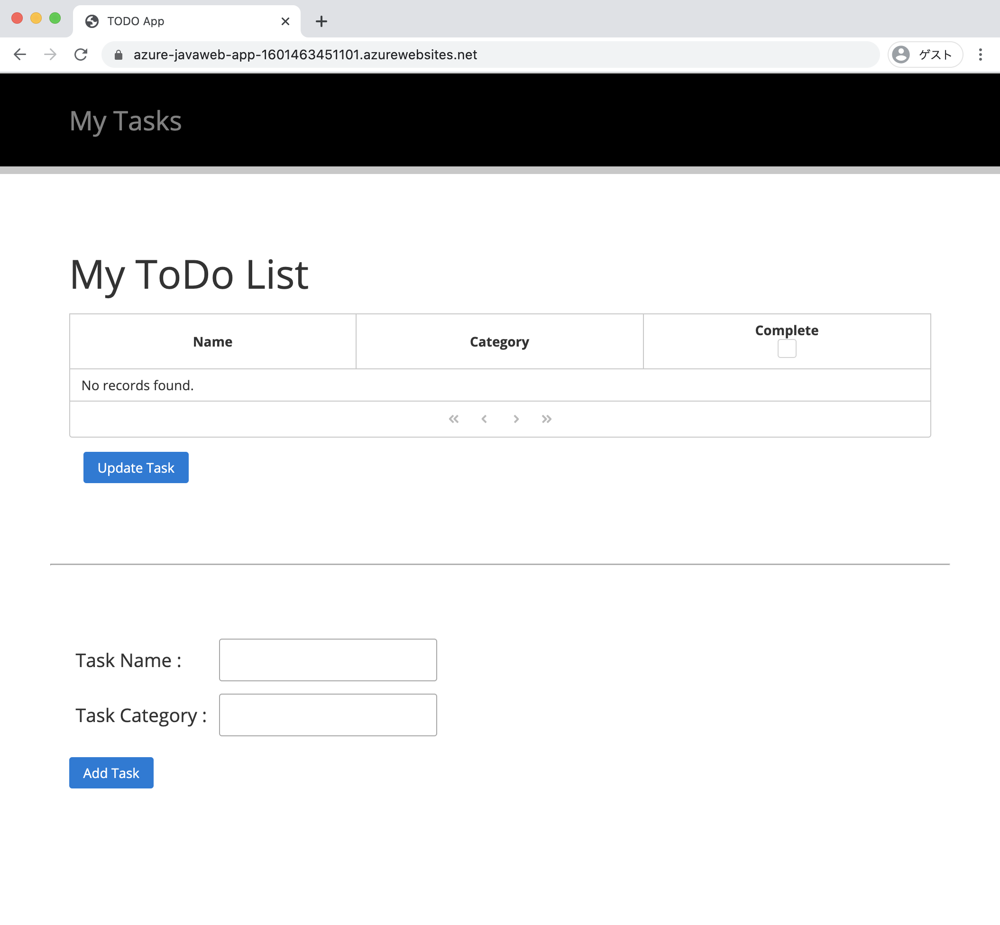
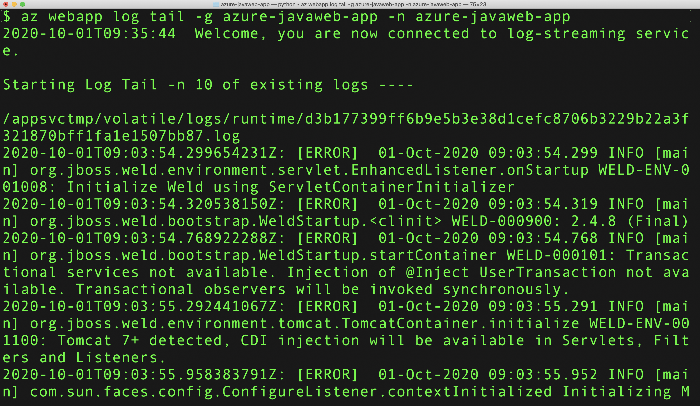

ローカル環境の Tomcat で動作確認ができたので、アプリケーションを Azure App Services にデプロイします。  
Azure App Service にデプロイするためには、Maven Plugin for Azure Web Apps (https://github.com/microsoft/azure-maven-plugins) を利用できます。最新バージョンを指定してください (2020年10月1日時点で 1.11.0)。

```bash
mvn com.microsoft.azure:azure-webapp-maven-plugin:1.11.0:config
```

コマンドを実行するとプロンプトでいくつかの質問項目が表示ますので、適切な項目を入力・選択し設定をして下さい。今回は下記の内容を入力してください。

|  項目  |  入力値  |
| ---- | ---- |
|  Subscription  |  適切なサブスクリプションを選択  |
|  Define value for OS  |  1: Linux |
|  Define value for Java Version  |  1: Java 11 |
|  Define value for Runtime Stack  |  1: TOMCAT 9.0 |
|  Confirm (Y/N)  |  Y |

実際に実行すると、下記のように表示されます。

```
mvn com.microsoft.azure:azure-webapp-maven-plugin:1.11.0:config
Picked up JAVA_TOOL_OPTIONS: -Dfile.encoding=UTF-8
[INFO] Scanning for projects...
[INFO] 
[INFO] -----------< com.microsoft.azure.samples:azure-javaweb-app >------------
[INFO] Building azure-javaweb-app Maven Webapp 1.0-SNAPSHOT
[INFO] --------------------------------[ war ]---------------------------------
[INFO] 
[INFO] --- azure-webapp-maven-plugin:1.11.0:config (default-cli) @ azure-javaweb-app ---

Available subscriptions:
* 1: My Subscription (********-****-****-****-************)
Please choose a subscription [My Subscription]: [Enter]
[INFO] It may take a few minutes to load all Java Web Apps, please be patient.
[WARNING] There are no Java Web Apps in current subscription, please follow the following steps to create a new one.
Define value for OS [Linux]:
* 1: Linux
  2: Docker
  3: Windows
Enter your choice: 
Define value for javaVersion:
  1: Java 11
* 2: Java 8
Enter your choice: 1
Define value for runtimeStack:
  1: TOMCAT 9.0
* 2: TOMCAT 8.5
Enter your choice: 1
Please confirm webapp properties
Subscription Id : ********-****-****-****-************
AppName : azure-javaweb-app-1601541274402
ResourceGroup : azure-javaweb-app-1601541274402-rg
Region : westeurope
PricingTier : PremiumV2_P1v2
OS : Linux
RuntimeStack : TOMCAT 9.0-java11
Deploy to slot : false
Confirm (Y/N) [Y]: y
[INFO] Saving configuration to pom.
[INFO] ------------------------------------------------------------------------
[INFO] BUILD SUCCESS
[INFO] ------------------------------------------------------------------------
[INFO] Total time:  37.656 s
[INFO] Finished at: 2020-10-01T17:24:02+09:00
[INFO] ------------------------------------------------------------------------
```

正常にコマンドを終了すると、`pom.xml` ファイルに下記のような `<plugins>`のエントリが追加されます。  

リソース・グループ名やインスタンス名、配備するロケーションを変更したい場合、それぞれ `<resourceGroup>`, `<appName>`, `<region>` の内容を変更してください。  

また、Tomcat のデフォルトで 8080 番号で待ち受けている PORT を Azure App Services 上で 80 番で待ち受けたり、起動時のタイムアウト設定を行うために、`<appSettings>` に記載するプロパティの項目 `PORT`, `WEBSITES_PORT`, `WEBSITES_CONTAINER_START_TIME_LIMIT` を追記してください。

```xml 
    <plugins>
      <plugin>
        <groupId>com.microsoft.azure</groupId>
        <artifactId>azure-webapp-maven-plugin</artifactId>
        <version>1.11.0</version>
        <configuration>
          <schemaVersion>V2</schemaVersion>
          <subscriptionId>********-****-****-****-************</subscriptionId>
          <resourceGroup>azure-javaweb-app</resourceGroup>
          <appName>azure-javaweb-app-1601463451101</appName>
          <pricingTier>P1v2</pricingTier>
          <region>japaneast</region>
          <runtime>
            <os>linux</os>
            <javaVersion>java11</javaVersion>
            <webContainer>TOMCAT 9.0</webContainer>
          </runtime>

          <appSettings>
            <property>
              <name>PORT</name>
              <value>8080</value>
            </property>
            <property>
              <name>WEBSITES_PORT</name>
              <value>8080</value>
            </property>
            <property>
              <name>WEBSITES_CONTAINER_START_TIME_LIMIT</name>
              <value>600</value>
            </property>
          </appSettings>

          <deployment>
            <resources>
              <resource>
                <directory>${project.basedir}/target</directory>
                <includes>
                  <include>*.war</include>
                </includes>
              </resource>
            </resources>
          </deployment>
        </configuration>
      </plugin>
    </plugins>
```

### Compile & Deploy to Azure  App Services

Azure App Services にデプロイするための設定が完了しましたので、再度ソースコードをコンパイルします。

```bash
mvn clean package
```

コンパイルが完了すると、`Maven Plugin for Azure Web Apps` のコマンドを利用してアプリケーションをデプロイします。  
下記のコマンドを実行してください。

```bash
mvn azure-webapp:deploy
```

デプロイが完了すると下記のようなメッセージが出力されます。　　

```
[INFO] Successfully deployed the artifact to https://azure-javaweb-app-1601463451101.azurewebsites.net
[INFO] ------------------------------------------------------------------------
[INFO] BUILD SUCCESS
[INFO] ------------------------------------------------------------------------
[INFO] Total time:  01:35 min
[INFO] Finished at: 2020-09-30T20:02:37+09:00
[INFO] ------------------------------------------------------------------------
```

メッセージを確認すると `Successfully deployed the artifact to` にデプロイしたアプリケーションの公開 URL が表示されていますので、ブラウザで URL にアクセスします。


`https://azure-javaweb-app-1601463451101.azurewebsites.net`




## Deploy App to the Deployment Slot as Staging Environment

アプリケーションは、バグ修正や新機能追加などで度々更新する必要があります。しかし現在動作しているアプリケーションを直接更新してしまうと、サービスの停止が発生するだけでなく、新しく更新したアプリケーションが正しく動作していない可能性もあります。こうしたサービスの更新におけるトラブルを避けるために、[ステージング環境にアプリケーションをデプロイ](https://docs.microsoft.com/azure/app-service/deploy-staging-slots)する事ができます。  
ここでは、アプリケーションを更新し Deployment Slot に更新したアプリケーションをデプロイしてみましょう。

### アプリケーションの更新

今回、アプリケーションを更新するために、`index.xhtml` のヘッダ部分の文字列を `My Tasks` から `My Tasks V2` に更新します。`index.xhtml` を開き下記のように修正してください。

```xml
<p:outputLabel
   style="color: #808080; font-size: 2em; position: absolute;top: 50%; -webkit-transform : translateY(-50%); transform : translateY(-50%);"
   value="My Tasks V2" />
```

### Deployment Slot の設定

Azure App Services の Deployment Slot を設定するため、再度下記のコマンドを実行してください。

```bash
mvn com.microsoft.azure:azure-webapp-maven-plugin:1.11.0:config
```

コマンドを実行するとプロンプトでいくつかの質問項目が表示ますので、適切な項目を入力・選択し設定をして下さい。今回は下記の内容を入力してください。

|  項目  |  入力値  |
| ---- | ---- |
|  Please choose which part to config  |  3: DeploymentSlot  |
|  Deploy to slot?(Y/N) [N]:   |  y |
|  Define value for slotName | azure-javaweb-app-staging |
|  Define value for configurationSource  |  無し |
|  Confirm (Y/N) [Y]  |  y |

実際に実行すると下記のように表示されます。

```
mvn com.microsoft.azure:azure-webapp-maven-plugin:1.11.0:config
Picked up JAVA_TOOL_OPTIONS: -Dfile.encoding=UTF-8
[INFO] Scanning for projects...
[INFO] 
[INFO] -----------< com.microsoft.azure.samples:azure-javaweb-app >------------
[INFO] Building azure-javaweb-app Maven Webapp 1.0-SNAPSHOT
[INFO] --------------------------------[ war ]---------------------------------
[INFO] 
[INFO] --- azure-webapp-maven-plugin:1.11.0:config (default-cli) @ azure-javaweb-app ---

Please choose which part to config:
* 1: Application
  2: Runtime
  3: DeploymentSlot
Enter your choice: 3
Deploy to slot?(Y/N) [N]: y
Define value for slotName [azure-javaweb-app-slot]: azure-javaweb-app-staging
Define value for configurationSource: 
Please confirm webapp properties
AppName : azure-javaweb-app
ResourceGroup : azure-javaweb-app
Region : japaneast
PricingTier : PremiumV2_P1v2
OS : Linux
RuntimeStack : TOMCAT 9.0-java11
Deploy to slot : true
Slot name : azure-javaweb-app-staging
ConfigurationSource : 
Confirm (Y/N) [Y]: y
[INFO] Saving configuration to pom.
[INFO] ------------------------------------------------------------------------
[INFO] BUILD SUCCESS
[INFO] ------------------------------------------------------------------------
[INFO] Total time:  49.504 s
[INFO] Finished at: 2020-10-01T18:15:29+09:00
[INFO] ------------------------------------------------------------------------
```

コマンドを実行すると `pom.xml` ファイルに下記のエントリが追加されていることを確認できます。

```xml
          <deploymentSlot>
            <name>azure-javaweb-app-staging</name>
            <configurationSource></configurationSource>
          </deploymentSlot>
```

## Confirm the Log Stream from Command Line

TODO: Explanation

```azurecli
az webapp log tail -g azure-javaweb-app-1601463451101 -n azure-javaweb-app
```

