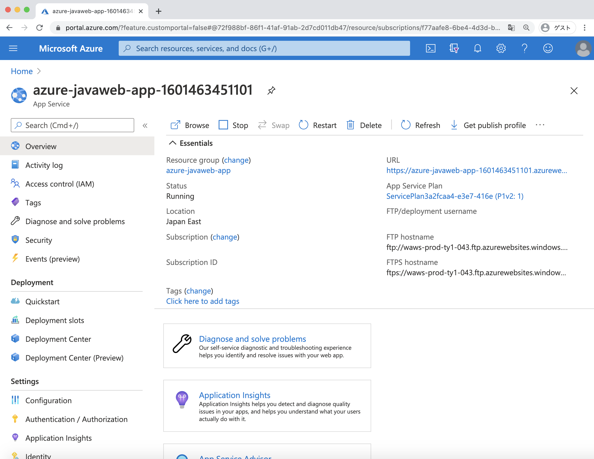
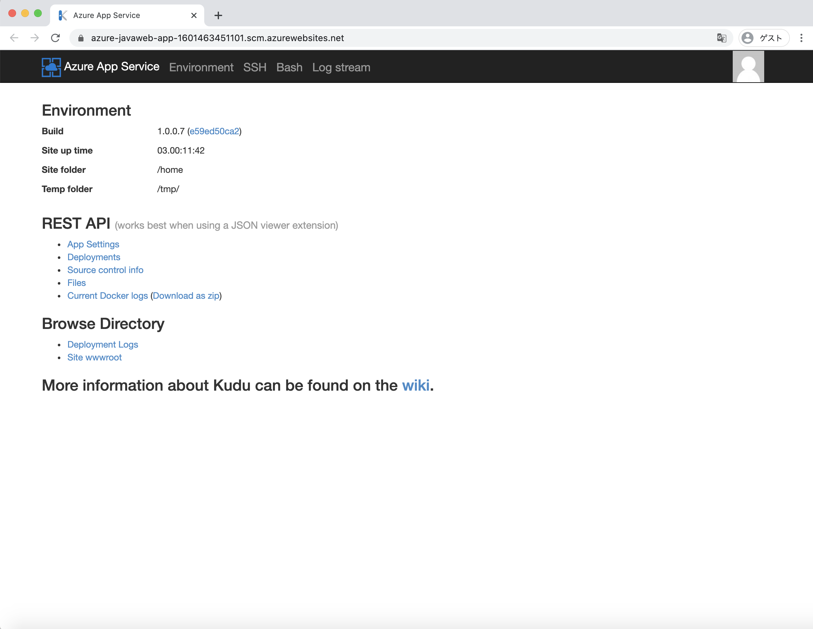
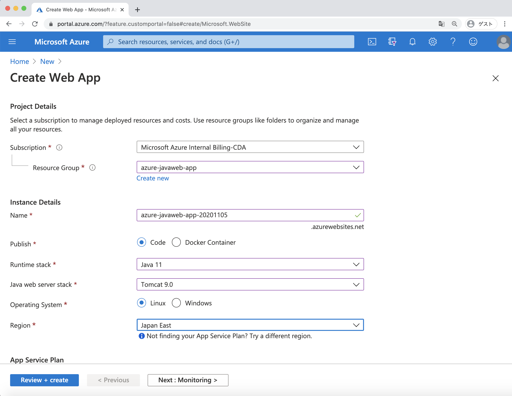

ローカル環境での動作確認が完了できたため、ここから Java の Web Application を Cloud 環境にデプロイする方法について紹介します。  
Azure では、Java の Web Application を目的に応じて様々な環境にデプロイすることができます。

* General VM (Linux, Windows)
* Azure App Service
* Azure App Service for Container
* Azure Container Instances
* Azure Kubernetes Service
* Azure Red Hat OpenShift
* Azure Spring Cloud

どの環境にデプロイするかは、作成するアプリケーションや提供するサービスに応じて、柔軟に選択していただくことができます。
前セクションで作成したアプリケーションは Tomcat 上で稼働するアプリケーションですので、ここでは Azure 上でいち早くそして簡単に Tomcat を作成し稼働させる環境を選択したいと思います。Tomcat を動作させる環境として Azure では Platform as a Service として Azure App Service を提供しています。  
本節では、Azure App Service の概要について紹介します。

## What is Azure App Service

Azure App Service は、Web アプリケーション、REST API、およびモバイル バックエンドを実行するための HTTP ベースのサービスです。  
Windows 環境と Linux 環境を用意し、利用者の希望に応じて、環境を選択できます。
セキュリティ、負荷分散、自動スケーリング、自動管理機能などを備え、Azure DevOps、GitHub などの CI/CD 環境と統合することも可能です。  
これを利用する事で、OS の管理、Java VM, Tomcat のバージョン管理を Azure にまかせ、利用者はビジネス・アプリケーションの構築に集中でき、少ない管理項目で、本番環境用まで適用できます。



また、Azure App Service を利用すると、Azure の Portal 画面からブラウザを利用して、SSH, Bash でログインを行なったり、ブラウザからアプリケーション・ログを確認できますので、障害発生時などの解析でとても便利です。



## Java Deployment Options for App Service



まず、最初に App Service で利用する Java VM のバージョンを選択します。App Service では下記のように `Java 11` もしくは `Java 8` のいずれかを選択できます。
`Java 11` を選択した場合、さらに下記の実行環境を選択します。`Java SE (Embedded Web Server)` は、組み込みの Web サーバを内包する Executable JAR ファイルを実行する際に選択します。また、Tomcat は 7.0 〜 Tomcat 9.0 まで複数のバージョンを用意していますので、実装したアプリケーションの実行環境として適切な環境を選択します。  
また、`Java 8` を選択した場合、下記の実行環境を選択できます。`Java  11` に加え `JBoss EAP 7.2 (Preview)` が追加されていますので、仮に JBoss 環境でアプリケーションを実行したい場合は、こちらを選択します。  

| Runtime Stack |  Java 11  |  Java 8  |
| ---- | ---- | ---- |
|Java Web Server Stack|  Java SE (Embedded Web Server)  |  Java SE (Embedded Web Server)  |
|^|   |  JBoss EAP 7.2 (Preview)  |
|^| Tomcat 9.0   |  Tomcat 9.0  |
|^| Tomcat 8.5   |  Tomcat 8.5  |
|^| Tomcat 8.0   |  Tomcat 8.0  |
|^| Tomcat 7.0  | Tomcat 7.0  |


今回の ToDo サンプル・アプリケーションは Tomact 9.0.39 上で稼働しますので、Tomcat 9.0 を選択します。


## Maven Plugin for Azure App Service

Microsoft は Java 開発者が容易に Azure を利用できるようにするため、`Maven Plugins for Azure Services` を提供しています。	

* Maven Plugin for Azure App Service
* Maven Plugin for Azure Functions	
* Maven Plugin for Azure Spring Cloud

これらのプラグインを利用する事で、作成したアプリケーションを簡単に Azure 環境にデプロイできるようになりますので、プラグインをご利用下さい。　　
今回は、App Service にデプロイするため、`Maven Plugin for Azure App Service` を利用します。  

`Maven Plugin for Azure App Service` を利用するために下記のコマンドを実行してください。

```bash
mvn com.microsoft.azure:azure-webapp-maven-plugin:1.12.0:config
```