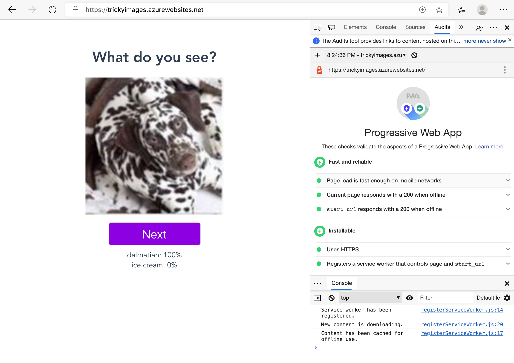

You have a web app, and it's been published to Azure. Now you can make sure that it works as a PWA, or Progressive Web App. These apps are interesting if they need to be used offline.

## What is a PWA?

A Progressive Web App is a web site that looks and behaves as if it's a mobile app. That means it works offline, might use push notifications, and has access to hardware such as bluetooth and cameras. For this app, you can make use of PWA functionality to ensure that your app can work both offline and online. You can do this by ensuring that all the files that are needed by the app are available during the build process and no online API calls are needed to access its machine learning model.

## Configure your PWA

For the most part, the Vue CLI has already created the files you need for your PWA. If you look in the `/public/images/icons` folder, you'll find ready made icons so that a user can create a bookmark to the app on a desktop. The build process also creates a `service-workers.js` file to launch a service worker that takes care of offline capabilities. Make sure that a service worker can be created by adding one more file to your app: a `vue.config.js` file.

Add a new file called `vue.config.js` to the root of your web app. This file will help Webpack filter files that stop service workers from being created.

In that file, add this code:

```JavaScript
module.exports = {
	pwa: {
		workboxOptions: {
			exclude: [/\.map$/, /web\.config$/],
		},
	},
};
```

Now, when you push your code to GitHub and it's built, a service worker should be created. You can use the Developer Tools to determine your page's Lighthouse Score, which is a good way to gauge the performance of your PWA.



## Test the app

To test your Lighthouse score, open your web app in a browser and open the Developer Tools. Navigate to Audit and create an audit report for your web app. You can test its offline capabilities by clicking `Application` in the Developer Tools area, then click `Service Workers`. Take your app offline by clicking the offline checkbox, then try the app. The model should perform inference well, as if it were online.

Try building a new model in Custom Vision AI with fresh images for testing and verification and then load your model again via your build process. The Service Worker should pick up the fact that there's a new model and alert you in console that it exists. When you refresh the screen, the new model should appear.
