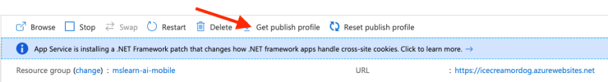
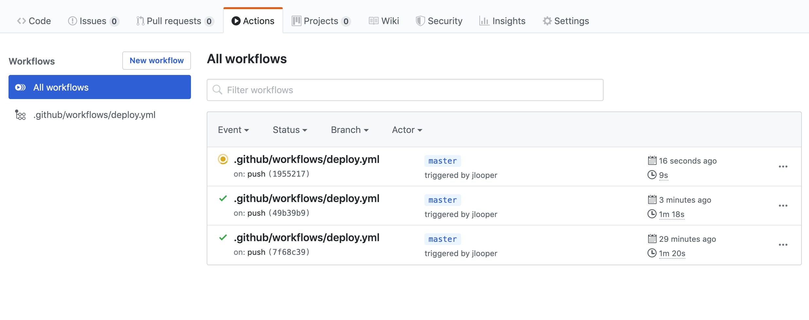

You're now ready to publish your app to Azure. Use the sandbox's Windows instance to host your web app. Using Azure's Visual Studio Code extension helps streamline the process.

## Create a web app on Azure

Now it's time to run our app in Azure. You need to create an Azure App Service app and deploy your code.

## Create the App Service plan and app

Creating an App Service app is a two-step process: First create the _plan_, then create the _app_.

The _plan_ name only needs to be unique within your subscription, so you can use the same name we've used: **pwa-exercise-plan**. The app name needs to be globally unique, though, so you'll need to pick your own.

In Azure Cloud Shell, run the following command to create an App Service plan.

```azurecli
az appservice plan create \
    --name pwa-exercise-plan \
    --sku FREE \
    --location centralus \
    --resource-group [your resource group]
```

Next, run the following command to create the Web App that uses the App Service plan you just created.

```azurecli
az webapp create \
    --plan pwa-exercise-plan \
    --runtime "node|10.6" \
    --resource-group [your resource group] \
    --name <your-unique-app-name>
```

## Create a GitHub Action to deploy your app

You now need to create a GitHub Action to build your app whenever you push new code to it, and connect the code to the web app you created on Azure. There are two steps to this process.

1. First, create two nested folders in the root of your app called `.github/workflows`. In the `workflow` folder, add a file called `deploy.yml`. This file will be picked up by GitHub actions automatically as a workflow after you commit it to GitHub. Add the following code to `deploy.yml`.

    ```yaml
    on:
        push:
            branches:
                - master
    
    env:
        AZURE_WEBAPP_NAME: 'trickyimages' # set this to your application's name
        AZURE_WEBAPP_PACKAGE_PATH: 'dist' # set this to the path to your web app project, for Vue.js it's dist
        NODE_VERSION: '10.x' # set this to the node version to use
    
    jobs:
        build-and-deploy:
            name: Build and Deploy
            runs-on: ubuntu-latest
            steps:
                - uses: actions/checkout@v2
                - name: Use Node.js ${{ env.NODE_VERSION }}
                  uses: actions/setup-node@v1
                  with:
                      node-version: ${{ env.NODE_VERSION }}
                - name: npm install, build, and test
                  run: |
                      # Build and test the project, then
                      # deploy to Azure Web App.
                      npm install
                      npm run build --if-present
                      npm run test --if-present
                - name: 'Deploy to Azure WebApp'
                  uses: azure/webapps-deploy@v1
                  with:
                      app-name: ${{ env.AZURE_WEBAPP_NAME }}
                      publish-profile: ${{ secrets.PORTAL_PUBLISH_PROFILE }}
                      package: ${{ env.AZURE_WEBAPP_PACKAGE_PATH }}
    ```

1. Edit this file to set the name of the app to the name you gave your web app in Azure.

## Connect your app to GitHub using keys

You are going to create a new secret key in GitHub to create a handshake between Azure and GitHub.

Go to the Azure portal where your web app is hosted. Select **Get Publish Profile** to download a file.



In your GitHub repo, go to **Settings > Secrets**. Copy and paste the contents of that file into a new Secret with the name PORTAL_PUBLISH_PROFILE, and save it.

Now, when you push new code to your repo, your GitHub action will build and publish the new codebase and your web app will be refreshed.



Try it with a new model to watch the changes happen automatically.
