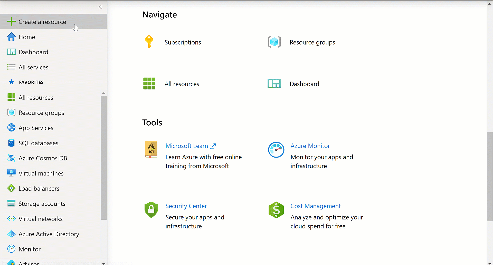

Lets build our model! Here we will download the dataset, create our Azure service, upload the data, and train the model.

## Download data

The first thing we need to create our model is to get data! We are going to use a subset of the NA Bird dataset from Cornell to train our model. Download the zip file with our [dataset](https://github.com/MicrosoftDocs/mslearn-cv-classify-bird-species/raw/master/bird_photos.zip).

## Create Custom Vision API resource

1. Go to the [Azure portal](https://portal.azure.com/?azure-portal=true).
1. Select **Create Resource**.
1. Search **Custom Vision**.
1. Select **Create**.
1. Complete the required fields.
1. Select **Create**.
1. When the deployment succeeds, you will get a notification in the top-right corner.
1. Select **Go to resource**.



## Upload data

Now it is time to upload the data for training. There are a couple ways to do this. Either use the UI to browse upload and tag OR we can use the SDK. Follow the instructions for the way that works best for you. With lots of data and images classes/tags it will be faster to use the SDK.

### Option 1: Steps for UI upload

1. Create a project.

   1. Select **Quick Start**.
   1. Select **Custom Vision Portal** or go to <https://www.customvision.ai/projects>.
   1. Select **Sign in**.
   1. Select **New Project** and fill in the required fields:

     | Field                  | Value                             |
     | ---------------------- | --------------------------------- |
     | **Enter a Name**           | Name of your choice               |
     | **Description**            | A Short description of the model  |
     | **Enter a Resource Group** | Select the resource you created   |
     | **Project Types**          | Classification                    |
     | **Classification Types**   | Multiclass (Single tag per image) |
     | **Domains**                | General                           |

   1. Create the project.

   > [!NOTE]
   > If you want to export the model to deploy on a mobile device, tensorflowjs, or IoT select the `compact` model option. This can also be changed after the project is created in the settings.

1. Add and tag an image:

   1. Select **Add Images**.
   1. Go to the `bird_photos` folder.
   1. Select Ctrl + A to select all the images for each bird species folder.
   1. Select **Open**.
   1. Add a tag for photos to indicate the bird species.
   1. Select **Upload photos**.
   1. Repeat these steps for each bird species (class).

   

### Option 2: SDK upload

The Custom Vision SDK is available in the following languages: Python, .NET, Node, Go, and Java. We are going to use Python and Jupyter Notebooks. If you don't have these installed already, I recommend getting them with Anaconda. You can [download it](https://www.anaconda.com/).

The following steps show you how to create the notebook and copy in the code. 

If you prefer to instead download the notebook and code, you can clone the repo by using the following command:

```bash
git clone https://github.com/MicrosoftDocs/mslearn-cv-classify-bird-species.git
```

1. Open a new Jupyter notebook instance or the IDE of your choice. Then, run the following command to import the package:

   ```python
   !pip install azure-cognitiveservices-vision-customvision
   ```

1. Import the packages needed to run the script:

   ```python
   from azure.cognitiveservices.vision.customvision.training import CustomVisionTrainingClient
   from azure.cognitiveservices.vision.customvision.training.models import ImageFileCreateEntry
   import numpy as np
   ```

1. Create the Custom Vision project. Update the endpoint and key with the values from the resource you created in Azure:

   ```python
   ENDPOINT = "<endpoint>"

   # Replace with a valid key
   training_key = "<key>"
   publish_iteration_name = "classifyBirdModel"

   trainer = CustomVisionTrainingClient(training_key, endpoint=ENDPOINT)

   # Create a new project
   print ("Creating project...")
   project = trainer.create_project("Bird Classification")

   print("Project created!")
   ```

1. Go to [customvision.ai](https://www.customvision.ai/) if you would like to validate the project was created in the UI.

1. Unzip `bird_photos.zip` and save it to directory where your Jupyter notebook is saved. Then, add the following code to get the list of bird type tags to be created based on the folder names in the `bird_photos` directory:

   ```python
   # Create Tag List from folders in bird directory
   import os
   os.chdir('./bird_photos')
   tags = [name for name in os.listdir('.') if os.path.isdir(name)]
   print(tags)
   ```

1. Next, we will create three different functions that we will call in the `for loop` to create each class and upload each image dataset.

   1. Create an image name tag in Custom Vision project.

     ```python
     def createTag(tag):
         result = trainer.create_tag(project.id, tag)
         print(f'{tag} create with id: {result}')
         return result.id
     ```

   1. In the function, we pass in the tag name from the list of folder names and the tag ID from the tag we created in our project. It takes the `base_image_url` value and sets the directory to the folder that contains the images for the tag we created from the folder names. Then we append each image to the list, which we will use to upload in batches to the tag created.

     ```python
     def createImageList(tag, tag_id):
         #set directory to current tag
         base_image_url = f"./{tag}/"
         photo_name_list = os.listdir(base_image_url)
         image_list = []
         for file_name in photo_name_list:
             with open(base_image_url+file_name, "rb") as image_contents:
                 image_list.append(ImageFileCreateEntry(name=base_image_url+file_name, contents=image_contents.read(), tag_ids=[tag_id]))
         return image_list
     ```

   1. In the `uploadImageList` function, we pass in the `image_list` we created from the folder and then upload that list to the tag.

     ```python
     def uploadImageList(image_list):
         upload_result = trainer.create_images_from_files(project.id, images=image_list)
         if not upload_result.is_batch_successful:
             print("Image batch upload failed.")
             for image in upload_result.images:
                 print("Image status: ", image.status)
             exit(-1)
     ```

   1. This is our main method that calls the functions we created for each tag. We will loop through each `tag` (folder name) in the `tags` collection we created from the folders in the `bird_folder` directory. 
   
      Steps in the loop:

      1. Call the `createTag` to create the class tag in custom vision.
      1. Call `createImageList` function and sending in the current `tag` name and `tag_id` that was returned from Custom Vision. This returns our list of images to upload.
      1. Then, we upload the images from the `image_list` in batches of 25. Computer Vision will time out if try to upload the entire dataset at once.

     ```python
     for tag in tags:
         tag_id = createTag(tag)
         print(f"tag creation done with tag id {tag_id}")
         image_list = createImageList(tag, tag_id)
         print("image_list created with length " + str(len(image_list)))

         #break list into lists of 25 and upload in batches
         for i in range(0, len(image_list), 25):
             batch = image_list[i:i + 25]
             print(f'Upload started for batch {i} total items {len(batch)} for tag {tag}...')
             uploadImageList(batch)
             print(f"Batch {i} Image upload completed. Total uploaded {len(batch)} for tag {tag}")
     ```

## Train the model

We have created our dataset in Custom Vision, and now we can train our model. This can be done with the SDK, but the following steps will use the CustomVision.ai UI.

1. Go to CustomVision.ai, and then select the **Bird Classification** project.
1. Select **Train**.

When the training is complete, you will get information about how the model is performing for the iteration. This is displayed with metrics called Precision, Recall, and AP for the model as a whole and for each class. In the next step, we will learn a bit more about what each of these terms mean.
