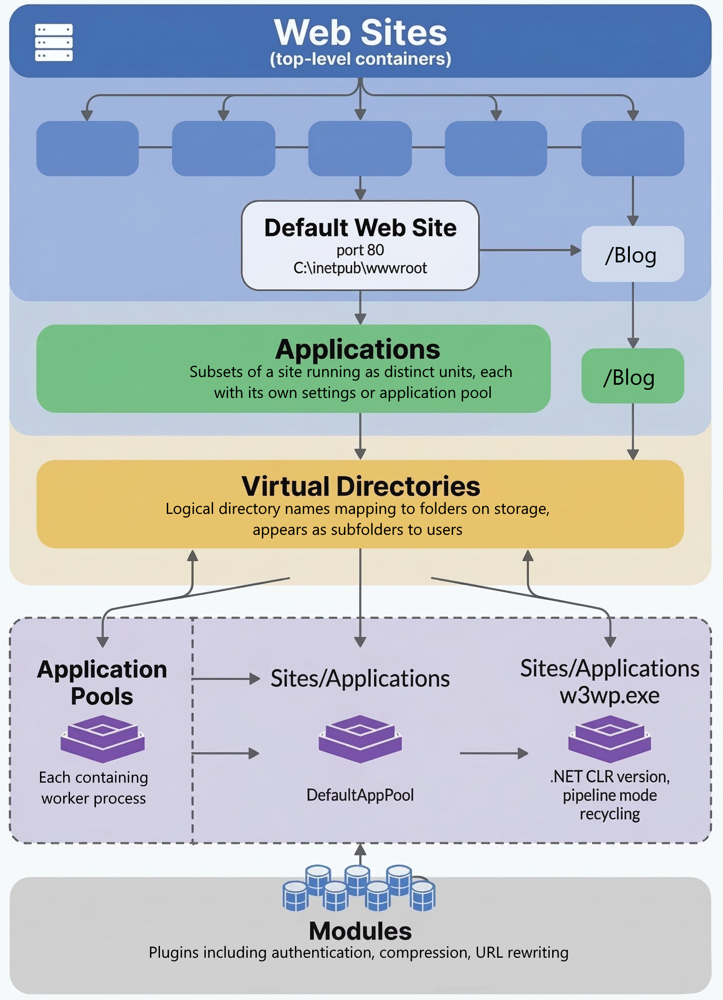

Windows Server includes IIS (Internet Information Services) version 10.0 as the built-in web server role. IIS isn't installed by default in a fresh Windows Server 2025 installation. You can add it via Server Manager or PowerShell. IIS 10 is available in all supported versions of Windows Server and Windows Client.

IIS uses a modular hierarchical architecture. The main architectural components are:

- **Web Sites**. Top-level containers that represent individual websites hosted on the server. Each site is identified by a unique combination of host name, port, and IP address and has its own folder path for content. By default, when IIS is installed, it creates a "Default Web Site", which listens on HTTP port 80 and serves content the %SystemDrive%\inetpub\wwwroot folder.
- **Applications**. An application in IIS is a subset of a site that runs as a distinct unit. Applications are configured starting at a virtual directory and have their own settings or even a separate application pool. For example, under one site you might have a "/Blog" application that has its own configuration or credentials. 
- **Virtual Directories**. A virtual directory is a logical directory name within a site or application that maps to a physical folder on disk. This folder can be outside the site's root folder. Virtual directories let you publish content or files in IIS from different file system locations under a single site structure. They appear as normal subfolders to users. 
- **Application Pools**. An application pool is the worker process environment in which one or more sites/applications run. Application pools provide isolation—each pool runs in its own sandboxed worker process named w3wp.exe. This means that problems in one site won't impact other sites hosted on the same server. By default, IIS puts the "Default Web Site" into a default application pool (DefaultAppPool). You should create additional application pools to isolate different applications or sites. Key settings of app pools include the .NET CLR version for ASP.NET apps, pipeline mode, and various recycling settings for stability. Each website in IIS can be assigned to a different application pool.
- **Modules**. Modules are components that handle specific request-processing tasks including authentication, compression, and URL rewriting. IIS's modular architecture means you can add or remove modules depending on the features you need.

These components function as follows:

1. When a request arrives, IIS determines which site it's for by matching the host header, port, and IP to a site binding. 
1. Within that site, it looks at the URL path to see if it corresponds to an application or virtual directory with distinct settings, then maps the request to a physical folder. 
1. The request is executed using the application pool associated with that site/application, which loads the necessary modules to handle things like authentication, authorization, serving content or executing application code, and sending the response.

