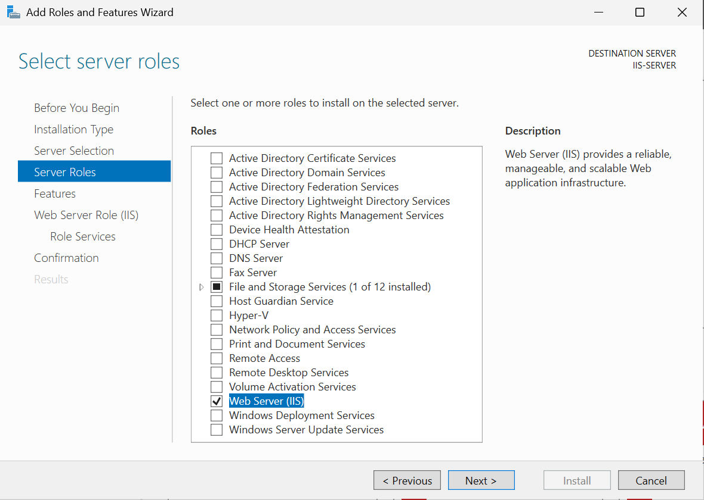
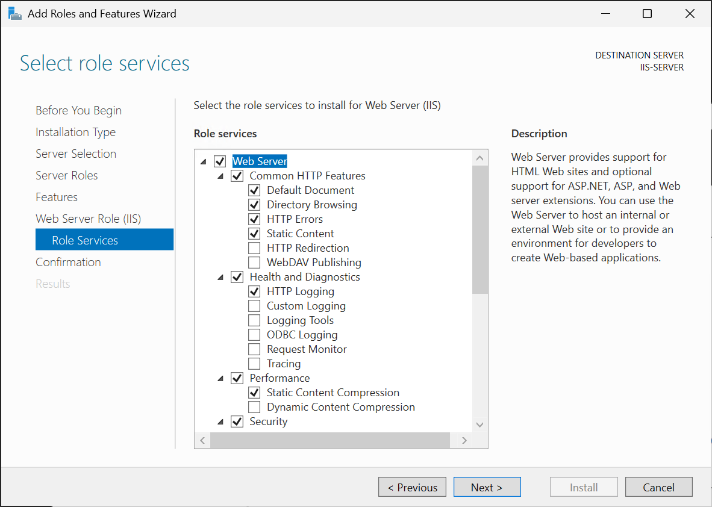

On a computer configured as Windows Server 2025 with Desktop Experience, you can install IIS using the Add Roles and Features Wizard:

1. In Server Manager's dashboard, select "Add Roles and Features." This opens the Add Roles and Features Wizard.
1. In the wizard's Before you begin page, select Next. Choose "Role-based or feature-based installation," then select your server. Continue to the Server Roles step.
1. In the list of roles, find and check "Web Server (IIS)". If this is the first time installing IIS, a pop-up appears to add associated features. Select "Add Features" when prompted to include IIS Management Console and other required components. After that, the "Web Server (IIS)" role should be checked.
[](../media/server-manager-install.png#lightbox)
1. Select Next to go through features until you reach the Role Services page. This list displays subcomponents like Common HTTP Features, Security, and Performance. By default, essential services are preselected. You can optionally select additional services or add them later as required. [](../media/server-manager-roles.png#lightbox)
1. Complete the wizard and then select Install on the confirmation page. The installation proceeds and when it completes, you'll see an "Installation succeeded" message.

> [!NOTE]
> By default, installing IIS through the wizard enables the Default Web Site on port 80. If you want to quickly verify that IIS works, you can open a web browser on the server and navigate to http://localhost. You should be greeted by the IIS welcome page, indicating the web server is running.

## PowerShell installation

To install IIS via PowerShell in Windows Server, use the Install-WindowsFeature cmdlet from an elevated command prompt:

```powershell
Install-WindowsFeature Web-Server -IncludeManagementTools
```

You can install specific IIS subcomponents by name using PowerShell. For example, to install IIS with some common features, you might specify component names like Web-WebSockets or Web-Dyn-Compression. You can see the available web server features by running the command:

```powershell
Get-WindowsFeature -Name Web*
```

You can determine which IIS features are installed by running the command: 

```powershell
Get-WindowsFeature -Name Web* | Where Installed
```

## IIS on Server Core

Server Core is the minimal, GUI-less installation option for Windows Server. The Server Core installation option is appropriate for workloads like IIS as the minimal number of components reduces the server's attack surface. You can deploy IIS on Server Core, but you can't use the local IIS Manager application. You can install IIS on Server Core using PowerShell using Install-WindowsFeature or remotely using Server Manager.

To enable remote management, you need to install the Web Management Service (WMSVC). You can do this by running the following command:

```powershell
Install-WindowsFeature -Name Web-Mgmt-Service 
```

You enable remote management by configuring the registry. You can do this with the following command:

```powershell
Set-ItemProperty -Path HKLM:\SOFTWARE\Microsoft\WebManagement\Server  -Name EnableRemoteManagement -Value 1
```

You can then configure the service to start automatically by running the command:

```powershell
Set-Service -Name WMSVC -StartupType Automatic
```

You have to allow inbound management traffic to the service. You can do this using the following command, restricting incoming management traffic to a designated management subnet (here it's 192.168.15.0/24):

```powershell
New-NetFirewallRule -DisplayName "IIS Remote Management" -Direction Inbound -Action Allow -Service WMSVC -RemoteAddress 192.168.15.0/24
```

Once WMSVC is running and listening, you can open IIS Manager on a different Windows machine and use the "Connect to a Server" option and enter the hostname (or IP) of your Server Core machine. You'll typically authenticate with an account that has local administrator privileges on the server hosting IIS.
