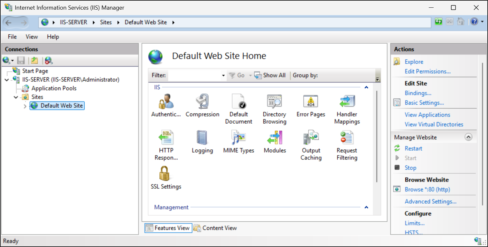
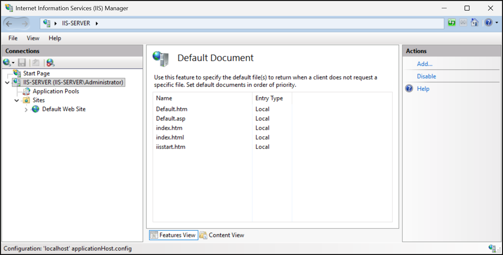
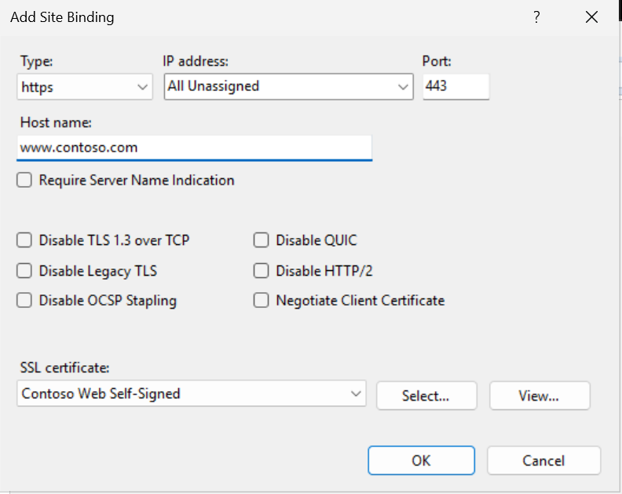
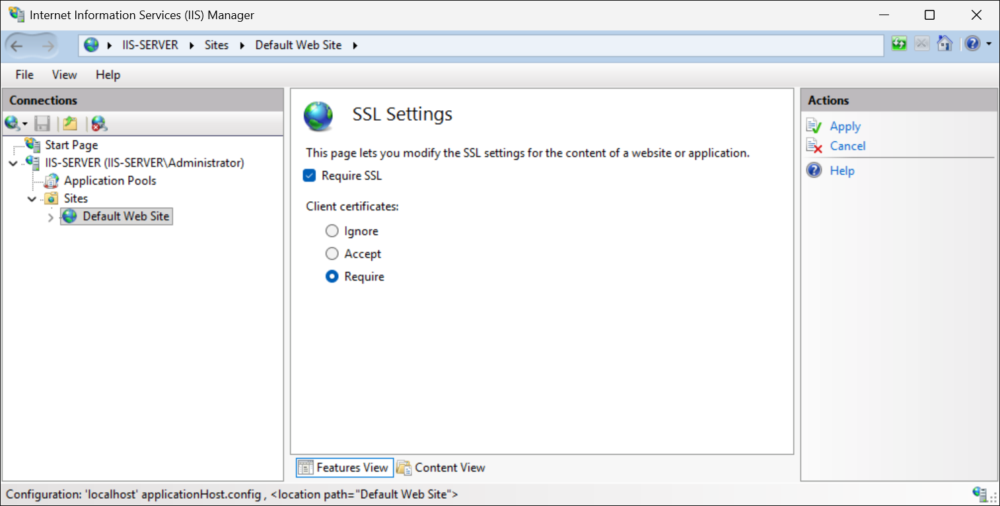

The deployment of the web server role creates a web site named Default Web Site. This site uses the path C:\inetpub\wwwroot as its content root and listens on port 80 (http) on all IP addresses configured for the server. The Default Web Site also has an empty host name binding, which means it responds to any host name on that server's IP. This continues to occur unless you configure an additional site, specifying a host name, for the same port.

You can verify that the default web site is present by navigating to http://localhost using the local browser, or by navigating to the server's IP address or DNS name using a web browser on a remote host.
You can also test that the website is present using the Invoke-WebRequest PowerShell command.

```powershell
Invoke-WebRequest -Uri "http://localhost/"
```

## Exploring the IIS Manager Interface

IIS Manager (inetmgr.exe) is the graphical tool for managing IIS. On launch, you see a window with a tree on the left. Select the server node to expand it. Under it, you see subnodes for Application Pools and Sites. If you expand Sites, you see Default Web Site listed.

[](../media/iis-manager.png#lightbox)

When you select the server itself or a site, the middle pane populates with features. These allow you to configure settings such as authentication at the server level, or settings at the level of an individual site level. Settings configured at the site level take precedence over those configured at the server level.

You can determine which IIS features are installed by looking at the Features View for the server. For instance, if "URL Rewrite" is installed, you'd see an icon for it under the IIS section. If Dynamic Content Compression was installed, you'll see a "Compression" icon that includes both static and dynamic compression settings. If you're looking for a setting and it's not present, you might need to install the appropriate web server role service using Server Manager or PowerShell.

## Basic configurations

There are a few basic settings and checks that you should be familiar with before using IIS in a production environment. These include:

- Default documents
- SSL Settings
- HTTP Compression

### Default documents

The default document is the file that IIS serves if a user requests a URL that corresponds to a folder. For example, if a user goes to http://yoursite/ (with no page specified), IIS looks for a default document in that folder. Typical defaults include Default.htm, Default.asp, index.htm, index.html, and iisstart.htm. In IIS Manager, you can configure this at the server or site level by double-selecting Default Document. You see the list of default files. You can add (for example, if your application uses home.aspx as the main page, you could add that), remove, or reorder these entries. The server-level list serves as the default for all sites, but you can override per site.

[](../media/default-document.png#lightbox)

### SSL settings

To configure SSL for a website in IIS, first install or import a server certificate into the Local Computer\Personal certificate store so IIS can use it. Then open IIS Manager, select the website, and choose Bindings from the Actions pane. Add or edit an https binding, set the port to 443, select the appropriate SSL certificate, and enable SNI if the server hosts multiple HTTPS sites on the same IP address. 

[](../media/contoso-certificate.png#lightbox)

After applying the binding, you can use the SSL Settings feature to require SSL for the site or specific content. You can optionally configure an HTTP-to-HTTPS redirect so users will be automatically sent to the secure version of the site.

[](../media/certificate-settings.png#lightbox)

### HTTP compression

IIS can compress responses to clients, reducing bandwidth and speeding up web content delivery. There are two types: static compression (for files like HTML, CSS, JS, images) and dynamic compression (for content generated by applications, like ASP.NET or PHP pages). By default, the Static Content Compression feature may already be installed if you accepted recommended defaults, but Dynamic Content Compression might not be. 

> [!NOTE]
> On Windows Server, adding the Web Server role typically enables the basic firewall rules for World Wide Web Services (HTTP and HTTPS) on Domain networks (if the server is domain-joined). If your server is standalone or in a workgroup, you may need to manually enable the rules for Public/Private profiles or create new rules for port 80 and 443.
