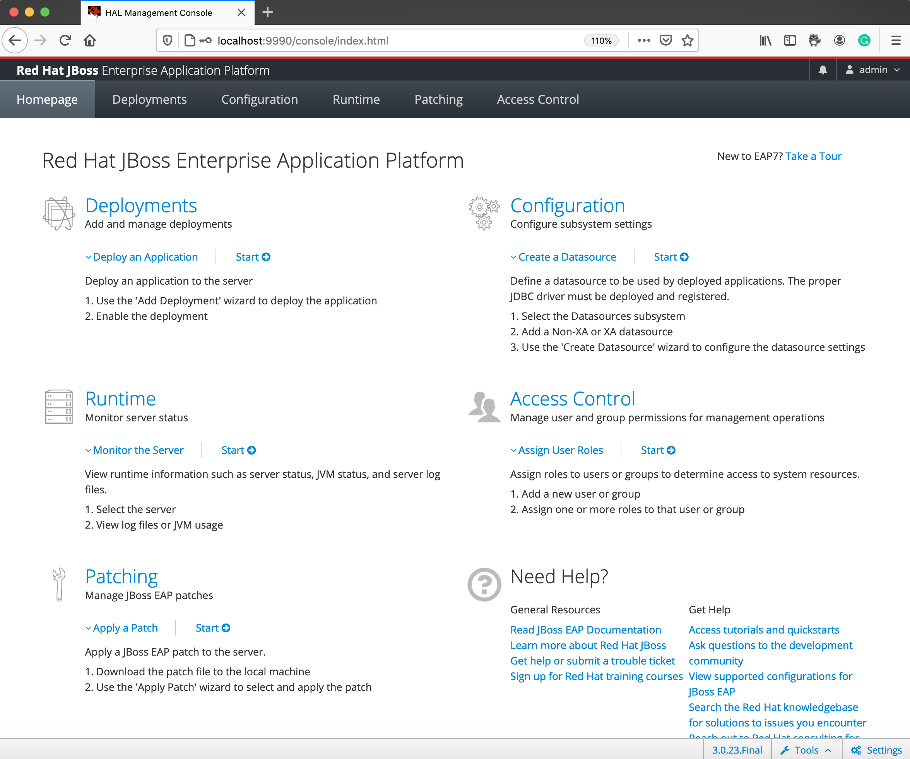
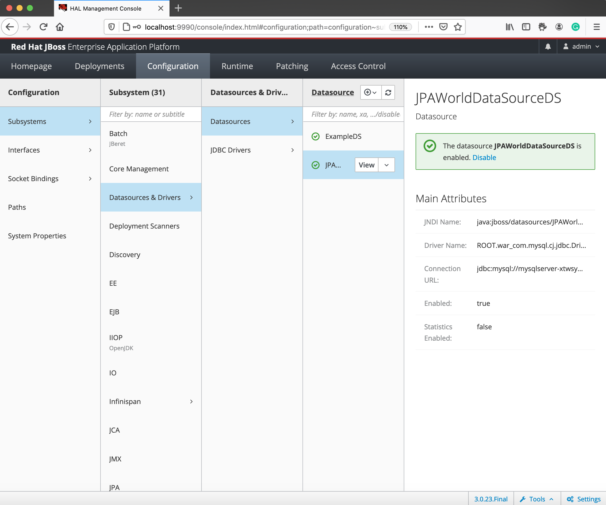

# Build and Deploy Java EE (Jakarta EE) Application to JBoss EAP on Azure  App Service

In this page, You will learn how to deploy  a Java EE (Jakarta EE) Application to JBoss EAP on Azure App Service.  
This is a general Java EE (Jakarta EE) application. In the project, we used following technologies.

- Java EE 8 (Jakarta EE 8)
	- [JPA 2.2](https://jakarta.ee/specifications/persistence/2.2/)
	- [CDI 2.0](https://jakarta.ee/specifications/cdi/2.0/)
	- [JSON-B 1.0](https://jakarta.ee/specifications/jsonb/1.0/)
	- [JAX-RS 2.1](https://jakarta.ee/specifications/restful-ws/2.1/)


## Configure App and Deploy to JBoss EAP on Azure App Service

You already clone the GitHub repository in the previous section, so you already have source code of Sample Application. 

In this section, at first we will configure the project to prepare the deployment by using `Azure App Service Maven Plugin`. After that we will compile the source code and create an artifact as WAR file. Finally we will deploy the artifact to JBoss EAP on Azure App Service.

### Configure the App with Azure App Service Maven Plugin

In order to configure the Application to deploy to JBoss EAP on Azure App Service, please execute the following command.

```bash
mvn com.microsoft.azure:azure-webapp-maven-plugin:1.12.0:config
```

Then you can see following messages in the terminal.

```bash
[INFO] Scanning for projects...
[INFO] 
[INFO] ---------< com.microsoft.azure.samples:jakartaee-app-on-jboss >---------
[INFO] Building jakartaee-app-on-jboss 1.0-SNAPSHOT
[INFO] --------------------------------[ war ]---------------------------------
[INFO] 
[INFO] Auth Type : AZURE_CLI, Auth Files : [/Users/yoterada/.azure/azureProfile.json, /Users/yoterada/.azure/accessTokens.json]
Available subscriptions:
   1: My Subscription(********-****-****-****-************)
Please choose a subscription [My Subscription]: 1
[INFO] It may take a few minutes to load all Java Web Apps, please be patient.
Web Container Web Apps in subscription My Subscription:
* 1: <create>
Please choose a Web Container Web App [<create>]: 
Define value for OS [Linux]:
* 1: Linux
  2: Docker
  3: Windows
Enter your choice: 
Define value for pricingTier [P1v2]:
   1: B1
   2: B2
   3: B3
   4: D1
   5: F1
*  6: P1v2
   7: P2v2
   8: P3v2
   9: S1
  10: S2
  11: S3
Enter your choice: 
Define value for javaVersion [Java 8]:
* 1: Java 8
  2: Java 11
Enter your choice: 
Define value for runtimeStack:
  1: Jbosseap 7.2
* 2: Tomcat 8.5
  3: Tomcat 9.0
Enter your choice: 1
Please confirm webapp properties
Subscription Id : ********-****-****-****-************
AppName : jakartaee-app-on-jboss-1606464084546
ResourceGroup : jakartaee-app-on-jboss-1606464084546-rg
Region : westeurope
PricingTier : PremiumV2_P1v2
OS : Linux
Java : Java 8
Web server stack: Jbosseap 7.2
Deploy to slot : false
Confirm (Y/N) [Y]: y
[INFO] Saving configuration to pom.
[INFO] ------------------------------------------------------------------------
[INFO] BUILD SUCCESS
[INFO] ------------------------------------------------------------------------
[INFO] Total time:  55.093 s
[INFO] Finished at: 2020-11-27T17:01:43+09:00
[INFO] ------------------------------------------------------------------------
```

In the command messages, you need input the following value.   
Especially in this time, we will deploy the application to JBoss EAP, so please select `Java 8` for `javaVersion` and `Jbosseap 7.2` for `runtimeStack`.

|  Input Element  |  Value  |
| ---- | ---- |
|  Please choose a Web Container Web App [<create>]: |  `1: <create>`  |
|  Define value for OS [Linux]:  |  `Linux`  |
|  Define value for pricingTier [P1v2]:  |  `P1v2`  |
|  Define value for javaVersion [Java 8]:  |  `1: Java 8`  |
|  Define value for runtimeStack:  |  `1: Jbosseap 7.2`  |
|  Confirm (Y/N) [Y]: | `y` |


After finshed the command, You can see following entry is added in `pom.xml`.

```xml
    <plugins>
      <plugin>
        <groupId>com.microsoft.azure</groupId>
        <artifactId>azure-webapp-maven-plugin</artifactId>
        <version>1.12.0</version>
        <configuration>
          <schemaVersion>v2</schemaVersion>
          <subscriptionId>********-****-****-****-************</subscriptionId>
          <resourceGroup>jakartaee-app-on-jboss-1606464084546-rg</resourceGroup>
          <appName>jakartaee-app-on-jboss-1606464084546</appName>
          <pricingTier>P1v2</pricingTier>
          <region>westeurope</region>
          <runtime>
            <os>Linux</os>
            <javaVersion>Java 8</javaVersion>
            <webContainer>Jbosseap 7.2</webContainer>
          </runtime>
          <deployment>
            <resources>
              <resource>
                <directory>${project.basedir}/target</directory>
                <includes>
                  <include>*.war</include>
                </includes>
              </resource>
            </resources>
          </deployment>
        </configuration>
      </plugin>
    </plugins>
```

### Create Package for Deploy

After configure the Azure App Service Deployment settings, you need to compile and package the source code. In order to compile and package the code, please execute the following command?

```bash
mvn clean package
```

Then you can see following in the terminal.

```text
[INFO] Packaging webapp
[INFO] Assembling webapp [jakartaee-app-on-jboss] in [/Users/********/Desktop/microprofile-samples/MySQL/jakartaee-app-on-jboss/target/ROOT]
[INFO] Processing war project
[INFO] Copying webapp resources [/Users/********/Desktop/microprofile-samples/MySQL/jakartaee-app-on-jboss/src/main/webapp]
[INFO] Webapp assembled in [276 msecs]
[INFO] Building war: /Users/********/Desktop/microprofile-samples/MySQL/jakartaee-app-on-jboss/target/ROOT.war
[INFO] WEB-INF/web.xml already added, skipping
[INFO] ------------------------------------------------------------------------
[INFO] BUILD SUCCESS
[INFO] ------------------------------------------------------------------------
[INFO] Total time:  6.631 s
[INFO] Finished at: 2020-11-27T17:07:21+09:00
[INFO] ------------------------------------------------------------------------
```


### Deploy Java EE App to JBoss EAP on Azure App Service

After compile and package the code, you can deploy it to the JBoss EAP on Azure App Service. In order to deploy the application, please execute the following command.

```bash
mvn azure-webapp:deploy
```

Then you can see following message in the terminal.

```text
[INFO] Auth Type : AZURE_CLI, Auth Files : [/Users/********/.azure/azureProfile.json, /Users/********/.azure/accessTokens.json]
[INFO] Subscription : My Subscription(********-****-****-****-************)
[INFO] Target Web App doesn't exist. Creating a new one...
[INFO] Creating App Service Plan 'ServicePlancd5a2677-324c-47d7'...
[INFO] Successfully created App Service Plan.
[INFO] Successfully created Web App.
[INFO] Using 'UTF-8' encoding to copy filtered resources.
[INFO] Copying 1 resource to /Users/********/Desktop/microprofile-samples/MySQL/jakartaee-app-on-jboss/target/azure-webapp/jakartaee-app-on-jboss-1606464084546-c16ffb02-b9f4-4673-907a-7719393772cd
[INFO] Trying to deploy artifact to jakartaee-app-on-jboss-1606464084546...
[INFO] Deploying the war file ROOT.war...
[INFO] Successfully deployed the artifact to https://jakartaee-app-on-jboss-1606464084546.azurewebsites.net
[INFO] ------------------------------------------------------------------------
[INFO] BUILD SUCCESS
[INFO] ------------------------------------------------------------------------
[INFO] Total time:  01:43 min
[INFO] Finished at: 2020-11-27T17:09:08+09:00
[INFO] ------------------------------------------------------------------------
```

Especially following line is very important. It showes the URL of the EndPoint for your service. So in order to access to your service in following step, please remember it.

```text
[INFO] Successfully deployed the artifact to  
https://jakartaee-app-on-jboss-1606464084546.azurewebsites.net
```


## Configure DB Connection from JBoss EAP

In our Sample Application, it will communicate with MySQL DB to show the data. In order to access to the `Azure Database for MySQL`, you need configure the `DataSource` in JBoss EAP, and you need specify the JNDI name into your source code.

## What is Data Source

A Datasource is a component used to connect to a Database. Through the datasource, an application can persist the data and can reuse it in later. A Datasource can configure for any Database by using JDBC Driver.  

In this module, we will connect to MySQL Database. If you deploy the Sample Application, you already include a MySQL JDBC Driver in your deployment package `(ROOT.war)`. Bacause in the Maven Project Configuration in `pom.xml`, we specify the MySQL JDBC Driver as follows.

```xml
    <dependency>
      <groupId>mysql</groupId>
      <artifactId>mysql-connector-java</artifactId>
      <version>${mysql-jdbc-driver}</version>
    </dependency>
```

As a result, JBoss EAP automatically install the JDBC Driver. And you can refer the name of MySQL JDBC Driver as follows.

```text
ROOT.war_com.mysql.cj.jdbc.Driver_8_0
```

### Create the MySQL DataSource in JBoss EAP

In order to create MySQL `DataSource`, we will create it during the startup of JBoss EAP, please execute the following command? After executed it, the script will be invoke every times when the Application Server restarted.

```azurecli
az webapp config set --startup-file=/home/site/wwwroot/webapps/ROOT/WEB-INF/createMySQLDataSource.sh \
-n ${WEBAPP_NAME} \
-g ${RESOURCEGROUP_NAME}
```

In the above shell script following code is wrote and the script is stored in the `/WEB-INF` directory. In the code, we created a MySQL DataSource by JBoss CLI command. And the connection string, user name and password will get from the Environment Variables as `MYSQL_CONNECTION_URL`, `MYSQL_USER` and `MYSQL_PASSWORD`.

```shell
#!/usr/bin/bash

# In order to use the variables in JBoss CLI scripts
# https://access.redhat.com/solutions/321513
#
sed -i -e "s|.*<resolve-parameter-values.*|<resolve-parameter-values>true</resolve-parameter-values>|g" /opt/eap/bin/jboss-cli.xml

/opt/eap/bin/jboss-cli.sh --connect <<EOF
data-source add --name=JPAWorldDataSourceDS \
--jndi-name=java:jboss/datasources/JPAWorldDataSource \
--connection-url=${MYSQL_CONNECTION_URL} \
--driver-name=ROOT.war_com.mysql.cj.jdbc.Driver_8_0 \
--user-name=${MYSQL_USER} \
--password=${MYSQL_PASSWORD} \
--min-pool-size=5 \
--max-pool-size=20 \
--blocking-timeout-wait-millis=5000 \
--enabled=true \
--driver-class=com.mysql.cj.jdbc.Driver \
--jta=true \
--use-java-context=true \
--valid-connection-checker-class-name=org.jboss.jca.adapters.jdbc.extensions.mysql.MySQLValidConnectionChecker \
--exception-sorter-class-name=com.mysql.cj.jdbc.integration.jboss.ExtendedMysqlExceptionSorter
reload --use-current-server-config=true
exit
EOF
```

> [!WARNING]
> If your deployment artifact is not "ROOT.war", you need change the "--driver-name=YOUR_ARTIFACT.war_com.mysql.cj.jdbc.Driver_8_0" value too.

### Configure the Environment Variables for Connecting to MySQL

After specify the script file, you need to configure the Environment Variables in the Azure App Service. In order to configure the Environment Variables, please execute the following command.

```azurecli
az webapp config appsettings set \
  --resource-group ${RESOURCEGROUP_NAME} --name ${WEBAPP_NAME} \
  --settings \
  MYSQL_CONNECTION_URL='jdbc:mysql://mysqlserver-**********.mysql.database.azure.com:3306/world?useSSL=true&amp;requireSSL=false&amp;serverTimezone=JST' \
  MYSQL_PASSWORD=************ \
  MYSQL_USER=azureuser
```

> [!TIP]
> The value of "MYSQL_CONNECTION_URL", "MYSQL_USER" and "MYSQL_PASSWORD" was already got in the previous section.

## Access to the Application

In this Sample Application, we implemented three RESTful endpoints. So we will confirm whether the three endpoint is available or not by using `curl` command or Web browser.

In order to access to the  Application, you need specify the Web Server name in the URL. For the URL, You already got in the previous section like follows. So please specify it. 

```text
[INFO] Successfully deployed the artifact to  
https://jakartaee-app-on-jboss-1606464084546.azurewebsites.net
```

If you have the curl command, please execute following command. Then you can get all of the Continent Area infomation as JSON format.


```bash
$ curl https://jakartaee-app-on-jboss-1606464084546.azurewebsites.net/area
["North America","Asia","Africa","Europe","South America","Oceania","Antarctica"]$ 
```

And if you specify the Cotinent in the URL, you can get all of the countries in the specified continent like follows.


```bash
$ curl https://jakartaee-app-on-jboss-1606464084546.azurewebsites.net/area/Asia | jq '.[] | { name: .name, code: .code }'
  % Total    % Received % Xferd  Average Speed   Time    Time     Time  Current
                                 Dload  Upload   Total   Spent    Left  Speed
  0     0    0     0    0     0      0      0 --:--:-- --:--:-- --:--:--   100 16189  100 16189    0     0  65278      0 --:--:-- --:--:-- --:--:-- 65542
{
  "name": "Afghanistan",
  "code": "AFG"
}
{
  "name": "United Arab Emirates",
  "code": "ARE"
}
{
  "name": "Armenia",
  "code": "ARM"
}
{
  "name": "Azerbaijan",
  "code": "AZE"
}
{
  "name": "Bangladesh",
  "code": "BGD"
}
{
  "name": "Bahrain",
  "code": "BHR"
}
{
  "name": "Brunei",
  "code": "BRN"
}
{
  "name": "Bhutan",
  "code": "BTN"
}
{
  "name": "China",
  "code": "CHN"
}
{
  "name": "Cyprus",
  "code": "CYP"
}
{
  "name": "Georgia",
  "code": "GEO"
}
{
  "name": "Hong Kong",
  "code": "HKG"
}
{
  "name": "Indonesia",
  "code": "IDN"
}
{
  "name": "India",
  "code": "IND"
}
{
  "name": "Iran",
  "code": "IRN"
}
{
  "name": "Iraq",
  "code": "IRQ"
}
{
  "name": "Israel",
  "code": "ISR"
}
{
  "name": "Jordan",
  "code": "JOR"
}
{
  "name": "Japan",
  "code": "JPN"
}
....
```

Finally, if you specify the Country Code after the `/countries`, you will be able to get all of the cities which has the population over 1 million persons in the Country.


```bash
$ curl https://jakartaee-app-on-jboss-1606464084546.azurewebsites.net/countries/JPN | jq '.[].name'
  % Total    % Received % Xferd  Average Speed   Time    Time     Time  Current
                                 Dload  Upload   Total   Spent    Left  Speed
  0     0    0     0    0     0      0      0 --:--:-- --:--:-- --:--:--     0     0    0     0    0     0      0      0 --:--:-- --:--:-- --:--:--   100   788  100   788    0     0   2671      0 --:--:-- --:--:-- --:--:--  2662
"Tokyo"
"Jokohama [Yokohama]"
"Osaka"
"Nagoya"
"Sapporo"
"Kioto"
"Kobe"
"Fukuoka"
"Kawasaki"
"Hiroshima"
"Kitakyushu"
```

Then you could finish the confirmation of the Application. Exactlly you get the data from `Azure Database for MySQL`.

## Access to the JBoss EAP Admin Tool (CLI & Web Console)

In order to manage or monitor the  JBoss EAP Application Server, sometimes you may want to access to the server and you want to confirm or configure the Server. In order to do it, Azure App Service provide the command. In this section, we will confirm it.

### Create a TCP Tunnel for connecting  to Remote Server

In order to access to the remote server, You can create a TCP Tunnel between remote server and your local machine. Please execute the following command?

```azurecli
$ az webapp create-remote-connection -n jakartaee-app-on-jboss-1606464084546 \
  -g jakartaee-app-on-jboss-1606464084546-rg

Verifying if app is running....
App is running. Trying to establish tunnel connection...
Opening tunnel on port: 59445
SSH is available { username: root, password: Docker! }
Ctrl + C to close
```

Then you will get like the following information from the command result.

|  Required Information  |  Value  |
| ---- | ---- |
|  Opening tunnel on port  |  PORT_NUMBER (ex. 59445)  |
|  username  |  root  |
|  password  |  Docker!  |


### SSH Login by TCP Tunnel

Then you can Login to the Server by using `ssh` command. Please open a new command terminal and execute the  following commnand.

```bash
ssh  root@127.0.0.1  -L 9990:localhost:9990 -p $PORT_NUMBER (ex. 59445)
```

> [!TIP]
> If you would like to access to the JBoss EAP Admin Web Concole, please specify the `-L 9990:localhost:9990` options. Then you can access to the `http://localhost:9990/console` for Web Console. If you don't need to login the JBoss Web Console, you can remove the "-L" option.

Then you can see following messages and you could login to the Server.

```bash
The authenticity of host '[127.0.0.1]:59445 ([127.0.0.1]:59445)' can't be established.
ECDSA key fingerprint is SHA256:vHsp1b3+7NtnHISvZ6aKS82pww+e5L6CUc9fKaPZGDQ.
Are you sure you want to continue connecting (yes/no/[fingerprint])? yes
Warning: Permanently added '[127.0.0.1]:59445' (ECDSA) to the list of known hosts.
root@127.0.0.1's password: 
Last login: Fri Nov 27 06:41:33 2020 from yoshio-jbosseap_kudu_1_d7fdf00b.yoshio-jbosseap_nw
  _____                               
  /  _  \ __________ _________   ____  
 /  /_\  \___   /  |  \_  __ \_/ __ \ 
/    |    \/    /|  |  /|  | \/\  ___/ 
\____|__  /_____ \____/ |__|    \___  >
        \/      \/                  \/ 
A P P   S E R V I C E   O N   L I N U X

Documentation: http://aka.ms/webapp-linux

**NOTE**: No files or system changes outside of /home will persist beyond your application's current session. /home is your application's persistent storage and is shared across all the server instances.


-bash-4.2# 
```

### Execute JBoss CLI Command

After login to the remote server, you can execute JBoss EAP Admin CLI Tool as `jboss-cli.sh`. The CLI command is located on `/opt/eap/bin/` directory. So you can connect to JBoss EAP by using following command.

```bash
-bash-4.2# /opt/eap/bin/jboss-cli.sh --connect
Picked up JAVA_TOOL_OPTIONS: -Xmx2402M -Djava.net.preferIPv4Stack=true 
```

After connected to the JBoss EAP Server, you can execute the JBoss CLI command like follows. 

You can get the Product Information from following command.

```bash
[standalone@localhost:9990 /] :product-info
{
    "outcome" => "success",
    "result" => [{"summary" => {
        "host-name" => "05b2037f748e",
        "instance-identifier" => "895f0c88-5c7d-440f-9e45-e972f5cc14a5",
        "product-name" => "JBoss EAP",
        "product-version" => "7.2.9.GA",
        "product-community-identifier" => "Product",
        "product-home" => "/opt/eap",
        "last-update-date" => "8/27/20 1:09 PM",
        "standalone-or-domain-identifier" => "STANDALONE_SERVER",
        "host-operating-system" => "Red Hat Enterprise Linux Server 7.8 (Ma
ipo)",
        "host-cpu" => {
            "host-cpu-arch" => "amd64",
            "host-core-count" => 1
        },
        "jvm" => {
            "name" => "OpenJDK 64-Bit Server VM",
            "java-version" => "1.8",
            "jvm-version" => "1.8.0_262",
            "jvm-vendor" => "Oracle Corporation",
            "java-home" => "/usr/lib/jvm/java-1.8.0-openjdk-1.8.0.262.b10-0
.el7_8.x86_64/jre"
        }
    }}]
}
```

You can get all of the deployed Applications from following command.

```bash
[standalone@localhost:9990 /] ls deployment
ROOT.war          activemq-rar.rar  
```

You can test DB connection availabiilty from following command.

```bash
[standalone@localhost:9990 /] /subsystem=datasources/data-source="JPAWorldDataSourceDS":test-connection-in-pool
{
    "outcome" => "success",
    "result" => [true]
}
```

### Access to the JBoss EAP Admin Web Console

Not only terminal login, you can also access to the Admin Web Console. Before accessing to the Web Concole, please create admin user and password for authentication.

```bash
-bash-4.2# /opt/eap/bin/add-user.sh -u admin -p admin -r ManagementRealm
```

Then you can access to the Web Console from your Local environment. Please open the browser and access to the following URL.

```
http://127.0.0.1:9990/console
```

Then you will see following Login Screen and you can login with previous user name and password.


After Login to the Web Console, you can see like following screen.



You can confirm created Datasource from `Configuration` -> `Subsystems` -> `Datasources & Drivers` -> `Datasources`.



You can also confirm your RESTful endpoint of application from `Runtime` -> `system` -> `JAX-RS` -> `Your Application`.


> [!NOTE]
> If you directly access to the Remote Server via JBoss CLI command or Web Console and add or update some configurations, the configuration will be clear and deleted after the container is rebooted due to some reason. So if you need persist the configuration, please configure in the Start up script. For example, we created the `createMySQLDataSource.sh` in previous section as a startup script. 

## Open a Log stream

If you login to the server, you can confirm the Application log. However Azure CLI provide very useful functionality to confirm the log without login to the remote server.
In order to confirm the Application Log on your local machine, you can execute following command.

```azurecli
az webapp log tail --name ${WEBAPP_NAME} \
 --resource-group ${RESOURCEGROUP_NAME}
```

If you executed the command you can see the log look like follows.

```azurecli
az webapp log tail  -n jakartaee-app-on-jboss-1606464084546 \
  -g jakartaee-app-on-jboss-1606464084546-rg

2020-12-09T02:23:24.412067731Z: [INFO]  02:23:24,411 INFO  [org.wildfly.extension.undertow] (ServerService Thread Pool -- 82) WFLYUT0021: Registered web context: '/' for server 'default-server'
2020-12-09T02:23:24.455340165Z: [INFO]  02:23:24,453 INFO  [org.jboss.as.server] (Controller Boot Thread) WFLYSRV0010: Deployed "ROOT.war" (runtime-name : "ROOT.war")
2020-12-09T02:23:24.464834646Z: [INFO]  02:23:24,456 INFO  [org.jboss.as.server] (ServerService Thread Pool -- 45) WFLYSRV0010: Deployed "activemq-rar.rar" (runtime-name : "activemq-rar.rar")
2020-12-09T02:23:24.674103836Z: [INFO]  02:23:24,673 INFO  [org.jboss.as.server] (Controller Boot Thread) WFLYSRV0212: Resuming server
2020-12-09T02:23:24.676640538Z: [INFO]  02:23:24,675 INFO  [org.jboss.as] (Controller Boot Thread) WFLYSRV0025: JBoss EAP 7.2.9.GA (WildFly Core 6.0.30.Final-redhat-00001) started in 25914ms - Started 537 of 709 services (345 services are lazy, passive or on-demand)
2020-12-09T02:23:24.680203180Z: [INFO]  02:23:24,679 INFO  [org.jboss.as] (Controller Boot Thread) WFLYSRV0060: Http management interface listening on http://127.0.0.1:9990/management
2020-12-09T02:23:24.680950010Z: [INFO]  02:23:24,680 INFO  [org.jboss.as] (Controller Boot Thread) WFLYSRV0051: Admin console listening on http://127.0.0.1:9990
```

## Finally

In this chapter, we learned how to configure and deploy a Java EE 8 (Jakarta EE) Application to JBoss EAP on Azure App Service. Then we created `DataSource` for accessing from MySQL to  JBoss EAP in the startup script. And learned how to access to the Remote Server both CLI and GUI by TCP Tunnel. Finally we confimed how to see the log file from local machine.

> [!WARNING]
> I need write a little bit more for considering the structure.