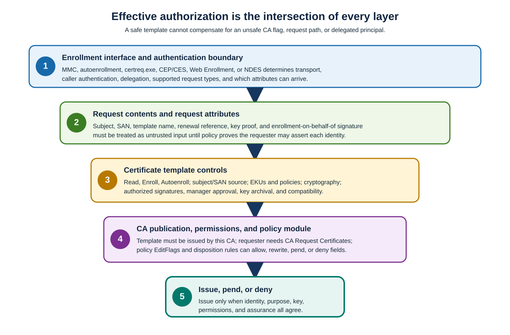

The following table separates template permissions from CA permissions and issuance controls. Read each row as one necessary layer rather than as a complete authorization decision by itself.

| Control | Meaning | Safe delegation |
|---|---|---|
| **Read** | Discover and read the template | Required for requesting principals and for every issuing CA computer account. If Authenticated Users is removed, explicitly grant Read to every issuing CA computer account. |
| **Enroll** | Submit against the template | Grant to a security group representing the exact identity population, not to individual accounts or broad authenticated populations. |
| **Autoenroll** | Permit the autoenrollment client to request/renew automatically | Also requires Read and Enroll plus client policy. It doesn't override manager approval or authorized-signature requirements. |
| **Write** | Change template attributes; it doesn't itself grant Write DACL or Write Owner | Treat as PKI policy administration; compromise can create an authentication issuance path. |
| **Full Control** | Change attributes, ACL, and ownership | Limit to a protected template-admin group; review owner and inherited rights. |
| CA **Request Certificates** | Submit requests to that CA | Necessary but not sufficient. Template permissions, publication, issuance requirements, and policy module must also authorize issuance. |
| CA certificate-manager rights | Approve/deny pending requests and perform configured management | Separate from template administration and enrollment; scope certificate-manager restrictions where supported. |

Use lifecycle groups such as `<TLS-Server-Enrollers>`, `<NPS-Servers>`, and `<Template-Admins>`. Group ownership and membership approval are part of the certificate control, not external housekeeping.

**CA certificate manager approval** is suitable for low-volume, high-impact exceptions where an approver can verify an external fact that automation can't. It creates queue dependency and expiry risk; define approver coverage, evidence, maximum pending age, and denial handling.

An **authorized signature** proves that a designated enrollment agent or policy signer approved/signed the request. Configure the required signature count and application policy. Enrollment-agent certificates are credential-equivalent: restrict who can obtain one, which templates and subjects the agent can enroll, where its key is stored, and how every on-behalf-of issuance is audited. Don't use an enrollment agent merely to bypass a bad subject-source design.

## Subject and SAN effective authorization

Evaluate identity across all layers:

- **Template Subject Name**: AD-built names bind the request to directory attributes; **Supply in the request** permits requester-provided names.
- **Request contents**: PKCS #10/CMC Subject and SAN extensions can assert identities; renewal can copy names from the old certificate.
- **Request attributes**: SAN or template attributes can carry additional values outside the signed extension depending on interface and policy.
- **CA policy-module `EditFlags`:** flags such as acceptance of SAN request attributes can broaden every template issued by that CA.
- **Enrollment interface**: MMC/autoenrollment, CES, Web Enrollment, NDES, and custom callers authenticate and delegate differently and don't expose identical fields.

The effective authorization is the union of accepted input paths constrained by the intersection of template ACL, CA ACL, template publication, issuance requirements, and policy processing. Review the CA policy module whenever reviewing a template.

## Procedure: Inspect CA policy

In the following procedure, you can inspect CA policy. You need CA Admin permissions to inspect/publish/unpublish and delegated template administrator or Domain Admin to create the replacement. It assumes that an unsafe template has been published to every issuing CA.

Run the following read-only command to record the CA policy module's `EditFlags` before changing the template or CA configuration.

```powershell
certutil.exe -getreg policy\EditFlags
```

To inspect the CA policy and remove the unsafe template:

1. In `certtmpl.msc`, inspect Subject Name, EKUs, Security, Issuance Requirements, exportability, and owner/Write permissions. A critical pattern is broad Enroll plus **Supply in the request** plus Client Authentication, Smart Card Logon, KDC Authentication, or Any Purpose.
1. In each **Certification Authority** console, identify whether the template is published. Unpublish it as containment; don't delete the AD object.
1. Query the CA database for certificates issued from `<TemplateName>`. Classify subjects, SANs, requesters, EKUs, status, and current reliance. Escalate anomalous identity issuance without publishing exploit steps.
1. Duplicate the closest narrow built-in. Build identity from AD DS where possible, retain only the workload EKU, deny export, use a scoped enrollment group, and add approval/signatures only when they validate a defined requirement.
1. Evaluate the CA-wide `EditFlags` result. Remove CA-wide SAN attribute acceptance through the approved hardening change if it isn't required; otherwise isolate the exceptional workload to a separate tightly governed issuance path.
1. Pilot the replacement, publish it only on approved CAs, verify relying-party behavior, then inventory and explicitly replace, revoke, or retain each old certificate according to risk and outage consequence.
