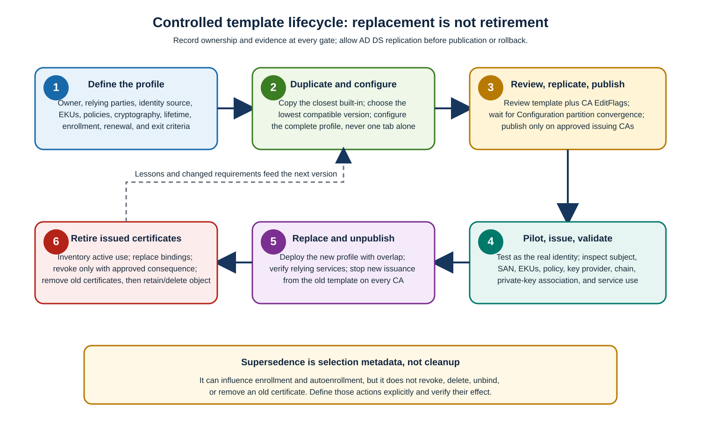

Certificate renewal asks a CA for another certificate related to an existing one. It doesn't guarantee that subject, SAN, template, provider, identity mapping, or key remains identical after policy changes. The following table identifies common profile changes and indicates when same-key renewal is unsafe or incapable of implementing the change.

| Profile change | Same-key renewal technically possible? | Required decision |
|---|---|---|
| Subject/SAN rule changes | Sometimes, but names may be copied from the old certificate or rebuilt from current AD DS depending on template/client settings | If removing or correcting identity, require a new request and verify the new names. Never assume renewal removes an obsolete SAN. |
| Provider or CSP/KSP family | No meaningful in-place move; the key belongs to its provider | Generate a new key under the target provider and replace the certificate/binding. |
| Algorithm change | No | Generate a new key and test every relying party. |
| Minimum key length increase | Existing shorter key doesn't become longer | Require a new compliant key. Don't let "renew with same key" preserve a now-noncompliant key. |
| Template schema/version or compatibility | Not automatically forced either way | Determine whether new settings require a different client, provider, key, or request shape; prefer parallel replacement for material changes. |
| Lifetime, EKU, policy OID | Same key may be possible | Decide whether extended key exposure is acceptable and verify the issued extensions. A purpose expansion normally warrants a new key and stronger approval. |
| Suspected compromise or ownership change | Must not reuse | Revoke as authorized, generate a new key, repair access, and validate active service binding. |

Define an overlap long enough for policy refresh, issuance, service binding, and rollback but short enough to limit duplicate credentials. Validate which certificate the service actually selects; newest issuance time alone doesn't guarantee selection.

## Stronger cryptography or post-quantum transition

Treat a cryptographic transition as a parallel profile migration, not an in-place algorithm edit. Inventory every CA, enrollment client, provider/HSM, protocol, relying party, inspection device, and recovery process. Create a separately named template, pilot dual certificates where the application supports deterministic selection, validate live handshakes/signatures, and retain a bounded rollback path. A post-quantum algorithm is eligible only when the specific Windows Server update, CA, provider, client, chain engine, and relying application all support it. Don't claim post-quantum assurance or configure an automatic classical fallback unless the approved transition design explicitly defines that mixed assurance.

## Safe retirement and supersedence limitations

Template supersedence tells enrollment and autoenrollment that a new template replaces one or more older templates for the same purpose; it doesn't revoke or remove certificates already issued from those templates. When retiring or superseding templates:

1. Create a new template instead of materially rewriting the old profile.
1. Publish to a pilot CA/population; validate issued fields, key, chain, and live relying services.
1. Configure supersedence only when the new profile truly replaces the same population and purpose.
1. Allow overlap and monitor enrollment/renewal failures.
1. Unpublish the old template on every CA to stop new issuance.
1. Inventory all old issued certificates, local stores, service bindings, hardware slots, and application caches.
1. Replace and verify active use. Revoke only when risk requires it and CRL/OCSP propagation and outage consequences are understood.
1. Remove obsolete certificates and private keys from endpoints under approved retention rules.
1. Retain the template object disabled/unpublished for audit unless deletion has an approved forest-wide requirement. Deletion isn't a certificate revocation mechanism.

> [!WARNING]
> **Revocation plus key deletion are disruptive or irreversible**: Before the next steps, prove the replacement is active, preserve encryption/decryption and signature-validation dependencies, confirm CRL/OCSP publication capacity, obtain service-owner approval, and record rollback evidence.

Supersedence influences enrollment and autoenrollment selection. It doesn't revoke, delete, remove, archive, or unbind certificates already issued. A relying service may continue selecting the old certificate until configuration or store cleanup changes.
