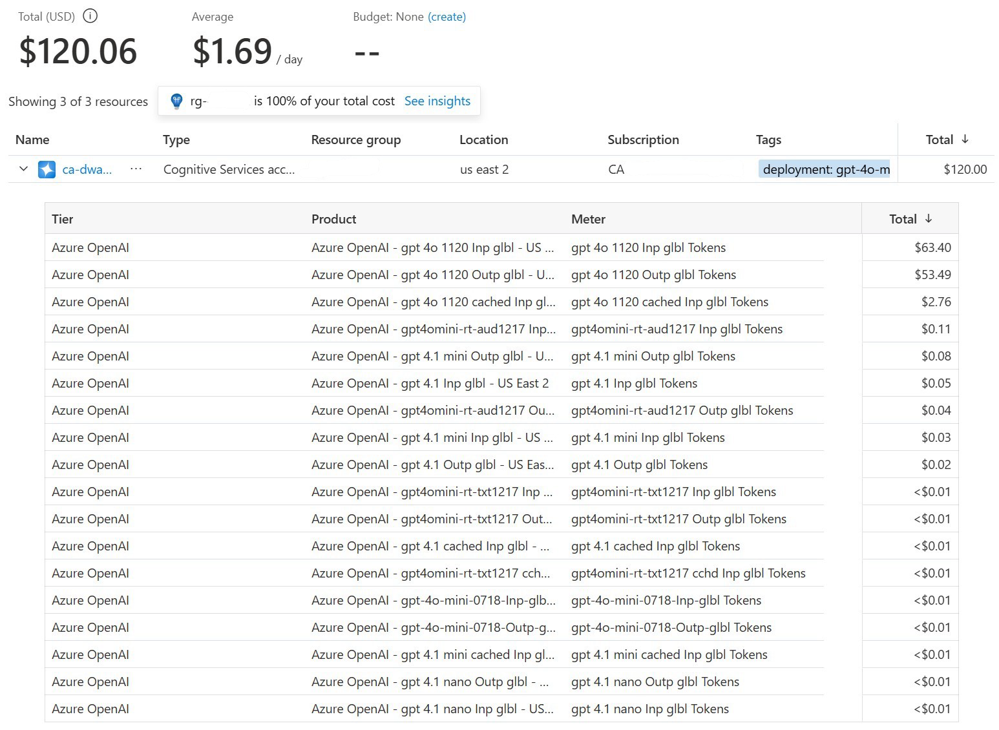

Once your AI application has been deployed, you want to carefully monitor its costs to see if your estimate (and budget) was accurate. At the end of the billing period, it appears on your Microsoft Azure invoice along with other resources in your Azure subscription. 

Remember, usage, and cost are related, but they're two different things. Usage is determined by how many calls and responses are made to your AI service, including factors like the quality of generative AI outputs, and can be influenced by the structure and accuracy of your LLMs. Cost is the dollar value associated with that usage, and can be influenced by your customer agreements or commitment discounts.   Let's start by looking at how to ensure visibility of the costs related to this workload.

## Resource groups

In Microsoft Azure, a resource group is like a folder where you can store different types of resources. All of the resources required for an application can be created in the same resource group. Resource groups can be found in the Azure portal and can be acted on by CLI commands including Azure PowerShell. They can also be used as a billing filter, giving you only the costs of the resources contained in that group, using Microsoft  Cost Analysis, Budgets, and via the Azure Cost Management Query API. 

If you want to easily view the cost data of your entire AI application, use its resource group.   

## Tagging

Another billing filter available in Microsoft Azure is tagging. Tagging enables you to add plain text metadata of a name and value pair, regardless of which resource group or region your resources are in. You may choose to tag individual resources with a specific cost center, department/function, or application name. This is helpful if you have a more complex application with front end and back-end components, and maybe some shared services. You can also use tags as a billing filter in Cost Analysis, Budgets, and via the Azure Billing REST API. 

## Cost analysis - Resource meters

Each resource in Microsoft Azure has Meters associated with it, that capture usage. You can use these as filters in Microsoft Cost Management + Billing's cost analysis reports. For example, grouping your subscription's cost data by Meter can show you which models & token types are costing you the most alongside other resource meters:

You can then select a meter, like "gpt 40 1120 inp glbl Tokens" and sort by resource to find which resources this cost is associated with. 

## Cost analysis - Azure OpenAI smart view

Microsoft Cost Management + Billing's cost analysis includes a prebuilt smart view for Azure OpenAI, filtered to only Azure OpenAI resources. You can expand your resource to see the input, output, and cached token cost across your deployed models.

## Cost analysis - filtering

Another way to break down your costs is with a prebuilt view in cost analysis, like Accumulated costs, then use the filters. This example displays the monthly costs to date for the AI + Machine Learning services, grouped by resource. You can select a resource then group by Meter to show the models' input, output, and cached token costs.

## Other methods for accessing cost data

If you want to go beyond the Cost Management views in the Azure portal, there are several other methods available to access your cost data. Microsoft Cost Management + Billing includes an export feature that automatically exports your Cost Management data to Azure storage on a daily or monthly basis. You can use the exported data with external systems and combine it with your own custom data.

You can also use the Microsoft Cost Management connector for Power BI Desktop to make powerful, customized visualizations and reports that help you better understand your Azure spending. Or you can use the Cost Management APIs directly to pull data about cost details, pricing, budgets and alerts, invoicing or reservations. These can help with invoice reconciliation, cross-charging, and cost trend reporting.
