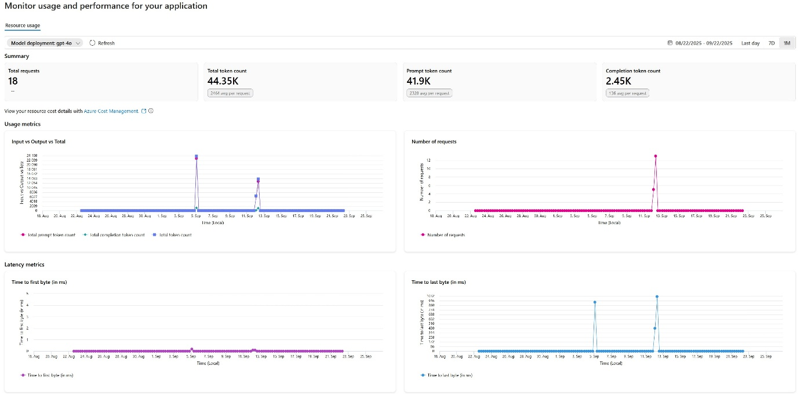

## Track token costs against budget thresholds

However you prefer to view your cost data, it's highly recommended that you configure Azure budget thresholds and alerts to notify you about cost accumulation before the invoicing date. Budgets and alerts can be set within the Azure portal, or by using Bicep, ARM templates, or the REST API. You can set budget amounts and alert thresholds (percentage of budget total) on entire subscriptions, resource groups, or individual resources.

With filters, you can select the specific Meter relating to the token type, like "gpt 40 112 input global tokens". This gives you visibility of the accumulated cost of that token type during the budget period (monthly, quarterly or annually).

## Cost Allocation

Customers with a Microsoft Customer Agreement (Enterprise), a Microsoft Customer Agreement (Online), or an Enterprise Agreement can take advantage of a feature in Microsoft Cost Management + Billing to allocate costs elsewhere. This doesn't change the Microsoft invoice details but facilitates internal cross-charging back to the correct department or cost center, especially when an application uses shared services located in a different resource group, subscription, or using different tag metadata.

This is achieved by setting up cost allocation rules, which specify the source subscription, resource group, or tags and the subscriptions, resource groups, or tags that you wish to allocate the costs to instead. You can split out computer, storage or network costs, or decide on a fixed percentage relative to the source's current billing month costs. You can also distribute the costs evenly across your targets or manually allocate each target a whole number percentage.

**Note:** While cost allocation doesn't allow you to split out costs based on models or tokens, it can be useful if your AI workload uses shared service components that you need to incorporate into the actual cost of this AI workload.

## Usage visibility

An increase in AI costs can mean growth in how much your application is being used, or an anomaly in your models. You may want to dig deeper into how that cost was generated, by exploring the usage metrics of your AI services.

### Resource details in the Azure portal

For Azure OpenAI resources, you can access the most important token metrics via the Overview blade, Monitor tab. This displays HTTP requests, token-based usage, PTU utilization, fine-tuning, and latency. For more detailed charts, use the Metrics blade under the Monitoring section.

### Azure AI Foundry

Token usage and latency metrics are also available in Azure AI Foundry, in the Monitoring tool.

