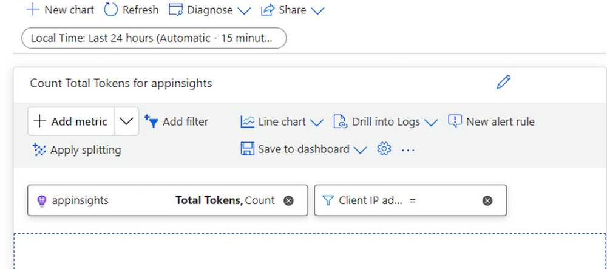

The previous cost & usage management methods assumed that you were managing the cost of an LLM as one whole unit, perhaps distinguishing between input and output tokens. But what if your model deployment is serving multiple applications, developer teams or departments across your organization? 

Azure API Management includes capabilities for generative AI APIs, with a range of policies, metrics, and other features to enhance security, performance, and reliability for the APIs serving your intelligent apps. These are collectively known as "AI gateway capabilities."

## Emit Token Metric with Azure API Management Gateway

The "emit token metric" policy sends metrics to Application Insights about consumption of LLM tokens through Azure OpenAI Service APIs. This helps provide an overview of the utilization of Azure OpenAI Service models across multiple applications or API consumers and is useful for chargeback scenarios, monitoring, and capacity planning. It captures prompt, completions, and total token usage metrics and sends them to an Application Insights namespace of your choice. You can also configure or select from predefined dimensions to split token usage metrics, so you can analyze metrics by:

- API ID
- Operation ID
- Product ID
- User ID
- Subscription ID
- IP address
- Location
- Gateway ID
- or a custom dimension of your choice.

This enables you to calculate usage metrics for billing based on the number of tokens consumed by each application or API consumer (for example, segmented by subscription ID or IP address).

Example: Filtering the Applications Insights token metrics data to specific originating client IP address:

API Management also enables you to log requests processed by the gateway for large language model REST APIs. 

> [!NOTE]
> These capabilities require the deployment of an API Management Service resource and an Application Insights resource, at additional cost.
