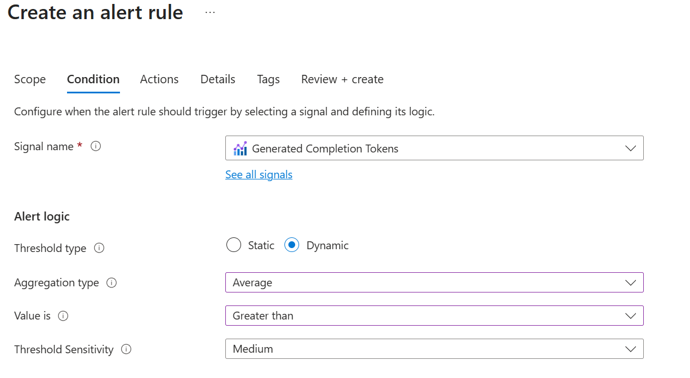

We've discussed how you can investigate the cost and usage metrics of your AI application, but it can be useful to monitor usage metrics to be alerted of any spikes, which could lead to increased costs if left unchecked. This can be achieved using Azure Monitor to read the platform metrics of your application.

Steps:  

1. In your Azure OpenAI resource, navigate to the Monitoring section and select the Alerts pane.
1. Create an alert rule and in the Condition tab, choose "See all signals" under the signal name selection box. You're presented with a list of platform metrics, including:
1. Active tokens
1. Generated completion tokens
1. Input tokens
1. Output tokens
1. Processed inference tokens
1. Processed prompt tokens
1. Total tokens
1. If you don't wish to enter a static threshold value to trigger the alert, you can take advantage of dynamic thresholds. Dynamic thresholds analyze the metrics of the application over time to learn what is normal, based on the application's historical behavior. In this example below, the alert triggers if the number of generated completion tokens are greater than the historic average number of generated completion tokens for this app. This might indicate a sudden increase in demand for this application, or a problem that needs to investigate. You can also detect for metrics less than the average, which may also indicate a problem with your application.

1. On the actions tab, you can create or select an action group to trigger automation, like automatically creating a service desk ticket in another system.

> [!NOTE]
> While monitoring token metrics can help you manage your AI costs, you should also explore other observability features (like AI Foundry's evaluators) to measure the quality, safety, and reliability of your AI responses.
