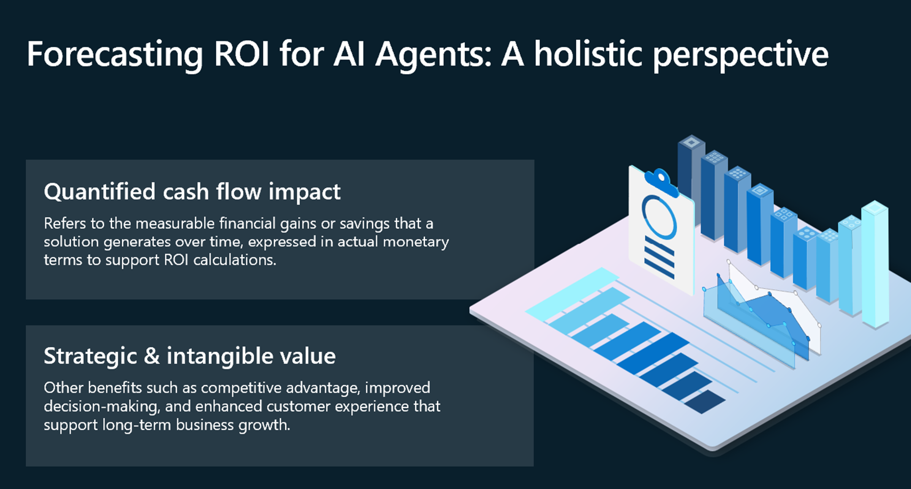

As AI agents become deeply integrated into business workflows, the
imperative to quantify their financial impact grows stronger.
Organizations can no longer rely solely on anecdotal success stories or
qualitative assessments. Instead, they must adopt rigorous, repeatable
frameworks to measure the tangible and strategic value of AI
investments.

To accurately assess the return on investment (ROI) of AI initiatives,
it's essential to recognize that value manifests across multiple
dimensions. While traditional ROI models emphasize direct financial
outcomes, AI often delivers strategic and intangible benefits that are
equally critical to long-term success. These include enhanced
decision-making, improved customer experience, sustained competitive
advantage, and many other benefits.

By understanding and quantifying these layers of value, organizations
can make data-driven decisions, prioritize high-impact initiatives, and
ensure that AI investments align with broader business goals.

**Quantified Cash Flow Impact**

This dimension refers to the measurable cash flow gains generated by AI
solutions, expressed in monetary terms. It forms the foundation of
traditional ROI calculations and might include:

- **Revenue Uplift**
  For example: AI agents that support personalization, dynamic pricing,
  and predictive analytics increasing conversion rates and average deal
  sizes.
- **Spending Optimization**
  For example: AI agents that negotiate spot purchases (< $10,000)
  which might not be negotiated at the moment.
- **Efficiency Gains**
  For example: AI agents that accelerate workflows, reduce cycle times,
  and improve resource utilization, translating into time savings and
  productivity improvements.
- **Risk Mitigation**
  For example: AI agents that help identify fraud, predict equipment
  failures, or flag compliance issues early, reducing potential
  financial losses.

These impacts should be tracked over time using KPIs such as cost per
interaction, customer lifetime value (CLV), sales velocity, and
operational throughput, enabling organizations to build robust business
cases for AI adoption.

**Strategic & Intangible Value**

Beyond measurable cash flow gains, AI agents also deliver strategic
advantages that are harder to quantify but crucial for sustainable
growth:

- **Enhanced Decision-Making**
  For example: AI augments human judgment with data-driven insights,
  enabling faster and more accurate decisions across functions.
- **Improved Customer Experience**
  For example: AI-powered recommendation engines, and sentiment analysis
  tools personalize interactions and boost satisfaction.
- **Scalability & Agility**
  For example: Scale operations without linear increases in headcount
  and adapt quickly to market changes.
- **Innovation Enablement**
  For example: AI experimentation that unlocks new business models,
  products, and services.
- **Brand Differentiation**
  For example: AI can position a company as a technology leader,
  attracting talent, partners, and customers.

While these benefits may not always be reflected in immediate cash flow,
they contribute to long-term enterprise value and should be captured
through qualitative assessments, strategic KPIs, and scenario modeling.
