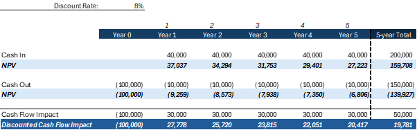

As organizations increasingly adopt AI agents to automate tasks, enhance decision-making, or improve customer experiences across various use cases, understanding the financial impact of these investments becomes critical. Forecasting the return on investment (ROI) for AI agents
involves more than just calculating cost savings, it requires evaluating long-term value creation, strategic alignment, and associated risks.

## What is ROI and How to Calculate It

Return on Investment (ROI) is a key metric used to evaluate the profitability of a project or investment. For AI agent deployments, ROI
helps quantify the financial return relative to the total cost of implementation and maintenance.

**Basic ROI Formula**

ROI% $= \dfrac{\mathrm{Benefits} - (\mathrm{Cost\ to\ Achieve} + \mathrm{Cost\ to\ Maintain})}{\mathrm{Cost\ to\ Achieve} + \mathrm{Cost\ to\ Maintain}} \times 100$

This formula accounts for both the initial investment and ongoing operational costs, giving a more realistic view of long-term returns.

Table: Components and drivers

| Category          | Components                                        | Drivers |
|-------------------|---------------------------------------------------|---------|
| Benefits          | Business growth                                   | • Additional revenue from increased volume (existing products) • Additional revenue from new products |
| Benefits          | Cost savings                                      | • Non-IT cost savings from spending optimization • IT cost savings from retired legacy technology |
| Benefits          | Productivity improvement                          | • Application users’ productivity from manual process automation • Data scientists and Machine Learning engineers' productivity |
| Cost to achieve   | Implementation and application building           | • Upfront internal labor costs • Upfront external costs |
| Cost to achieve   | Training and change management                    | • Upfront internal labor costs (users and engineers) • Upfront external costs |
| Cost to maintain  | Cloud consumption and software licenses           | • Ongoing costs resulting from cloud consumption • Ongoing costs from software licenses |
| Cost to maintain  | Models/applications’ management and quality assurance | • Ongoing internal labor costs (data scientists and engineers) • Ongoing internal labor costs (quality assurance) |

## Step-by-Step Guide to Forecast ROI for AI Agent Investments

### Step 1: Estimate the Cost to Achieve

This includes all upfront costs. For example:

- Development, integration, and deployment
- Training and change management

### Step 2: Estimate the Cost to Maintain

Include recurring costs such as:

- Cloud hosting or software licenses
- Monitoring and optimization
- Quality assurance

### Step 3: Forecast the Financial Benefits

Estimate the total value generated by the AI agent. For example:

- Revenue growth
- Spending optimization
- Time saved by employees

### Step 4: Plug Values into the ROI Formula

**Example:**

- Cost to Achieve = $80,000
- Cost to Maintain = $20,000/year × 3 years = $60,000
- Total Benefits over 3 years = $200,000

When used with the formula to calculate ROI this achieves a result of 42.86%

$$
ROI\% = \frac{200{,}000 - (80{,}000 + 60{,}000)}{80{,}000 + 60{,}000} \times 100
= \frac{60{,}000}{140{,}000} \times 100
= 42.86\%
$$

### Step 5: Interpret the Result

- **ROI > 0%** → Profitable investment

- **ROI < 0%** → Loss-making investment

A 42.86% ROI means the AI agent is expected to return nearly 43% more value than it costs over the investment period.

## Evaluating ROI from a Multi-Year Perspective Using NPV

ROI calculation should embed Net Present Value (NPV) to reflect the time value of money as AI agents' investments are often assessed over a 3 to
5-year horizon. Indeed, future benefits are worth less than they appear today due to the cost of capital, inflation and risks.

That's why we calculate ROI using the NPV of both benefits and costs, discounting future cash flows to their present value. This approach
ensures a more realistic and financially sound assessment of multi-year investments in AI agents.

## Step-by-Step Guide to Calculate Net Present Value (NPV)

### Step 1: Understand the Concept

NPV accounts for the time value of money, meaning that a dollar today is worth more than a dollar in the future.

It does this by discounting future cash flows back to their present value using a rate that accounts for the company's cost of capital,
expected returns, inflation, and risk. The further into the future those benefits or costs occur, the more heavily they're discounted, ensuring
that long-term investments are evaluated in today's financial terms.

NPV provides a clear signal on whether an investment should be approved or rejected.

### Step 2: Gather Your Inputs

To calculate NPV, you need:

- **Initial Investment (I):** The upfront cost of the AI agent.
- **Annual Cash Flows Impact (CF):** The expected yearly cash flow
  impact.
- **Time Horizon (n):** The number of years the AI agent investment is
  assessed against.
- **Discount Rate (r):** The rate used to discount future cash flows
  (for example, 8%, which your finance team could provide).

### Step 3: Apply the NPV Formula

The formula is:

$$
NPV = \sum_{t=1}^{n} \frac{CF_t}{(1 + r)^t} - I
$$

Where:

- *CF**t* = cash flow in year *t*
- *r* = discount rate
- *n* = number of years
- *I* = initial investment

### Step 4: Run an Example

Let's say:

- Initial Investment = $100,000
- Annual Cash Flow Impact (positive) = $30,000
- Time Horizon = 5 years
- Discount Rate = 8%

Then:

The 5-year discounted cash flow impact (NPV) is 19,781 dollars. Without applying the discount rate, the cash flow impact would be 50,000 dollars.

### Step 5: Interpret the Result

- NPV of the cash flow impact > 0 → Investment could be approved (subject to budget constraints)
- NPV of the cash flow impact < 0 → Investment should be rejected

## Understanding Sensitivity Analysis for AI Investments

AI investments often involve uncertainty around key variables such as adoption rates, operational costs, and performance outcomes. Sensitivity analysis is a technique used to evaluate how changes in these assumptions affect the projected return on investment (ROI). By modeling different scenarios, such as optimistic, conservative, and baseline, organizations can better understand the risk exposure and potential rewards of deploying AI agents. This approach helps decision-makers identify which variables have the greatest impact on ROI and where to focus mitigation strategies or further research.

### Step-by-Step Guide to Conducting Sensitivity Analysis

### Step 1: Identify Key Variables

Start by listing the assumptions that significantly influence ROI. For
AI agents, these might include:

- Adoption rate (for example, % of users actively using the AI agent)
- Development cost (for example, agents' building and change management)
- Operational cost (for example, maintenance, updates, cloud usage)
- Performance outcomes (for example, time saved, errors reduced, revenue
  generated)

### Step 2: Establish a Baseline Scenario

Define the expected values for each variable based on current data or
forecasts. For example:

- Adoption rate: 70%
- Development cost: $90,000
- Operational cost: $12,000/year
- Annual savings: $48,000/year

### Step 3: Create Alternative Scenarios

Model how ROI changes when each variable is adjusted. Common approaches include:

- Optimistic scenario: Higher adoption, lower costs, better performance
- Conservative scenario: Lower adoption, higher costs, modest performance
- Worst-case scenario: Minimal adoption, unexpected costs, poor performance

### Step 4: Calculate ROI and NPV for Each Scenario

Use the NPV formula or ROI calculation to assess financial impact under each scenario.

**Example:**

- Baseline NPV = $50,000
- Optimistic NPV = $140,000
- Conservative NPV = $1,000
- Worst-case NPV = -$50,000

### Step 5: Visualize the Results

Use a table or chart to show how changes in each variable affect ROI or NPV. This helps stakeholders quickly grasp the range of outcomes.

### Step 6: Interpret and Communicate Findings

Highlight which variables have the most influence. For example, if the adoption rate swings NPV by $50,000, it's a critical factor. Use this insight to guide investment decisions, risk planning, or further analysis.
