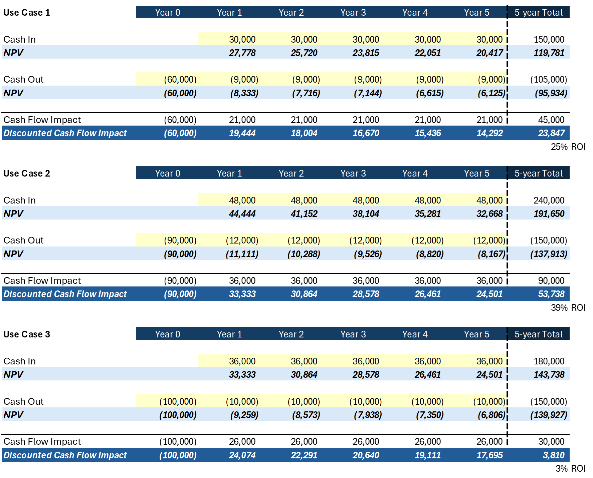

This unit is designed to help nonfinance professionals apply the concepts outlined in earlier units in a simple, practical way. You learn how to compare three AI use cases using a step-by-step method that combines ROI, NPV, and strategic value, without needing a finance background.

## Step-by-Step Framework Example

In this example, we walk through a simplified, fictional analysis of three AI agent use cases (intended solely for demonstration purposes) to illustrate how the concepts from previous units can be applied in a practical evaluation.

### Step 1: Define scope

AI Agent use cases to be evaluated:

- Use case 1
- Use case 2
- Use case 3

Each is evaluated using:

- ROI: Return on Investment
- NPV: Net Present Value
- Strategic Value: A simple score from 1--10 based on business impact
- Sensitivity Analysis: How results change under different scenarios

### Step 2: Comparing the 3 Use Cases

Example:

|  |Use case 1  |Use case 2  |Use case 3  |
|---------|---------|---------|---------|
|Cost to achieve     |$60,000         |$90,000         |$100,000         |
|Cost to maintain (5 yrs)     |$45,000         |$60,000         |$50,000         |
|Total benefit (5 yrs)     |$150,000         |$240,000         |$180,000         |
|Cash flow impact ($)     |$45,000         |$90,000         |$30,000         |
|Discounted cash flow impact, for example, NPV (4)     |$23,847         |$53,738         |$3,810         |
|ROI (%)     |25%         |39%         |3%         |
|Strategic value (1-10)     |7.5         |9.0         |6.5         |

**Use Case Comparison Table Explained**

In the comparison table, we estimated the cost to achieve and cost to maintain each AI use case based on typical implementation and operational expenses. For example, the "use case 1" has lower upfront costs due to simpler integration, while the "use case 2" requires more
customization and training. The total benefits were forecasted by estimating the value of time saved, increased revenue, and reduced errors over a 5-year period. These values were then plugged into the basic ROI formula:

**ROI (%) = (Total Benefits - Total Costs) / Total Costs × 100**

This gives us a clear percentage showing how much return each investment is expected to generate. The strategic value score (1--10) was added to reflect qualitative benefits like customer experience, innovation, and scalability, based on how each use case aligns with broader business
goals.

A use case might have a positive ROI but low NPV; it's important to consider both metrics when making a prioritization decision between investments.

### Step 3: Sensitivity Analysis (NPV Range)

A sensitivity analysis table assists with assessing NPV range:

|  **Use Case 2**    |Optimistic     |Baseline       |Conservative   |Worst Case
|--------------|--------------|--------------|--------------|--------------|
|Cost to achieve      |$70,000       |$90,000       |$110,000      |$130,000|
|Benefits       |$320,000      |$240,000      |$200,000      |$160,000|
|NPV            |$137,621      |$53,738       |$1,796        |-$50,146|

The example sensitivity analysis table shows how each use case performs under different scenarios: optimistic, baseline, conservative, and worst-case. These scenarios were modeled by adjusting key variables such as adoption rate, operational efficiency, and unexpected costs impacting
the cost to achieve and the benefits.

In the optimistic case, we assumed higher adoption and lower development cost, leading to higher NPV. In the worst-case scenario, we assumed low usage and higher-than-expected development costs, which significantly reduced the financial return.

This helps illustrate how risk and uncertainty can affect the outcome, and why it's important to test different assumptions before making a final decision.

### Step 4: Interpret the Results

- Use case 2 shows non-negative financial outcome (NPV) even in a conservative scenario.
- If we believe its development cost will be $90,000, use case 2 needs to generate at least $200,000 in benefits over 5 years to result in a positive financial outcome (NPV).
