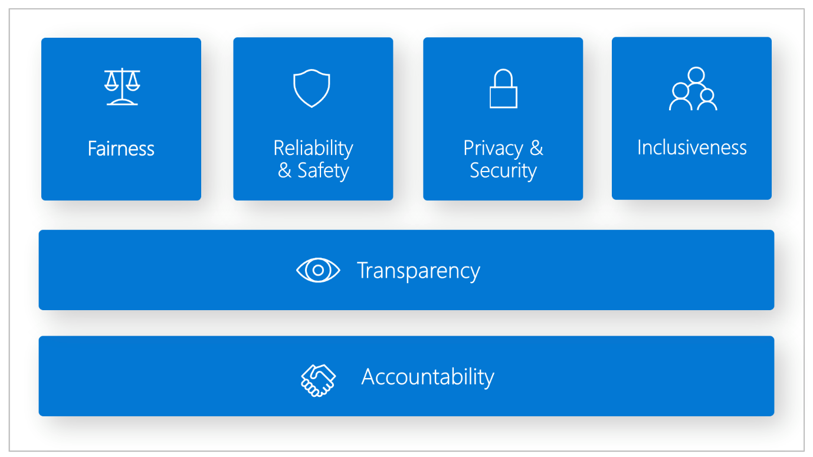

AI security is the practice of protecting computer systems, networks, devices, and data from digital attacks, unauthorized access, damage, or theft. The primary goal of cybersecurity is to ensure the confidentiality, integrity, and availability of digital assets and information. Security professionals working in the AI security space must design and implement security controls to protect the assets data and information contained within AI enabled applications. 

## How is AI security different from traditional cyber security?

AI security is different from traditional cybersecurity due to the nature of AI's learning capabilities and decision-making processes. The output of generative AI models won't always be the same. This lack of predictability poses challenges when designing security controls. The complex input and output of generative AI products makes applying security controls challenging. Constraining input to a UI element or API to limit the attack surface is an understood known security control, but you can't do the same with a natural language interface without fundamentally undermining its utility.

Other considerations specific to AI security include, but aren't limited to:

- Integrity of the AI model
- Integrity of the training data
- Responsible AI (RAI) concerns
- Adversarial AI attacks
- AI model theft
- Overreliance on AI
- Nondeterministic (creative) nature of generative AI

One of the biggest challenges with AI security is that the field is developing rapidly with new features and technology. This makes it challenging for security professionals to keep up to date with the scope and capabilities of the technology and thus it's challenging to have the correct security controls in place to secure these systems.

## Why does responsible AI matter for cyber security?

Responsible Artificial Intelligence (Responsible AI) is an approach to developing, assessing, and deploying AI systems in a safe, trustworthy, and ethical way. AI systems are the product of many decisions made by those who develop and deploy them. From system purpose to how people interact with AI systems, Responsible AI can help proactively guide these decisions toward more beneficial and equitable outcomes. That means keeping people and their goals at the center of system design decisions and respecting enduring values like fairness, reliability, and transparency.

Microsoft's Responsible AI Standard is a framework for building AI systems according to six principles: fairness, reliability and safety, privacy and security, inclusiveness, transparency, and accountability. For Microsoft, these principles are the cornerstone of a responsible and trustworthy approach to AI, especially as intelligent technology becomes more prevalent in products and services that people use every day.

AI harms are issues in cybersecurity that are specific to AI systems. Some of these AI harms would also be considered cybersecurity issues, but some of them go further than this and would also be considered privacy and ethical issues. AI blurs the lines between the traditional split of cybersecurity and ethics. It is important that security professionals understand responsible AI holistically in order to create secure and responsible AI systems.

Examples of security-specific AI harms:

- Privacy violations
- Excessive over reliance on AI

Examples of other AI harms:

- Producing content that violates policies (e.g., harmful, offensive, or violent content)
- Access to dangerous capabilities of the model (e.g., producing actionable instructions for dangerous or criminal activity)
- Subversion of decision-making systems (e.g., making a loan application or hiring system produce attacker-controlled decisions)
- Causing the system to misbehave in a newsworthy and screenshot-able way
- IP infringement