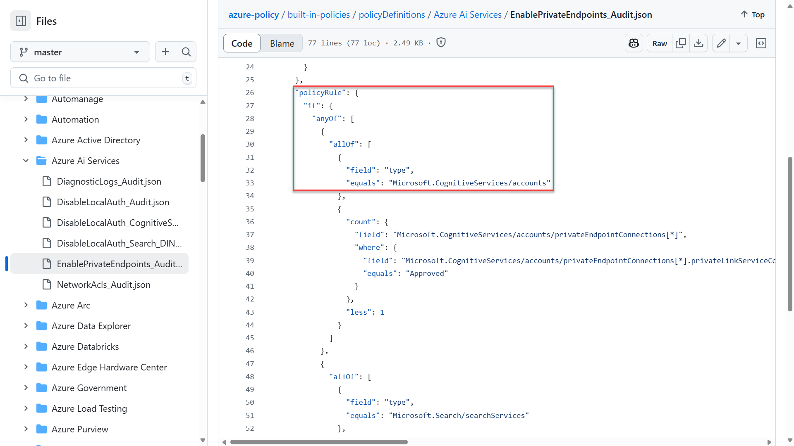
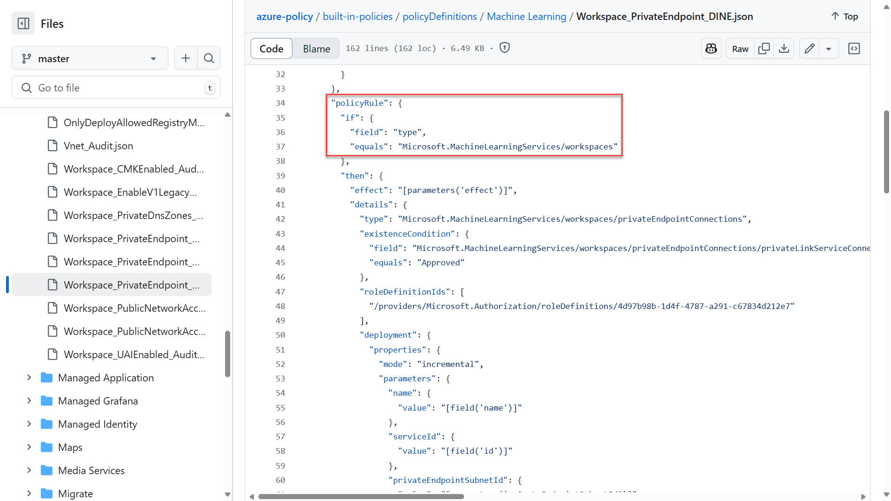

Azure Policy helps to determine that your organization's deployed workloads comply with regulatory requirements and organizational standards.

Azure Policy evaluates resources and actions in Azure by comparing the properties of those resources to business rules. These business rules, described in JSON format, are known as policy definitions. To simplify management, several business rules (policy definitions) can be grouped together to form a policy initiative, also referred to as a policySet. After your business rules are formed, the policy definition or initiative is assigned to any scope of resources that Azure supports. For example, management groups, subscriptions, resource groups, or individual resources. You can create new policy definitions and initiatives, or you can use preexisting, built-in policies created by Microsoft.

Some businesses workload deployments need to comply with government regulatory standards such as FedRAMP. To help these organizations, Microsoft has created policy initiative definitions, known as built-ins, that map to the compliance domains and security controls included in important compliance standards. For example, an organization that must comply with FedRAMP can apply the FedRAMP Moderate or FedRAMP High initiatives available in Azure Policy to assess the compliance of a workload's configuration.

As an AI workload operations administrator, Azure it's your responsibility to ensure services are following the business, security, and regulatory guidelines for your company. In that role, you should consider using Azure Policy with the following services:

- Azure AI services: This is a suite of Azure services to help developers create applications with out-of-the-box, prebuilt, and customizable APIs and models. Services in this suite include Azure OpenAI service, Azure AI Search, Azure AI Document Intelligence, and more.
- Azure AI Foundry: Azure AI Foundry is a cloud service for the full lifecycle of application development. With AI Foundry developers can explore, build, test, and deploy AI tools and ML models.
- Azure Machine Learning: Azure Machine Learning is a cloud service for accelerating and managing the machine learning (ML) project lifecycle.

Policy definitions or initiatives have a scope to which they're applied to. When you apply the scope of a Resource Group (or another scope) to a definition or initiative, the JSON file for the underlying policy definition targets resources based on the resource type.

Here's an example definition for an audit policy to enable the usage of Private Endpoint for Azure AI services on GitHub:

This definition runs under its scope against any resource of type Microsoft.CognitiveServices. When you analyze the resource ID structure of a service such as Azure OpenAI, you can see the resource type: /subscriptions/\<subscriptionID>/resourceGroups/\<RG-name>/providers/Microsoft.CognitiveServices/accounts/ContosoAIDemo

The result is this resource (Azure OpenAI) will be affected by the policy definition, unless an explicit exclusion is in place. The same will be true for any Azure AI service as they have the same resource type attribute.

> [!NOTE]
> Some Azure services branded under "Azure AI services" have different resource ID designations, such as Azure AI Search. The JSON files for policy definitions under "Azure AI services" should have both resource ID types listed as part of their rules. However, the service itself might have extra definitions that are applicable to the service only.

Here's an example definition for an audit policy to deploy a private endpoint to Azure Machine Learning:

The policy definition targets resources of type "Microsoft.MachineLearningServices". When you analyze the resource ID structure of BOTH Azure Machine Learning and Azure AI Foundry, you can see the same structure:

- Azure Machine Learning: /subscriptions/\<subscriptionID>/resourceGroups/\<RG-name>/providers/Microsoft.MachineLearningServices/workspaces/ContosoML
- Azure AI Foundry: /subscriptions/\<subscriptionID>/resourceGroups/\<RG-name>/providers/Microsoft.MachineLearningServices/workspaces/ContosoAIFoundryDemo

The result is both resources are affected by these policy definitions, unless an explicit exclusion is in place.

Consider the following best practices when managing Azure Policy:

- Granular scoping: Assign policies at the appropriate scope to balance control and flexibility. For example, apply at the subscription level to control all resources in the subscription, or apply at the resource group level to control resources in a specific group.
- Policy naming: Use a consistent naming convention for policy assignments to make it easier to identify the purpose of the policy. Include information such as the purpose and scope in the name.
- Documentation: Keep records of policy assignments and configurations for auditing purposes. Document any changes made to the policy over time.
- Regular reviews: Periodically review policy assignments to ensure they align with your organization's requirements.
- Testing: Test policies in a nonproduction environment before applying them to production resources.
- Communication: Make sure developers are aware of the policies in place and understand the implications for their work.