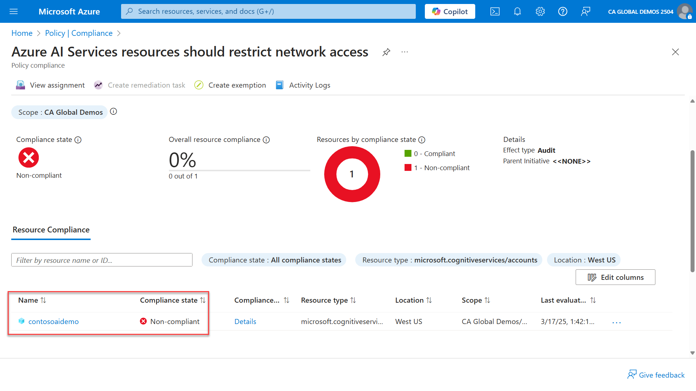

To apply a policy definition to an Azure AI service:

> [!NOTE]
> For the example below, Azure OpenAI is used as the target resource. This process can be used for any other Azure AI service. This process can also be used for Azure Machine Learning and Azure AI Foundry by changing the target of your policy definition.

1. On the Azure portal, select the Search resources, services, and docs option at the top and type Policy.
1. Select the Policy icon in the results.
1. On the left-hand side menu, select Compliance.
1. On the Compliance page, select Assign policy.
1. On the scope, select the scope to which you want to assign this policy. You can select, for example, a Resource Group.
1. Under Basics, select the ellipsis to select the Policy definition.
1. Type "Azure ai service" in the search and select "Azure AI Services resources should restrict network access". Select Add.
1. For this implementation, we use the default settings. Select Review + Create and select Create.
1. You receive a notification Creating policy assignment succeeded, which notes that it takes 5-15 minutes for it to take effect.
1. Once the policy is in effect, you can check out the status of the policy you deployed on the Compliance page.
1. Select the policy Azure AI Services resources should restrict network access.
1. On the policy page, scroll down to check which resource is in noncompliant state:

Azure Policy evaluates the state of a resource to enforce organizational standards and to assess compliance. You can apply the following list of built-in policies to Azure AI services directly from the Azure portal:

| **Name** | **Description** |
|---|---|
| **Azure AI Services resources should encrypt data at rest with a customer-managed key (CMK)** | Using customer-managed keys to encrypt data at rest provides more control over the key lifecycle, including rotation and management. This is relevant for organizations with related compliance requirements. This isn't assessed by default and should only be applied when required by compliance or restrictive policy requirements. If not enabled, the data is encrypted using platform-managed keys. To implement this, update the 'Effect' parameter in the Security Policy for the applicable scope. |
| **Azure AI Services resources should have key access disabled (disable local authentication)** | Key access (local authentication) is recommended to be disabled for security. Azure OpenAI Studio, typically used in development/testing, requires key access and won't function if key access is disabled. After disabling, Microsoft Entra ID becomes the only access method, which allows maintaining minimum privilege principle and granular control. |
| **Azure AI Services resources should restrict network access** | By restricting network access, you can ensure that only allowed networks can access the service. This can be achieved by configuring network rules so that only applications from allowed networks can access the Azure AI service. |
| **Azure AI Services resources should use Azure Private Link** | Azure Private Link lets you connect your virtual network to Azure services without a public IP address at the source or destination. The Private Link platform reduces data leakage risks by handling the connectivity between the consumer and services over the Azure backbone network. |
| **Cognitive Services accounts should use a managed identity** | Assigning a managed identity to your Cognitive Service account helps ensure secure authentication. This identity is used by this Cognitive service account to communicate with other Azure services, like Azure Key Vault, in a secure way without you having to manage any credentials. |
| **Cognitive Services accounts should use customer owned storage** | Use customer owned storage to control the data stored at rest in Cognitive Services. |
| **Configure Azure AI Services resources to disable local key access (disable local authentication)** | Key access (local authentication) is recommended to be disabled for security. Azure OpenAI Studio, typically used in development/testing, requires key access and won't function if key access is disabled. After disabling, Microsoft Entra ID becomes the only access method, which allows maintaining minimum privilege principle and granular control. |
| **Configure Cognitive Services accounts to disable local authentication methods** | Disable local authentication methods so that your Cognitive Services accounts require Microsoft Entra identities exclusively for authentication. |
| **Configure Cognitive Services accounts to disable public network access** | Disable public network access for your Cognitive Services resource so that it's not accessible over the public internet. This can reduce data leakage risks. |
| **Configure Cognitive Services accounts with private endpoints** | Private endpoints connect your virtual networks to Azure services without a public IP address at the source or destination. By mapping private endpoints to Cognitive Services, you reduce the potential for data leakage. |
| **Diagnostic logs in Azure AI services resources should be enabled** | Enable logs for Azure AI services resources. This enables you to recreate activity trails for investigation purposes, when a security incident occurs or your network is compromised |
| **Enable logging by category group for Cognitive Services (microsoft.cognitiveservices/accounts) to Event Hub** | Resource logs should be enabled to track activities and events that take place on your resources and give you visibility and insights into any changes that occur. This policy deploys a diagnostic setting using a category group to route logs to an Event Hubs for Cognitive Services (microsoft.cognitiveservices/accounts). |
| **Enable logging by category group for Cognitive Services (microsoft.cognitiveservices/accounts) to Log Analytics** | Resource logs should be enabled to track activities and events that take place on your resources and give you visibility and insights into any changes that occur. This policy deploys a diagnostic setting using a category group to route logs to a Log Analytics workspace for Cognitive Services (microsoft.cognitiveservices/accounts). |
| **Enable logging by category group for Cognitive Services (microsoft.cognitiveservices/accounts) to Storage** | Resource logs should be enabled to track activities and events that take place on your resources and give you visibility and insights into any changes that occur. This policy deploys a diagnostic setting using a category group to route logs to a Storage Account for Cognitive Services (microsoft.cognitiveservices/accounts). |

Alternatively, you can leverage Regulatory Compliance in Azure Policy, which provides Microsoft-created and managed initiative definitions for the compliance domains and security controls related to different compliance standards, such as FedRAMP, SOC, and others.