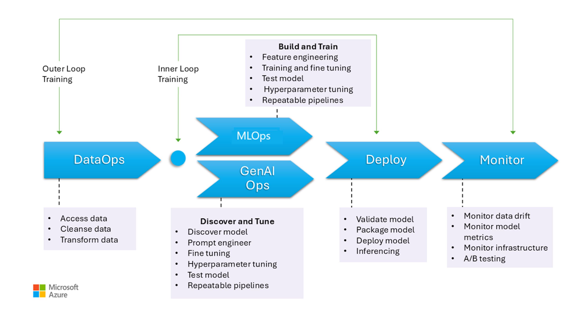

A generative AI CoE typically focuses on setting direction, defining strategies, providing support, establishing metrics, and monitoring the impact of generative AI initiatives. A generative AI CoE provides an organization with a central location and set of people that have the knowledge, skills, and capabilities to effectively leverage AI. When properly implemented, a generative AI CoE holds the authority and influence within an organization needed to drive adoption of generative AI solutions.

GenAIOps is a set of methods and practices aligned with the deployment, management, and operation of generative AI workloads. To build effective GenAI solutions, developers need to select the right models, and also understand how these models fit into the broader operational framework to develop an application. The end-to-end application development of a GenAI solution is also referred to as Large Language Model Operations (LLMOps), or GenAI Operations (GenAIOps). GenAIOps involves tasks like model discovery and refining pretrained models with enriched data. The overall goal of GenAIOps is capability delivery with efficient operations throughout the development lifecycle. The expected outcomes are:

- Repeatable processes with consistent results.
- Sustained accuracy of the models over time.
- Effective governance that minimizes risks.
- Change management processes for adapting to model drift.

An organization's generative AI CoE can help ensuring that appropriate GenAIOps processes are implemented throughout a generative AI workload's lifecycle. GenAIOps methods and practices include the following elements:

- The workload integrates security and compliance technologies. Security and compliance are built into the workload rather than addressed as an ancillary concern.
- Model choice and refinement. Evaluate existing models to identify one that's pretrained for the specific workload use case. Refine the model for domain-specific grounding.
- Monitoring and Metrics. Ensure that generative AI workloads are continually  assessed to determine if they meet organizational needs, are cost effective, and meet Return on Investment (ROI) goals. Also determines whether the output of the AI workload is generating appropriate or anomalous results.
- Workload governance. Ensure that workloads include the appropriate mechanisms to allow them to configured meet relevant governance and compliance requirements, and that the workloads meet those requirements.
- Ensures that workloads include versioning and rollback mechanisms. This allows the workload deployment to be automated, for updates to be rolled out quickly, and for rollback to occur should a new deployment lead to undesired outcomes.

While an organization's generative AI CoE provides strategic guidance, frameworks, and recommended best practices for GenAIOps, the implementation and operational execution of these frameworks is usually managed by individual dedicated teams within the organization. 

The CoE facilitates GenAIOps processes by providing training, templates, and governance policies. The CoE helps ensure that workloads are implemented with a consistent set of technologies, are scalable, and adhere to governance standards across the enterprise. 

The CoE should provide GenAIOps guidance on the following elements of workload operation:

- Security and governance practices
- Infrastructure management standards
- Cost management processes
- Monitoring and optimization processes

There should be bidirectional communication between the generative AI CoE and workload teams. 

- A CoE disseminate recommended methods and practices to workload teams
- Workload teams provide feedback to the CoE on the effectiveness of those methods and practices based on actual operational experience
- The CoE can redistribute that feedback to other generative AI workload teams in the organization.
