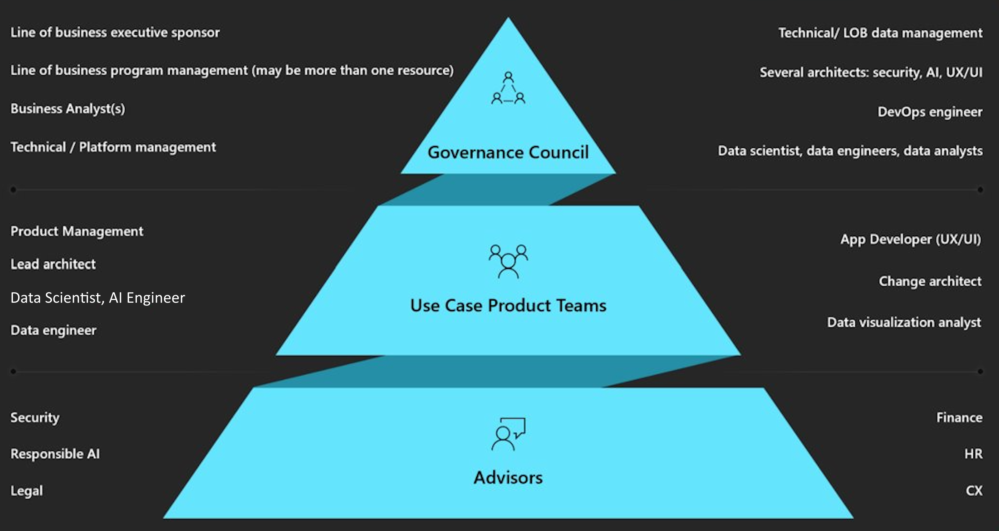

An organization's CoE is responsible for understanding which governance and regulatory requirements the organization's generative AI workloads must adhere to. The generative AI CoE should ensure that the mechanisms are in place to assess whether workloads are compliant against relevant standards and it's the responsibility of the AI workload teams to configure workloads to meet those regulatory requirements.

The CoE is also responsible for ensuring that workload teams are aware of the methods and practices that they should use to manage sensitive workloads. This is because compliance regulation not only applies to the configuration of, but also to the processes used to manage and maintain.

The CoE should ensure that the organization practices responsible AI governance. The CoE can accomplish this by:

- Defining AI guardrails to prevent generative AI misuse, including automated filtering for disallowed content and detection of inaccurate or biased outputs.
- Enforcing traceability and documentation standards for generative AI models, ensuring transparency in AI-generated outputs.
- Implementing metadata tagging and AI provenance tracking to maintain AI content authenticity and accountability.
- Working with compliance teams to structure incident response plans for AI-related security breaches or regulatory violations.

Generative AI workloads must comply with existing cloud-platform regulations, along with emerging AI-specific requirements related to provenance, bias, and safety. A well-defined governance framework ensures alignment across legal, risk, and engineering teams, enabling faster, more responsible releases. The following governance guidelines are recommended to establish robust compliance processes:  

- **Regulatory alignment (Compliance mapping):** ensures workloads meet compliance by clearly mapping controls and responsibilities for each model, dataset, and endpoint to established standards (GDPR, HIPAA, PCI-DSS) and emerging AI-specific regulations (EU AI Act, NIST AI Risk Management Framework).
- **Audit & lineage (Logging and traceability)**: captures end-to-end logs showing who trained what, on which data, and how outputs are used. Lineage and tamper-proof logs support breach forensics, bias investigations, and external audits.
- **Automated policy enforcement (Pre-deployment checks):** gate deployments with preflight checks (region, data-classification, Responsible AI scorecard). It also enforces tag/label requirements and triggers drift or bias retests on every retrain.
- **AI-specific assurance (Risk monitoring and evidence collection)**: tracks fairness, robustness, and content-safety metrics, surfaces risk dashboards to business owners, and keeps evidence packages ready for auditors or customers.
