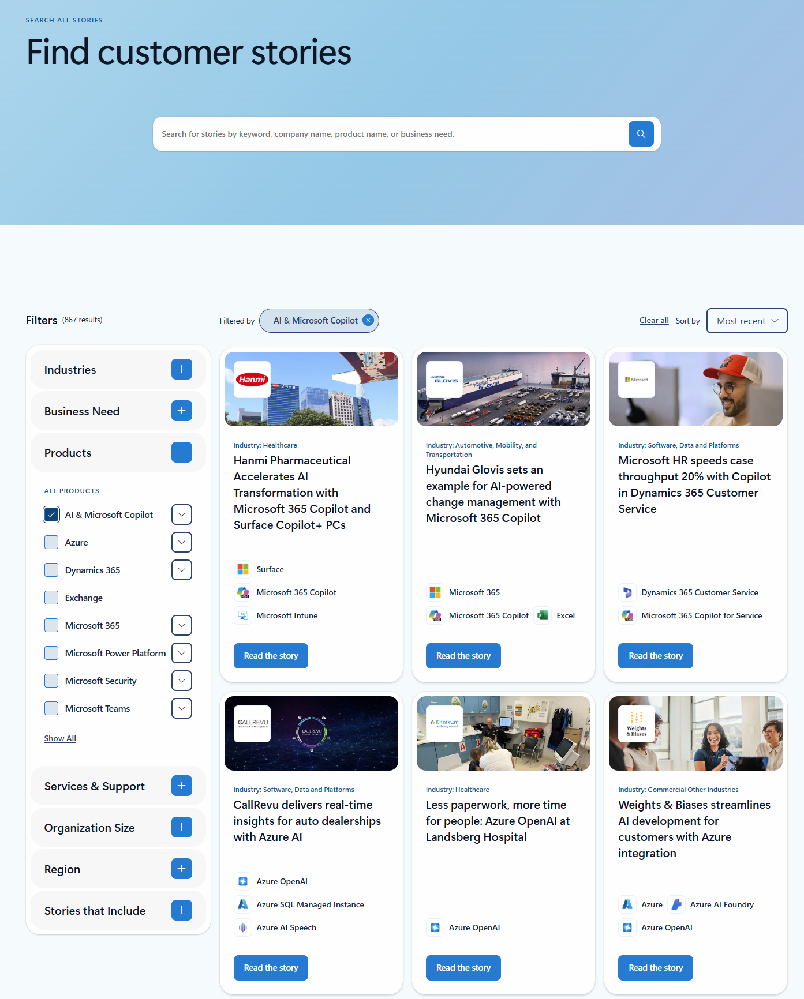

Using existing use cases when researching the cost efficiency of AI
agents provides a reliable benchmark for evaluating potential return on
investment. These use cases offer concrete examples of how AI agents
have been deployed to reduce operational costs, improve productivity, or
streamline workflows in comparable environments. By analyzing outcomes
such as time savings, automation rates, and resource utilization,
organizations can make informed projections about cost efficiency
without relying solely on theoretical models. This evidence-based
approach not only strengthens financial justification but also helps
identify the most cost-effective configurations and deployment
strategies for AI agents.

## Find existing use cases

Steps to find more AI customer stories:

- Navigate to **Search Customer Success** Stories from the **Learn more**
  section, in the **Summary**.

- Use the filters on the left-hand side to search by industry, product,
  region, and more. You can also use the search bar to enter
  relevant terms and search.

You should then read the relevant use case stories to learn more about
how other companies are using AI agents for their use cases. This can
help you identify how you might be able to implement something similar
for your specific situation.

## Collaborate with cross-functional teams

To maximize the cost efficiency of AI agents, you should look at both
costs and benefits. To identify the greatest potential benefits, you
should collaborate with cross-functional teams to uncover operational
pain points, analyze existing workflows to identify automation
opportunities, gather customer feedback to find use cases that improve
customer satisfaction, and conduct an internal assessment to identify
challenges and inefficiencies that AI can address. You can then research
industry use cases using defined goals and objectives.
