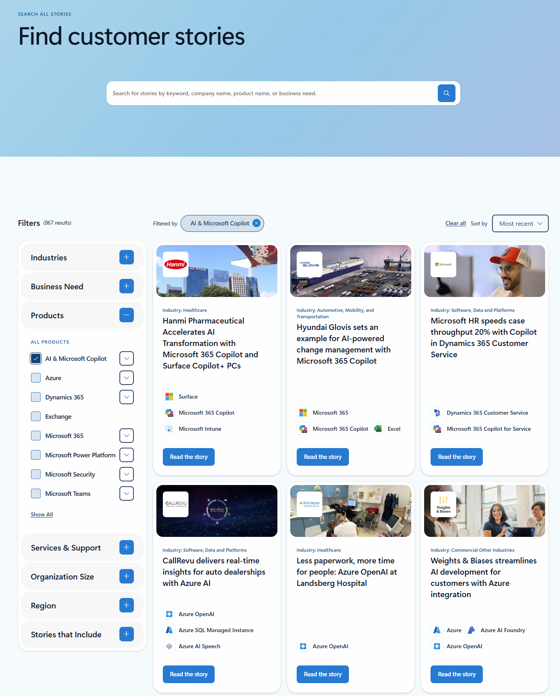

Using existing use cases when researching the cost efficiency of AI
agents provides a reliable benchmark for evaluating potential return on
investment. These use cases offer concrete examples of how AI agents
have been deployed to reduce operational costs, improve productivity, or
streamline workflows in comparable environments. By analyzing outcomes
such as time savings, automation rates, and resource utilization,
organizations can make informed projections about cost efficiency
without relying solely on theoretical models. This evidence-based
approach not only strengthens financial justification but also helps
identify the most cost-effective configurations and deployment
strategies for AI agents.

## Find existing use cases

Steps to find more AI customer stories:

- Navigate to **Search Customer Success** Stories from the **Learn more**
  section, in the **Summary**.

- Use the filters on the left-hand side to search by industry, product,
  region, and more. You can also use the search bar to enter
  relevant terms and search.

You should then read the relevant use case stories to learn more about
how other companies are using AI agents for their use cases. This can
help you identify how you might be able to implement something similar
for your specific situation.

## Collaborate with cross-functional teams

Collaborate with business owners, finance, operations, security, governance,
and technical teams to assess the costs and benefits of each candidate use
case:

- Define the business goal, measurable KPIs, and success criteria.
- Capture baseline data, including work volume, cycle time, error rates,
   escalation rates, and cost per transaction.
- Identify potential benefits by reviewing workflow pain points, automation
   opportunities, customer feedback, and industry use cases.
- Estimate implementation and integration effort, licensing or consumption,
   ongoing operations, monitoring, governance, enablement, and change
   management costs.
- Forecast adoption and usage, and apply attribution when other changes
   contribute to the expected outcome.
- Compare projected benefits with total costs. After deployment, use
   production telemetry to compare measured results with the baseline and
   update the business case.
