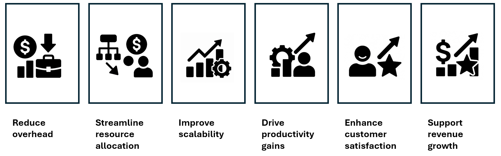

You should prioritize your use cases to focus on ones that have the most
business impact and are the most cost efficient. Consider the following
factors:

## Reduce overhead

Focus on use cases that minimize manual labor, administrative burden, or
redundant processes.

For example, you could create a patient intake assistant: an AI agent
that interacts with patients via a secure web or mobile interface to
collect, validate, and structure intake information before the
patient's appointment. Before implementing this solution, receptionists
would manually enter patient details from paper forms into electronic
health records (EHR), often duplicating effort, and introducing errors.
With the AI agent, patients fill out forms online, the agent clarifies
ambiguous responses with additional questions, data is validated in real
time via API integrations, and the structured data is automatically
pushed to the EHR system.

## Streamline resource allocation

You should identify use cases that optimize resource efficiency.

You should focus on use cases with a precisely designed scope to avoid
over-engineering, potentially using multiple, modular, agents rather
than one complex, monolithic, agent. You should consider use cases that
use lightweight models and task-specific models, where appropriate,
rather than always turning to large general-purpose models, to increase
resource efficiency.

For example, you could deploy multiple, modular factory line
optimization agents. In manufacturing, resource efficiency is critical,
not just in energy or materials, but in compute and operational
overhead. Instead of deploying a single, monolithic AI agent to manage
the entire production line, companies are increasingly using modular,
task-specific agents that each handle a distinct function.

## Improve scalability

Select use cases that enable growth without proportional increases in
cost or complexity.

You should focus on use cases that can automatically scale on demand and
that continually learn and adapt, without the need for retraining.

For example, insurance claims processing agents could handle the entire
claims workflow, from First Notice of Loss (FNOL) to verification and
settlement recommendations, without requiring constant retraining. The
agents could adapt through feedback loops and real-time data ingestion
to automatically scale during high-claim periods, for example, after a
natural disaster.

## Drive productivity gains

Target areas where AI agents can accelerate task completion or enhance
employee output.

You should consider use cases that automate repetitive tasks and agents
that apply intelligent decision-making to improve efficiency.

For example, AI agents for automated expense management could streamline
the entire expense reporting workflow, from receipt capture to policy
compliance checks and reimbursement, without human bottlenecks. The
agents would combine automation with intelligent decision-making to
eliminate repetitive tasks like manual data entry and receipt matching,
apply policy logic to flag anomalies or noncompliant expenses, learn
from corrections to improve future accuracy without retraining, and
integrate with ERP systems.

## Enhance customer satisfaction

You should consider use cases that enhance customer satisfaction. For
example, you might choose to enhance customer satisfaction by delivering
improved response times, creating agents that are personalized to the
user, consistent and accurate, and available 24/7.

## Support revenue growth

Consider use cases that enable upselling, cross-selling, or better
customer retention.

For example, you could consider agents that use machine learning to
proactively identify customers who are most likely to benefit from an
upselling or cross-selling proposal. Also consider sales support agents
that suggest products that are often bought together, or which
conditions might prompt an upgrade. Furthermore, investigate use cases
that detect signals that might result in churn, such as reduced product
use or increased service desk tickets, allowing an intervention before
the customer is lost.

## Examples of cost-effective AI agents

Here are two examples of AI agents, one, which is cost effective and one, which isn't:

**IT helpdesk agent**

This AI agent handles common IT issues such as password resets, software
installation guides, VPN setup, and printer troubleshooting.

This is cost effective because it has:

- **Low training cost** Use pretrained models fine-tuned on internal
  documentation.

- **24/7 availability** There's no need for shift work or overtime pay.

- **Quick ROI** Deflects 50% of tier1 support tickets, reducing wait
  times and allowing support staff to deal with more complex issues.

- **Scalability** The chatbot can be adapted to new products, tasks,
  languages, or markets.

**Predictive AI system to manage stock levels**

As a small specialist bookstore with 500 titles, you invest in an AI
agent to predict future demand and manage stock levels.

This is **not** cost effective because it has:

- **High development and maintenance costs** Custom AI solutions can be
  expensive to build and require ongoing tuning.

- **Overkill for the task** Basic spreadsheet tools or rule-based
  systems could do the job as well.

- **Low ROI** The complexity doesn't translate into meaningful savings
  or performance gains.
