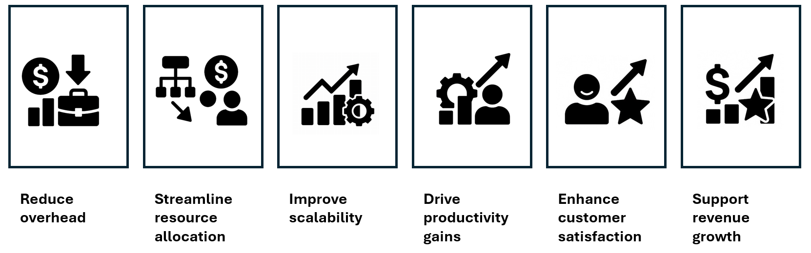

You should prioritize your use cases to focus on ones that have the most
business impact and are the most cost efficient. Consider the following
factors:

## Reduce overhead

Focus on use cases that minimize manual labor, administrative burden, or
redundant processes.

For example, you could create a patient intake assistant: an AI agent
that interacts with patients via a secure web or mobile interface to
collect, validate, and structure intake information before the
patient's appointment. Before implementing this solution, receptionists
would manually enter patient details from paper forms into electronic
health records (EHR), often duplicating effort, and introducing errors.
With the AI agent, patients fill out forms online, the agent clarifies
ambiguous responses with additional questions, data is validated in real
time via API integrations, and the structured data is automatically
pushed to the EHR system.

## Streamline resource allocation

You should identify use cases that optimize resource efficiency.

Define a precise scope to avoid over-engineering. For low-complexity or
cost-sensitive use cases, start with a single-agent prototype and measure
whether it meets the requirements. A multi-agent architecture can separate
responsibilities, but it also adds coordination, token usage, latency, state
management, monitoring, security considerations, and failure points. Use
multiple agents only when requirements such as security or compliance
boundaries, organizational ownership, independent scaling, or expected growth
justify this overhead. Select lightweight or task-specific models when they
meet the required quality.

For example, start factory line optimization with a single agent for a
well-defined workflow. Introduce separate agents only when distinct production
functions require independent permissions, ownership, or scaling.

## Improve scalability

Select use cases that enable growth without proportional increases in
cost or complexity.

Evaluate operational capacity and behavioral improvement separately.
Infrastructure can be configured to scale capacity as demand changes.
However, deployed agents don't automatically learn from feedback or real-time
data. Improving behavior requires a controlled process to monitor feedback,
update prompts, tools, retrieval data, rules, memory, or models, evaluate the
changes, create a new version, and republish it.

For example, an insurance claims processing agent could use
[autoscaling](/azure/machine-learning/how-to-autoscale-endpoints) to handle
increased demand after a natural disaster. Feedback from claim reviews could
inform controlled improvements, which must be evaluated and versioned before
deployment. For more information, see the [agent development
lifecycle](/azure/foundry/agents/concepts/development-lifecycle).

## Drive productivity gains

Target areas where AI agents can accelerate task completion or enhance
employee output.

You should consider use cases that automate repetitive tasks and agents
that apply intelligent decision-making to improve efficiency.

For example, AI agents for automated expense management could streamline the
expense reporting workflow, from receipt capture to policy compliance checks
and reimbursement. The agents could automate data entry and receipt matching,
apply policy rules to flag anomalies or noncompliant expenses, and integrate
with ERP systems. User corrections can be captured as feedback for a monitored
improvement process. Any resulting changes to prompts, rules, retrieval
sources, memory, tools, or models should be evaluated, versioned, and deployed
through the [agent development
lifecycle](/azure/foundry/agents/concepts/development-lifecycle).

## Enhance customer satisfaction

You should consider use cases that enhance customer satisfaction. For
example, you might choose to enhance customer satisfaction by delivering
improved response times, creating agents that are personalized to the
user, consistent and accurate, and available 24/7.

## Support revenue growth

Consider use cases that enable upselling, cross-selling, or better
customer retention.

For example, you could consider agents that use machine learning to
proactively identify customers who are most likely to benefit from an
upselling or cross-selling proposal. Also consider sales support agents
that suggest products that are often bought together, or which
conditions might prompt an upgrade. Furthermore, investigate use cases
that detect signals that might result in churn, such as reduced product
use or increased service desk tickets, allowing an intervention before
the customer is lost.

## Examples of cost-effective AI agents

Here are two examples of AI agents, one, which is cost effective and one, which isn't:

**IT helpdesk agent**

This AI agent handles common IT issues such as password resets, software
installation guides, VPN setup, and printer troubleshooting.

This is cost effective because it has:

- **Maintainable knowledge integration** Ground a pretrained model in approved
  internal documentation by using [retrieval-augmented generation
  (RAG)](/azure/foundry/concepts/retrieval-augmented-generation). Update the
  retrieval index as documentation changes. Consider fine-tuning only when
  evaluation demonstrates a need to change model behavior or task
  performance.

- **24/7 availability** There's no need for shift work or overtime pay.

- **Measurable support impact** Establish a baseline and define a target for
  the percentage of Tier 1 support tickets that the agent should resolve
  without human assistance. Measure resolution, escalation, abandonment, and
  [deflection
  rates](/microsoft-copilot-studio/guidance/deflection-overview) against the
  target.

- **Scalability** The chatbot can be adapted to new products, tasks,
  languages, or markets.

> [!NOTE]
> A value such as 50% ticket deflection is a hypothetical target, not a
> standard result. The achievable rate depends on the organization's request
> mix, knowledge quality, agent capabilities, adoption, and escalation design.

**Predictive AI system to manage stock levels**

As a small specialist bookstore with 500 titles, you invest in an AI
agent to predict future demand and manage stock levels.

This is **not** cost effective because it has:

- **High development and maintenance costs** Custom AI solutions can be
  expensive to build and require ongoing tuning.

- **Overkill for the task** Basic spreadsheet tools or rule-based
  systems could do the job as well.

- **Low ROI** The complexity doesn't translate into meaningful savings
  or performance gains.
