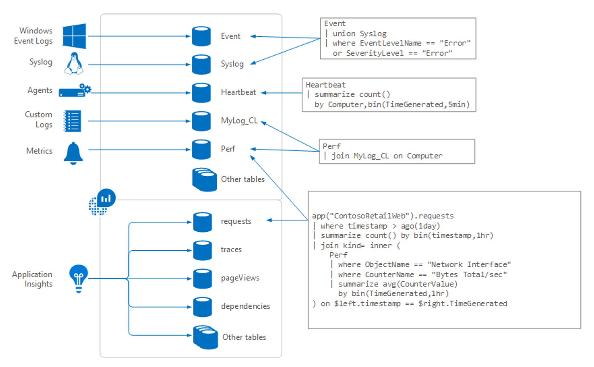
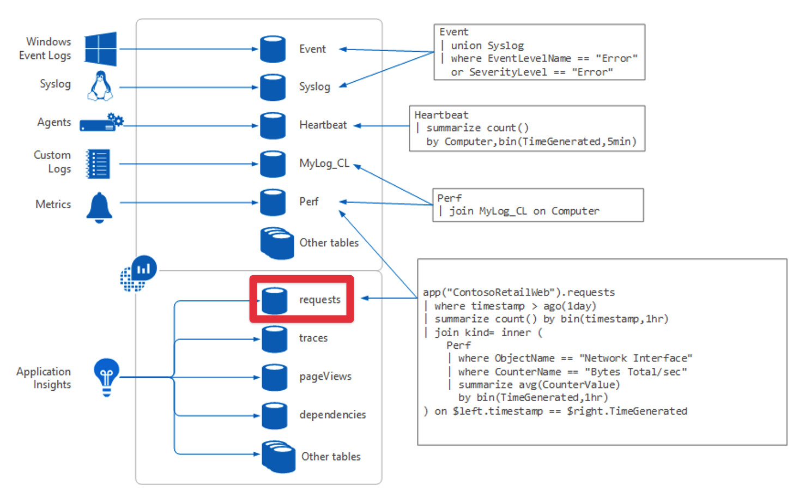
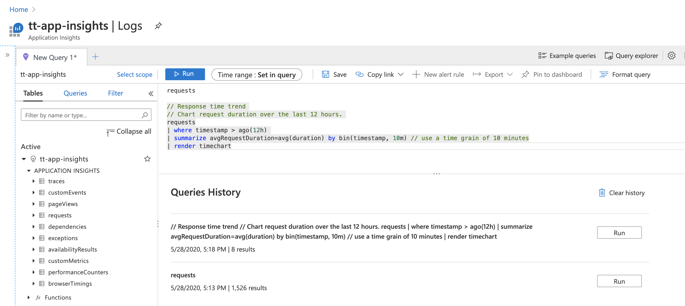

As we start to pay attention to our services' reliability, we need a way to track how well (or not well) they're doing. Often, we can find this information in a service's logs, so we're going to need a tool to work with those logs. Log Analytics is the tool we'll be using in Azure for this purpose. It allows us to query this data and display it in ways that are useful to our reliability work.

The log analytics query process involves writing queries in the Kusto Query Language (KQL). If you've ever worked with any other query language (for example, Structured Query Language, which most people know by its acronym, SQL) you'll have no problem picking up KQL. Even if you haven't, once you see how it works, basic KQL queries will likely come pretty easily to you.

## How Log Analytics works

So, let's see how this is all going to work. Here's a diagram about how Log Analytics works:

[](../media/log-analytics-overview.png#lightbox)

Data for Log Analytics comes in from a number of sources, including:

- Windows event logs
- `syslog` on Linux machines
- Azure Monitor Agent (AMA) running on VMs and servers
- Custom logs people choose to send in
- Metric data that has been routed from Azure resources
- Telemetry from Application Insights

On machines, the current Azure Monitor collection path uses AMA together with Data Collection Rules (DCRs). You might still encounter older material that refers to the Log Analytics agent (also known as MMA/OMS), but that agent was retired in August 2024 and is no longer supported for Azure Monitor collection. Current Azure Monitor guidance uses AMA.

All of this information lands in tables in a Log Analytics workspace. Think of a table as a structured set of records optimized for querying, not as a separate database. For the examples we'll show later in this module, we'll work primarily with Application Insights request telemetry. In a workspace-based Application Insights resource, that data is stored in the `AppRequests` table.

[](../media/log-analytics-requests-table.png#lightbox)

## Log Analytics interface

The following graphic shows the different parts of the Log Analytics interface.

[](../media/log-analytics-user-interface.png#lightbox)

On the left is a section of the screen that makes sure you never get lost when using Log Analytics. It shows the tables with which you're potentially working, and if you expand a section, you’ll see a listing of the fields in that table that are available to query. If you select any of the fields or the table name, it will be copied into the query construction area.

The query construction area is at the top. This is where you specify a query and run it. You can provide a timeframe for the data if it isn’t already specified as part of the query. You can save queries or open additional tabs if you want to work on several queries at a time.

At the bottom of the page is more useful information. Here, Log Analytics shows you previous queries you ran, which can be helpful if you need to return to something you’ve already specified previously; for example, if you were working on a query, tried something, and had to backtrack.

## Writing KQL queries

KQL is a powerful query language. We're only going to scratch the surface with some basic queries so you can see how easy it is to use. Later on, if you'd like to dive deeper into KQL itself and learn more query patterns, be sure to check out the [Kusto Query Language tutorial](/azure/data-explorer/kusto/query/tutorial?pivots=azuremonitor) and the guidance on [optimizing log queries in Azure Monitor](/azure/azure-monitor/logs/query-optimization).

Let's start by writing a simple KQL query. Almost all KQL queries begin with the data source; the table you're querying. So, if you were querying request telemetry from Application Insights, you'd start with this in the query area:

`AppRequests`

You might still encounter older examples that use legacy names such as `requests` and `timestamp`. Those names remain for backward compatibility, but current workspace-based Application Insights guidance uses `AppRequests` and `TimeGenerated`.

The next part of a KQL query is to connect the table with the operation you want to perform. Use a pipe character (the horizontal bar on the keyboard
most commonly found above the slash key) between the table name and the command.

Here's a simple query to return the 10 most recent records:

```kusto
AppRequests
| top 10 by TimeGenerated desc
```

Here are some examples of other common commands you might use instead of "top 10:"

- If you want to see any random 10 records instead of the top 10 (for example, to see the table structure), you can use the following command:

    ```kusto
    AppRequests
    | take 10
    ```

- To see records that have come in during the last half hour, you can use the following query:

    ```kusto
    AppRequests
    | where TimeGenerated > ago(30m)
    ```

- Another common task is to specify the order in which the data is to be returned. Here's an example of a query that sorts by a specific field (`TimeGenerated`) in descending order (for example, most recent data first):

    ```kusto
    AppRequests
    | sort by TimeGenerated desc
    ```

As with SQL, you can set multiple conditions to specify which records you want returned. Use additional pipe characters and clauses to add them. The pipe character separates commands so the output of the first one will be the input of the next command. A single query can have any number of commands.

Here's an example of a query that returns all of the 404 response-code records (for example, all of the "page not found" records from a web service) in the last 30 minutes:

```kusto
AppRequests
| where TimeGenerated > ago(30m)
| where ResultCode == "404"
```

This query uses direct string comparison because `ResultCode` is stored as text in `AppRequests`. It's also written using a good KQL performance pattern. By filtering to the last 30 minutes first, you reduce the amount of data that later steps need to work with. In many cases, the Kusto engine can optimize or reorder predicates for you, but it's still a good habit to put highly selective filters—especially `datetime` filters on `TimeGenerated`—early in the query.

One last query example before we return to the power of Log Analytics later in this module to help improve our reliability. Here's a query that shows a calculation based on the data:

```kusto
AppRequests
| where TimeGenerated > ago(30m)
| summarize RequestCount = sum(ItemCount) by Name, Url
```

> [!TIP]
> These examples use `sum(ItemCount)` rather than `count()`. Application Insights can use sampling to reduce telemetry volume, and each sampled record's `ItemCount` field indicates how many actual requests it represents. Using `sum(ItemCount)` gives accurate totals even when sampling is active. For simple exploration queries (like `take 10`), plain `count()` is fine, but for aggregations that drive decisions, prefer `sum(ItemCount)`.

This query returns a summary of the requests we received in the last half hour. So on a web service, it might tell us that a `GET index.html` request to the URL `https://tailwindtraders.com` was seen 2,875 times. We are pausing our look at KQL with this query, because it nicely connects to the KQL queries we'll use in the next unit.
