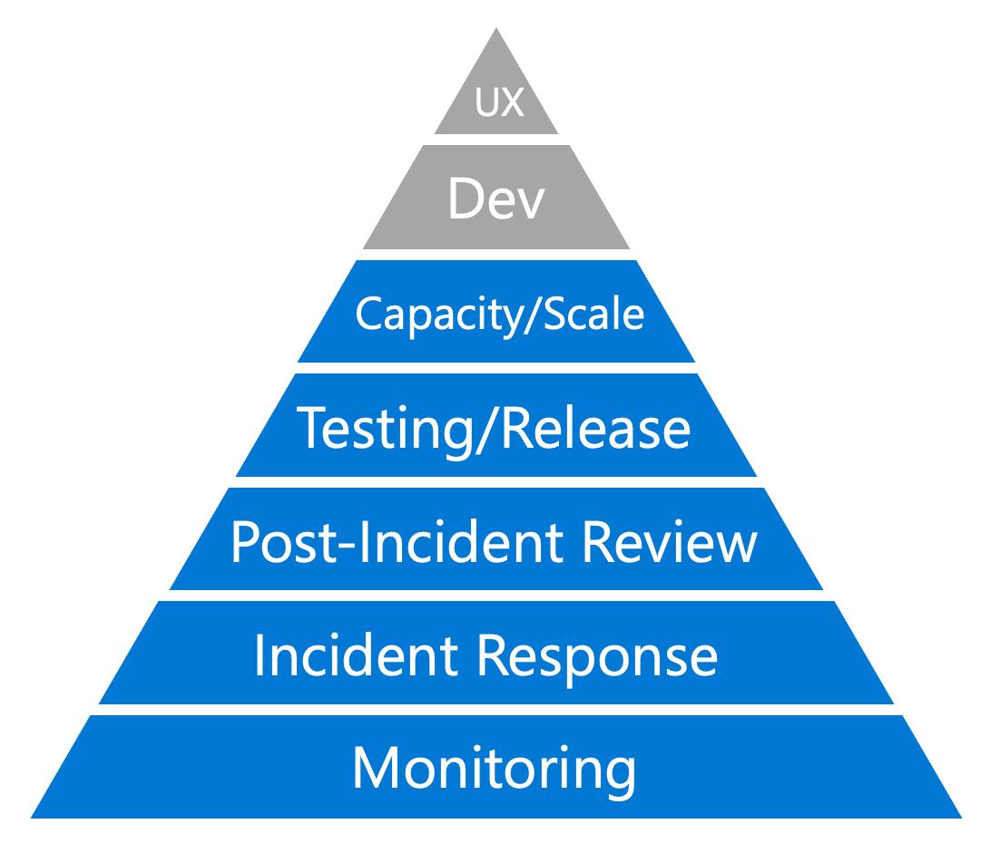
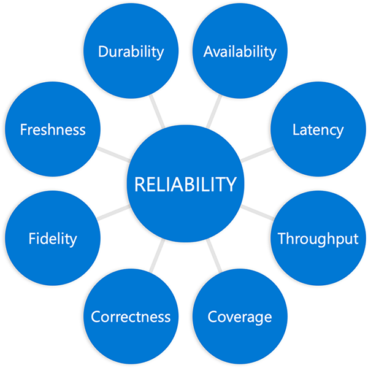
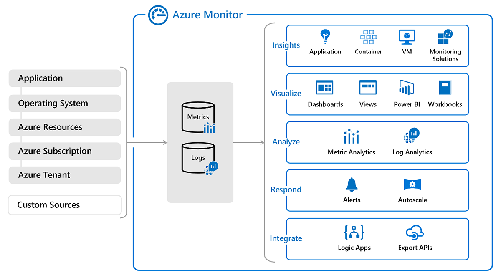

In this module, we've explored the subject of monitoring as the foundation of a larger framework for improving reliability. You now have:

- Concepts

- Tools

The expanded understanding of reliability we've discussed and the framing we've provided allows us to use the tools Azure provides to:

- Gain operational awareness.
- Rationalize an appropriate level of reliability for our systems, services, and products.
- Construct a process for monitoring this reliability using SLIs and SLOs.
- Have a concrete discussion about reliability using objective data.
- Create actionable alerts that support a sustainable operations practice.

Together, these concepts and tools will help you to create and nurture feedback loops within your organization that can lead to improved reliability.
