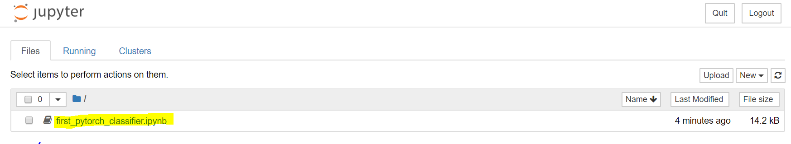
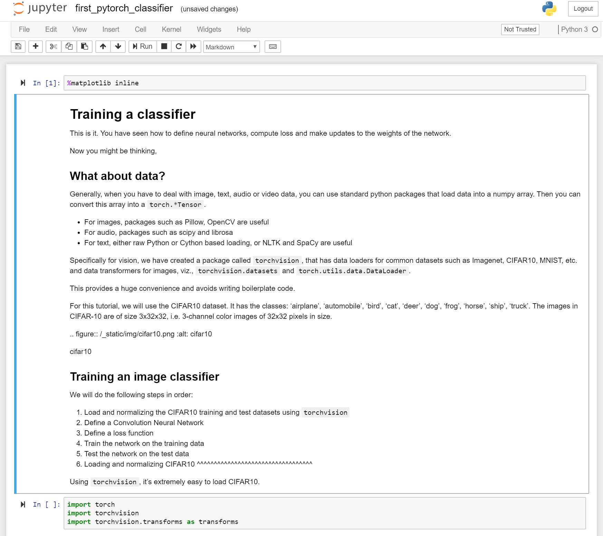

 

Typically deep learning engineers don't implement the matrix algebra operations all by hand. Instead, they use frameworks such as PyTorch or TensorFlow.  

PyTorch is a python-based framework that provides flexibility as a deep learning development platform. It's built on the Python scientific computing library, NumPy. 

Now you might ask, why would we use PyTorch to build deep learning models?  

- Easy to use API – If you know Python, you can ramp up quickly.
- Python support – PyTorch smoothly integrates with the scientific computing stack.
- Dynamic computation graphs – Instead of predefined graphs with specific functionality, PyTorch builds computational graphs dynamically that can be modified during runtime. Dynamic computation graphs are valuable for nested batching and when we do not know how much memory will be needed for creating a given network.

For more information about PyTorch, see [PyTorch.org official documentation](https://pytorch.org/about/).

## Run your first PyTorch model

Now that you have a Docker container provisioned from a PyTorch image, it's time to experiment. If you recall, we downloaded a notebook from [python.org](https://python.org). That sample notebook walks you through training a network to classify images  into different categories. It defines a deep Convolutional Neural Network (CNN).

1. Navigate in your local browser to the Jupyter Notebook server that you set up in the last exercise. The URL will be of the form:

    `<HOSTNAME>.<REGION>.cloudapp.azure.com:8888/?token={sometoken}`

1. Select the `first_pytorch_classifier.ipynb` notebook in the dashboard.

    

    Follow the instructions in the notebook to train your first PyTorch classifier.

    

2. Start from the top of the notebook and run each cell in order. Note the following:

    - Some of the cells take a long time to run. Observe the small dot in the top right of the notebook beside the words "Python 3". When the kernel is busy with an operation, the dot becomes a filled, darker, circle. It remains that way until the operation is complete. 
    - You're training a CNN to classify images. Once the network is trained, the notebook will test labeled images against the model. It records the prediction made for each image and calculates the accuracy of the model. You'll see results in the following format.

    
    
    - You can learn more about the notebook in the [PyTorch Tutorials documentation](https://pytorch.org/tutorials/beginner/blitz/cifar10_tutorial.html) online.
    
    - Towards the end of the notebook, the notes talk about training on a GPU. If you followed the exercises in this module, you have set up a CPU-based VM. This is fine for a model this size and you may not see any significant improvements in training time with a GPU. If you do want to try the module using a  virtual machine with GPUs, then there are two changes you need to make:
    - Provision DSVM on a GPU enabled, N-series VM size.
    - Create a container using `nvidia-docker` instead of `docker` in the previous exercise.