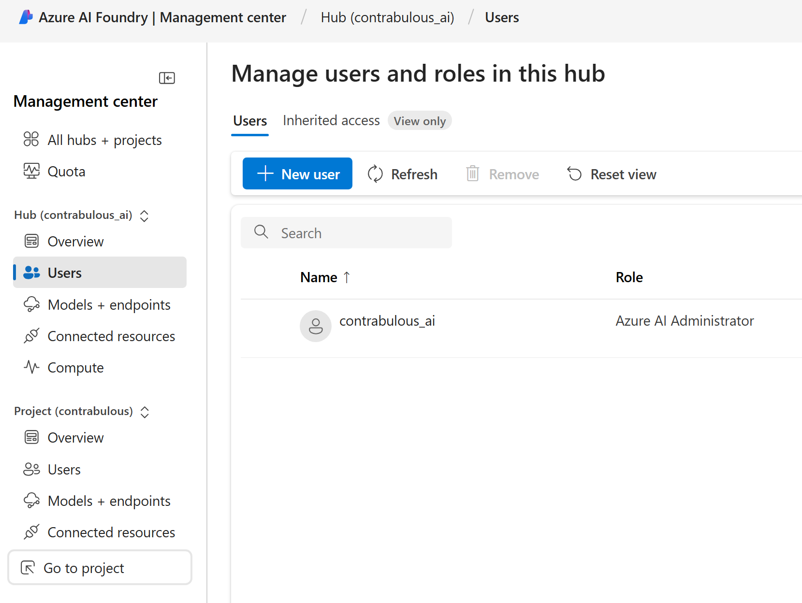

Azure role-based access control (Azure RBAC) is used to manage access to Azure resources, such as the ability to create new resources or use existing ones. Users in your Microsoft Entra ID are assigned specific roles, which grant access to resources. Azure RBAC allows you to configure access to Azure AI Foundry hubs and projects and by extension agents that exist within those projects.

The Azure AI Foundry hub has built-in roles that are available by default.

| **Role** | **Description** |
|---|---|
| **Owner** | Full access to the hub, including the ability to manage and create new hubs and assign permissions. This role is automatically assigned to the hub creator |
| **Contributor** | User has full access to the hub, including the ability to create new hubs, but isn't able to manage hub permissions on the existing resource. |
| **Azure AI Administrator** | This role is automatically assigned to the system-assigned managed identity for the hub. The Azure AI Administrator role has the minimum permissions needed for the managed identity to perform its tasks. |
| **Azure AI Developer** | Perform all actions except create new hubs and manage the hub permissions. For example, users can create projects, compute, and connections. Users can assign permissions within their project. Users can interact with existing Azure AI resources such as Azure OpenAI, Azure AI Search, and Azure AI services. |
| **Azure AI Inference Deployment Operator** | Perform all actions required to create a resource deployment within a resource group. |
| **Reader** | Read only access to the hub. This role is automatically assigned to all project members within the hub. |

Hubs have the system-assigned managed identity assigned to the Azure AI Administrator role. This role is more narrowly scoped to the minimum permissions needed for the managed identity to perform its tasks. This system-assigned managed identity is inherited at the project level. Depending on how an Azure AI Agent is configured, it will either use the system-assigned managed identity when accessing data sources or performing actions such as running code, running a custom function or an Azure function.  

When a user is granted access to a project (for example, through the Azure AI Foundry portal permission management), two more roles are automatically assigned to the user. The first role is Reader on the hub. The second role is the Inference Deployment Operator role, which allows the user to create deployments on the resource group that the project is in.

The following table is an example of how to set up role-based access control for your Azure AI Foundry for an enterprise.

| **Persona** | **Role** | **Purpose** |
|---|---|---|
| **IT admin** | Owner of the hub | The IT admin can ensure the hub is set up to their enterprise standards. They can assign managers the Contributor role on the resource if they want to enable managers to make new hubs. Or they can assign managers the Azure AI Developer role on the resource to not allow for new hub creation. |
| **Managers** | Contributor or Azure AI Developer on the hub | Managers can manage the hub, audit compute resources, audit connections, and create shared connections. |
| **Team lead/Lead developer** | Azure AI Developer on the hub | Lead developers can create projects for their team and create shared resources (such as compute and connections) at the hub level. After project creation, project owners can invite other members. |
| **Team members/developers** | Contributor or Azure AI Developer on the project | Developers can build and deploy AI models within a project and create assets that enable development such as computes and connections. |

You can add users and assign roles directly from Azure AI Foundry at either the hub or project level. In the management center, select Users in either the hub or project section, then select New user to add a user.

When you create a hub, the built-in role-based access control permissions grant you access to use the resource. However, if you wish to use resources outside of what was created on your behalf, you need to ensure both:

- The resource you're trying to use has permissions set up to allow you to access it.
- Your hub is allowed to access it.

For example, if you're trying to consume a new Blob storage that isn't hosted within the associated Azure AI hub. In this circumstance you need to ensure that hub's managed identity is added to the Blob Storage Reader role for the Blob. You will also need to ensure that you have configured workplace managed outbound access to allow network communication to the endpoint associated with the blob storage. Network access configuration is covered in more detail by the next unit.