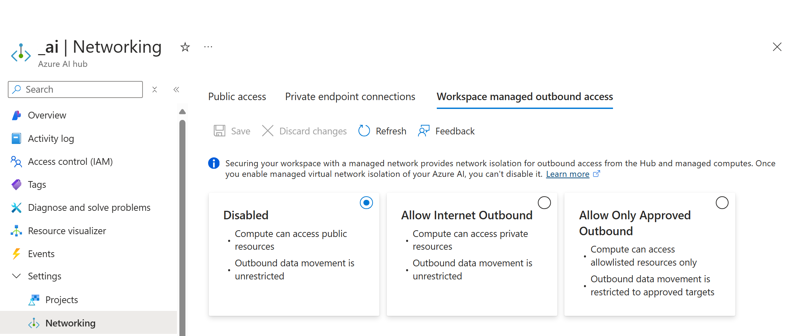
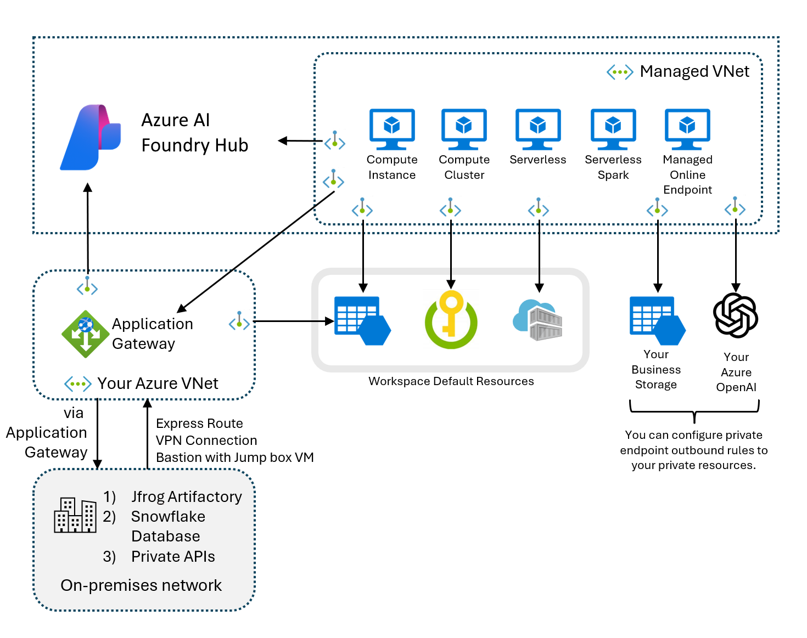

Network access for an Azure AI Agent associated with an Azure Foundry project is configured at the Hub level. You can only configure network settings for a hub in the Azure portal and can't configure network settings in Azure Foundry.

You have the following options when configuring network access:

- Public access. Either allow public access from all networks including the internet or disable public access. If you disable public access, you need to access the hub, project, and AI Agent service through a private endpoint.
- Private endpoint connections. Allows you to add private endpoints to access the hub, projects, and Azure AI Agents. When configuring private endpoint access, you can allow access from specific virtual networks and subnets. Private endpoints require a DNS address that can be hosted in a private DNS zone.
- Workspace managed outbound access. When configuring outbound access for the Azure AI hub associated with the project that hosts the Azure AI Agent, you can choose 
  - Disabled: Compute can access public resources and outbound data movement is unrestricted.
  - Allow Internet Outbound: Compute can access private resources and outbound data movement is unrestricted.
  - Allow Only Approved Outbound. Compute can access resources that specifically allowlisted and outbound data movement is restricted to approved addresses.

To access your non-Azure resources located in a different virtual network or located entirely on-premises from your Azure AI Foundry's managed virtual network, you need to configure and deploy an Application Gateway. Through this Application Gateway, you can configure full end to end access to your resources. Once you configure the Application Gateway, you can create a private endpoint from the Azure AI Foundry hub's managed virtual network to the Application Gateway. With the private endpoint, the full end to end path is secured and not routed through the Internet.

