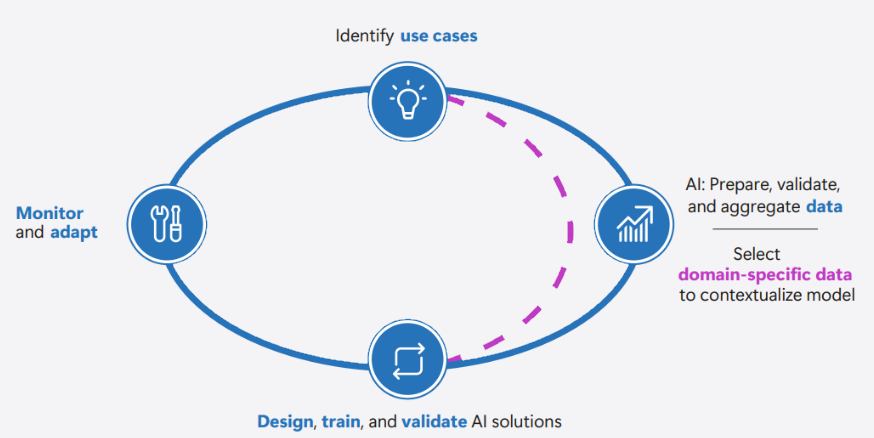

IT projects suffer from many risks including scope creep, missed deadlines, and projects exceeding allocated budgets. AI initiatives also need room for learning because teams often need to compare models, test prompts, validate data quality, and understand user behavior. Successful organizations combine structured planning with controlled experimentation through pilots or proofs of concept (PoCs) that have success metrics, safety and security guardrails, and go/no-go decision points. A properly constituted AI CoE helps an organization minimize the chance that AI projects are unsuccessful and helps projects meet organizational aspirations.

An AI CoE can influence all of an organization's AI projects with the aim of all of those projects being successful and driving value for the business.

## Estimates of business value

A strong reason for organizations to consider adopting an AI CoE is that the structured approach that a properly functioning AI CoE brings helps an organization realize the strongest benefits from AI adoption.

When implemented correctly, an AI center of excellence ensures the right people are involved at the right time. Key responsibilities of the AI CoE include:

- Setting AI strategy, standards, governance guardrails, reusable patterns, intake and prioritization workflows, and skills development plans.
- Aligning AI initiatives with organizational and business priorities.
- Advising business and workload teams as they identify and frame use cases, then assessing fit, priority, and readiness.
- Coordinating with platform teams that provide governed foundations while workload and business teams own domain data, integration, delivery, and business outcomes.
- Supporting modern AI solutions where teams select and evaluate models, build copilots and agentic AI experiences, ground responses in enterprise data, plan for tool interoperability by connecting agents to approved Model Context Protocol (MCP) servers that expose tools and resources where supported, and operate solutions in Microsoft Foundry rather than developing foundation models from scratch.
- Defining MCP governance expectations such as approved-server allow lists and allowed-tool lists, user or admin approvals, audit logging, and prompt or context data-sharing review before teams connect agents to third-party MCP servers.
- Enabling controlled pilots or PoCs with defined success metrics, safety and security boundaries, and go/no-go criteria.
- Measuring and communicating the impact of these initiatives.
- Promoting and overseeing leaders' alignment and commitment.
- Raising awareness and understanding of AI within the organization to drive adoption and build capabilities.
- Ensuring key business and technical decision-makers, and other stakeholders, are actively involved in AI initiatives.
- Bridging the gap between technical and leadership teams to translate technical capabilities into business outcomes.
- Defining and enforcing standards, publishing reusable assets such as templates and checklists, and optionally helping manage AI services after deployment.

Business and domain leaders are usually best positioned to identify and frame relevant use cases because they understand customer needs, operational constraints, and the data that supports the work. Domain experts also help evaluate model or agent effectiveness, especially for AI challenges such as ungrounded or fabricated outputs (often called hallucinations), model variability, and changing user expectations. The CoE advises these teams, assesses organizational fit, prioritizes opportunities, and helps align delivery with the organization's strategy and guardrails.

## Realistic estimates of outcomes

An AI CoE can also ensure that an assessment is performed of how realistic the goals of an AI project are before a line of code has been deployed, rather than determining that the goals weren't realistic only after the project fails to meet expectations. Implementing AI in an organization requires a clear approach to measure its performance, adoption, and impact.

Without actionable metrics, it's challenging to evaluate progress, identify improvement areas, or manage complexity. A solid strategy depends on well-defined metrics to assess performance and ensure initiatives provide value. An AI CoE can be responsible for tracking these metrics to ensure that organizational objectives are achieved.

Alongside business and adoption KPIs, it's crucial to track how effectively AI is being adopted within the organization. Metrics like user engagement, frequency of usage, and integration with existing workflows can reveal valuable insights into the user experience and identify areas for improvement. AI solutions also need quality, safety, and runtime measures such as groundedness, relevance, coherence/fluency, safety signals, latency, error rate, and token usage. For agentic AI solutions, track agent task-completion rates and tool-call accuracy. Continuous evaluation helps teams detect drift, compare improvements, and decide whether a pilot or PoC should continue, change direction, or stop.

Transparent performance metrics developed by an AI CoE based on organizational expectations also increase organizational confidence in AI by demonstrating its real-world impact. Establishing clear links between AI performance and business outcomes strengthens stakeholder trust and reduces adoption barriers in future AI projects.