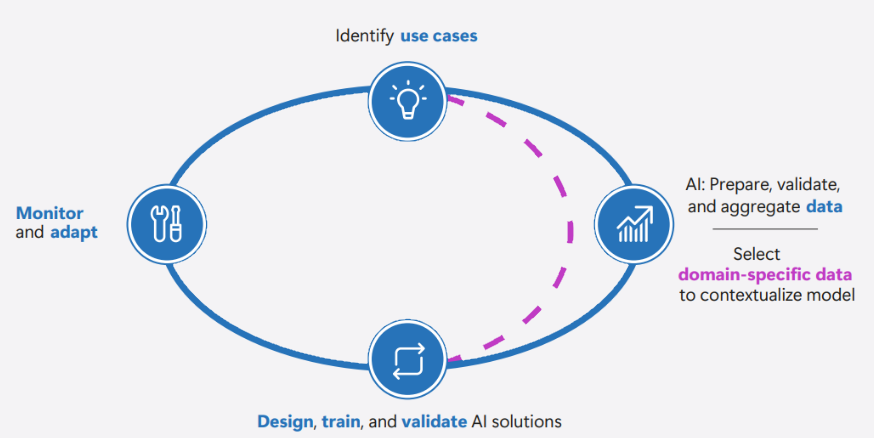

IT projects suffer from many risks including scope creep, missing completion deadlines, and the project exceeding allocated budget. Projects that are planned out and which include best practices from the beginning are more likely to achieve their goals, be deployed within the projected timeframe, and remain within projected costs than those projects that take a more exploratory approach. A properly constituted generative AI CoE helps an organization minimize the chance that generative AI projects are unsuccessful and that the projects meet organizational aspirations.

A generative AI CoE can influence all of an organization's generative AI projects with the aim of all of those projects being successful and driving value for the business.

## Estimates of business value

A strong reason for organizations to consider adopting a generative AI CoE is that the structured approach that a properly functioning generative AI CoE brings helps an organization reap the strongest benefits from generative AI adoption.

When implemented correctly, an AI center of excellence ensures the right people are involved at the right time. Key responsibilities of the AI CoE include: 

- Aligning AI initiatives with organizational and business priorities. 
- Measuring and communicating the impact of these initiatives. 
- Promoting and overseeing leaders' alignment and commitment. 
- Raising awareness and understanding of generative AI within the organization to drive adoption and build capabilities. 
- Ensuring key business and technical decision-makers, and other stakeholders, are actively involved in generative AI initiatives. 
- Bridging the gap between technical and leadership to translate technical capabilities into business outcomes.

A generative AI CoE is able to identify use cases and ensure the "organizational fit." Domain experts (from business or specific functions) play a crucial role in identifying relevant use cases, determining the necessary data, and evaluating the model's effectiveness, especially considering the unique challenges of generative AI like delusions or model variability. The CoE is able to ensure that use cases must align with the organization's overarching strategy and its ability to deliver on that strategy.

## Realistic estimates of outcomes

A generative AI CoE can also ensure that an assessment is performed of how realistic the goals of a generative AI project are before a line of code has been deployed, rather than determining that the goals weren't realistic only after the project fails to meet expectations. Implementing generative AI in an organization requires a clear approach to measure its performance, adoption, and impact. 

Without actionable metrics, it's challenging to evaluate progress, identify improvement areas, or manage complexity. A solid strategy depends on well-defined metrics to assess performance and ensure initiatives provide value. A generative AI CoE can be responsible for tracking these metrics to ensure that organizational objectives are achieved.

Beyond business outcomes, it's crucial to track how effectively generative AI is being adopted within the organization. Metrics like user engagement, frequency of usage, and integration with existing workflows can reveal valuable insights into the user experience and identify areas for improvement. 

Transparent performance metrics developed by a generative AI CoE based on organizational expectations also increase organizational confidence in AI by demonstrating its real-world impact. Establishing clear links between AI performance and business outcomes strengthens stakeholder trust and reduces adoption barriers in future generative AI projects.