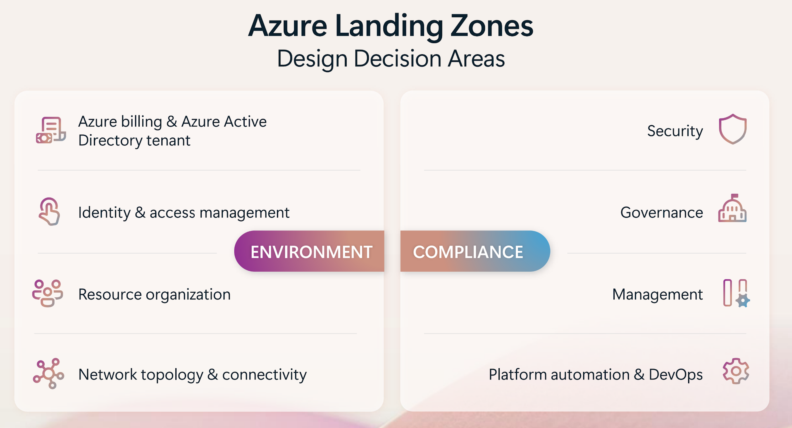

An Azure landing zone is a preconfigured, scalable environment within Microsoft Azure that serves as the foundation for deploying cloud workloads. Landing zones implement best practices for governance, security, and infrastructure. Landing zones provide standardized subscription designs, identity and access management controls, policy configurations, network topology, and shared services. 

Azure landing zones use subscriptions to isolate and scale application resources and platform resources. Azure landing zone architectures are scalable and modular. The repeatable infrastructure allows you to apply configurations and controls to every subscription consistently. You can deploy landing zones using the Azure portal, Bicep modules, or Terraform. 

You should use landing zone conceptual architectures as a starting point and tailor the architecture to meet your needs for your organization's AI workloads.

## Landing zone design areas

An Azure landing zone is an environment that follows key design principles across eight design areas. Azure landing zone design areas describe what to consider before you deploy a landing zone. Design areas help you establish a process in exploring the subjects relevant to making critical decisions about your environment. You should evaluate each design area to help you understand any changes that you might need to make to the implementation options for Azure landing zones and the AI related workloads that those zones might host.

Evaluating each design area sequentially provides you with a process that simplifies the design of any complex environment. Once you've already addressed each design area to your satisfaction, move on to the next area.

These Azure landing zone design areas are as follows:

- **Azure billing and Microsoft Entra tenant.** Ensures that the tenants in the landing zone are properly created, enrolled, and that billing is appropriately configured.
- **Identity and access management.** Identity functions as the primary security boundary in the public cloud. This landing zone design area ensures that identity and access management is implemented to serve as the foundation for a secure and fully compliant architecture.
- **Network topology and connectivity.** Appropriately planned network topology and connectivity ensure that deployed resources can communicate in a secure, reliable, and cost effective manner. 
- **Resource organization.** Determines the appropriate Azure management group and subscription hierarchy. Planning subscription hierarchy impacts governance, operations management, and adoption patterns. Configure subscriptions as management boundaries that separate the platform and workload teams. This separation is also termed subscription democratization. 
- **Security.** The security design area involves designing and implementing the appropriate controls and processes to secure all elements of the cloud environment. An example of this design area is ensuring use of managed identities rather than API keys for authentication and authorization.
- **Management.** The management design area includes developing management baselines that provide appropriate and secure visibility into resources and also ensuring that operations practices meet compliance requirements.
- **Governance.** This design area addresses ensuring that governance policies and auditing are enforced and automated. An example would be notifications and alerts being generated when an element of the deployment's configuration drifts out of compliance due to configuration changes.
- **Platform automation and DevOps.** This design element ensures that your organization leverages the right alignment of tools and templates to deploy landing zones and supporting resources.

As a general rule, be prepared to balance requirements and functionality. Your journey to the most effective architecture for your organization's AI workloads will evolve over time as requirements change and you learn from your implementation.

All Azure landing zone architectures are designed with a separation of ownership between the platform team and the workload team. This subscription democratization allows application architects, data scientists, and DevOps teams to understand what's under their direct influence or control and what isn't.

## Application and platform landing zones

Subscription democratization leads to two categories of landing zone that are relevant to AI adoption: application landing zones and platform landing zones. The differences between them are as follows: 

- An application landing zone is an Azure subscription in which a workload runs. An application landing zone is connected to the organization's shared platform resources. Through that connection, the landing zone has access to the infrastructure that supports the workload, such as networking, identity access management, policies, and monitoring. These landing zones and subscriptions are the responsibility of the workload team.
- A platform landing zone is a subscription that provides shared services (identity, connectivity, management) to applications in application landing zones. A platform landing zone is a collection of various subscriptions that multiple platform teams can manage. Each subscription has a specific function. For example, a connectivity subscription provides centralized Domain Name System (DNS) resolution, cross-premises connectivity, and network virtual appliances (NVAs) that are available for platform teams to use. These landing zones and subscriptions are the responsibility of the platform team.

Determine which infrastructure elements need to be present for the workloads in the application landing zones and deploy them in the platform landing zones. Ensure that the infrastructure present in the platform landing zones adheres to the principles laid out in the security, management, governance, network, and identity and access design areas. Once the infrastructure to support the workloads is in place, you can use the design principles, including those in the platform automation and DevOps design area, to deploy, update and maintain the application workloads.
