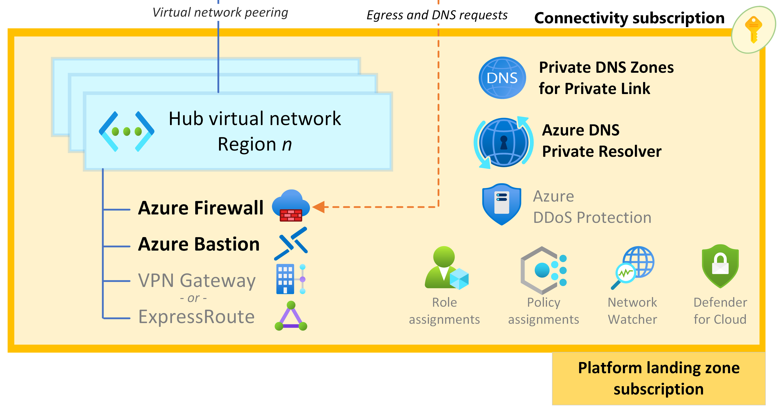

The Azure OpenAI chat baseline application published in the Azure Architecture Center on the Microsoft website illustrates an example of how you can use Azure Landing Zones with AI workloads. 

In the AI chatbot landing zone implementation, the workload team is mostly responsible for the configuration, management, and deployment of the workload components, including all AI services that are used in this architecture.

For this architecture, the workload team and platform team need to collaborate on a few topics: management group assignment (including the associated Azure Policy governance) and networking setup.

## Workload team managed resources

In the AI chatbot landing zone implementation, the workload team is responsible for the following resources:

- **Azure AI Foundry.** The platform used to build, test, and deploy AI solutions. AI Foundry is used in this architecture to build, test, and deploy the prompt flow orchestration logic for the chat application. In this architecture, Azure AI Foundry provides the managed virtual network for network security.
- **Managed online endpoints.** These are used as a platform as a service (PaaS) endpoint for the chat UI application, which invokes the prompt flows hosted by Azure AI Foundry.
- **Azure App Service**. Used to host the web application for the chat UI. In this architecture, App Service has three instances, each in a different Azure zone.
- **AI Search**. Service that's used in the flows behind chat applications. You can use AI Search to retrieve indexed data that's relevant for user queries.
- **Azure Storage.** Used to persist the prompt flow source files for prompt flow development.
- **Azure Container Registry.** Used to store flows that are packaged as container images.
- **Azure Application Gateway.** Used as the reverse proxy to route user requests to the chat UI that's hosted in App Service. In this architecture, Azure Application Gateway is also used to host an Azure web application firewall to protect the front-end application from potentially malicious traffic.
- **Key Vault.** Used to store application secrets and certificates.
- **Azure Monitor, Azure Monitor Logs, and Application Insights.** Used to collect, store, and visualize observability data.
- **Azure Policy.** Used to apply policies that are specific to the workload to help govern, secure, and apply controls at scale.

In this architecture the workload team is also responsible for maintaining the following resources:

- Spoke virtual network subnets and the network security groups (NSGs) that are placed on those subnets to maintain segmentation and control traffic flow.
- Private endpoints to secure connectivity to PaaS solutions.

## Platform team managed resources

In this architecture the platform team owns and maintains the following centralized resources which should be pre-provisioned before the deployment of the resources managed by the workload team:

- **Azure Firewall.** Deployed in the hub network is used to route, inspect, and restrict egress traffic. Workload egress traffic goes to the internet, cross-premises destinations, or to other application landing zones.
- **Azure Bastion.** Deployed in the hub network and provides secure operational access to workload components and also allows secure access to Azure AI Foundry components.
- **Spoke virtual network.** This network hosts the AI application.
- **User-defined routes (UDRs).** Used to force tunnel network traffic to the hub network.
- **Azure Policy-based governance constraints and DeployIfNotExists (DINE) policies.** You can apply these policies at the platform team-owned management group level or apply them to the workload's subscription directly.
- **Azure private DNS zones.** Host the A records for private endpoints. 
- **DNS resolution service for spoke virtual networks and cross-premises workstations.** That service usually takes the form of Azure Firewall as a DNS proxy or Azure DNS Private Resolver. In this architecture, this service resolves private endpoint DNS records for all DNS requests that originate in the spoke.
- **Azure DDoS Protection.** Used to protect public IP addresses against distributed attacks.

## Critical dependencies

All functionality that the workload performs in the platform and application landing zones are dependencies. Incident response plans require that the workload team is aware of the point and method of contact information for these dependencies, and the workload team should be included in the change management process for these dependencies. Also include these dependencies in the workload's failure mode analysis (FMA).

Important dependencies to take into account:

- Egress firewall. The centralized egress firewall, shared by multiple workloads, undergoes may undergo changes unrelated to the AI workload.
- **DNS resolution.** This architecture uses DNS provided by the platform team instead of directly interfacing with Azure DNS. This means that timely updates to DNS records for private endpoints and availability of DNS services are new dependencies.
- **DINE policies.** Deploy If Not Exists (DINE) policies for Azure DNS private DNS zones, or any other platform-provided dependency, are best effort, with no SLA when you apply them. For example, a delay in DNS configuration for this architecture's private endpoints can cause delays in the readiness of the chat UI to handle traffic or prompt flow from completing queries.
- **Management group policies.** Consistent policies among environments are key for reliability. Ensure that preproduction environments are similar to production environments to provide accurate testing and to prevent environment-specific deviations that can block a deployment or scale.

## Security considerations

The following security considerations should be addressed when implementing this type of AI workload.

- **Ingress traffic control.** Isolate your workload from other workload spokes within your organization by using NSGs on your subnets and the nontransitive nature or controls in the regional hub. Construct comprehensive NSGs that only permit the inbound network requirements of your application and its infrastructure.
- **Egress traffic control.** Apply NSG rules that express the required outbound connectivity requirements of your solution and deny everything else. Don't rely only on the hub network controls. As a workload operator, block undesired egress traffic as close to the source as practicable.
- **DDoS Protection.** Determine who should apply the DDoS Protection plan that covers all of your solution's public IP addresses. The platform team might use IP address protection plans, or use Azure Policy to enforce virtual network protection plans. This architecture should have coverage because it involves a public IP address for ingress from the internet.
- **Identity and access management.** Unless otherwise required by your platform team's governance automation, there are no expectations of extra authorization requirements on this architecture because of the platform team's involvement. Azure role-based access control (RBAC) should continue to fulfill the principle of least privilege, which grants limited access only to those who need it and only when needed.
- **Certificates and encryption.** The workload team typically procures the TLS certificate for the public IP address on Application Gateway in this architecture.
- **Correlate data from multiple sinks.** The workload's logs and metrics and its infrastructure components are stored in the workload's Azure Monitor Logs workspace. However, logs and metrics from centralized services, such as Azure Firewall, DNS Private Resolver, and Azure Bastion, are often stored in a central Azure Monitor Logs workspace. Correlating data from multiple sinks can be a complex task.
