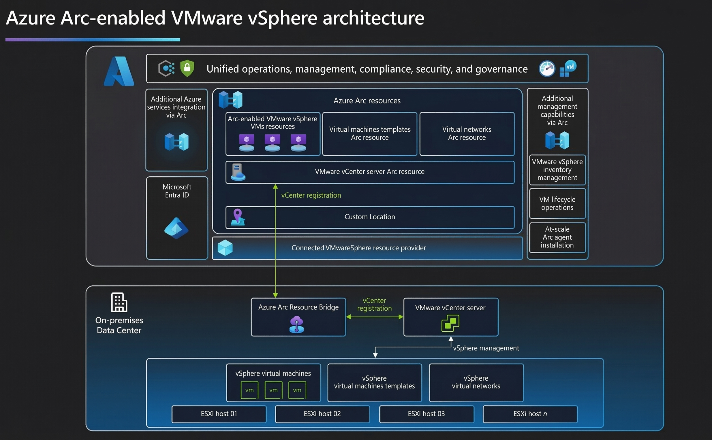

Azure Arc-enabled VMware vSphere is an Azure Arc service that helps you simplify management of hybrid IT estate distributed across VMware vSphere and Azure. It does so by extending the Azure control plane to VMware vSphere infrastructure. The technology enables the use of Azure for VM management and Azure services to enable security, governance, monitoring and patching across VMware vSphere on-premises private clouds, and Azure VMware Solution (AVS) private clouds.

Azure Arc-enabled VMware vSphere allows you to:

- Discover your VMware vSphere estate (VMs, templates, networks, datastores, clusters/hosts/resource pools) and register resources with Azure at scale.
- Perform various virtual machine (VM) operations directly from Azure, such as create, resize, delete, and power cycle operations such as start/stop/restart on VMware VMs consistently with Azure.
- Enable developers and application teams to self-serve VM operations on-demand mediated by Azure role-based access control.
- Govern, protect, configure, and monitor VMware VMs at scale by through the Azure connected machine agent.
- Browse your VMware vSphere resources (VMs, templates, networks, and storage) in Azure.
- Leverage Azure Arc benefits such as Windows Server management for VMs with Software Assurance licenses, Extended Security Updates benefits for Windows Server and SQL Server with pay-as-you-go billing for on-premises VMs and free ESUs for Azure VMware Solution VMs.

To connect your VMware vCenter Server to Azure Arc, you need to deploy the Azure Arc resource bridge in your vSphere environment. Azure Arc resource bridge is a virtual appliance that hosts the components that communicate with your vCenter Server and Azure.

vSphere resources are automatically discovered when you connect a VMware vCenter Server to Azure. After initial discovery, regular synchronization between the vCenter Server and Azure ensures that this inventory data is kept up-to-date.

Guest OS-based capabilities are provided by enabling guest management. Guest management involves installing the Arc agent on the VMs running in the VMware environment. Once you enable guest management, you can deploy VM extensions to extend the Azure management capabilities. For example, by enabling guest management, you can perform virtual hardware operations such as VM resizing, adding and deleting disks, and VM restarts.

Arc-enabled VMware vSphere works with vCenter Server versions 7 and 8. You can onboard multiple vCenters using a single Azure Arc resource bridge as long as the total number of VMs managed across all onboarded systems doesn't exceed 9500. 

Once a vCenter instance is connected to Azure, you can use the Azure portal to browse VMware vSphere inventory and register virtual machines resource pools, networks, and templates into Azure. This enables you to provide developer and operations teams fine-grained permissions on those VMware resources through Azure Role Based Access Control.

The difference between Azure Arc-enabled servers and Azure Arc-enabled VMware vSphere is as follows:

- Azure Arc-enabled servers interact on the guest operating system level, with no awareness of the underlying infrastructure fabric and the virtualization platform that it's running on. 
- Azure Arc-enabled VMware vSphere is a superset of Arc-enabled servers that extends management capabilities beyond the guest operating system to the VM itself. This provides lifecycle management and CRUD (Create, Read, Update, and Delete) operations on a VMware vSphere VM. These lifecycle management capabilities are exposed in the Azure portal and look and feel just like a regular Azure VM.
