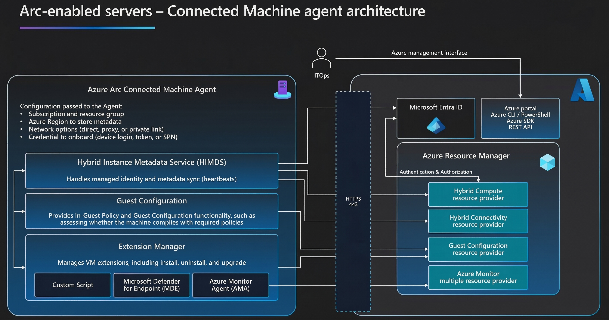

Azure Arc-enabled servers work with VMs running in an on-premises VMware vSphere environment and Azure VMware Solution and support the full breadth of guest management capabilities across security, monitoring, and governance.

Arc-enabled VMware vSphere enables you to onboard your VMware environment at-scale to Azure Arc with automatic discovery, in addition to performing full VM lifecycle and virtual hardware operations. Arc-enabled servers allow you to manage the guest OS of your VMs with the Azure Connected Machine agent. You have the flexibility to start with either option and incorporate the other one later without any disruption. With both options, you enjoy the same consistent experience.

## Enabling Guest Management with the connected machine agent

If you want to enable guest management with the connected machine agent, hosted VMs need to meet the following requirements:

- Is running a supported operating system.
- Is able to connect through the firewall to communicate over the internet to specific URLs in Azure.
- VMware tools are installed and running.
- The resource bridge appliance has network connectivity to the host running the VM.

To enable guest management, perform the following steps:

1. In the Azure portal, locate **vCenter Server Inventory** and choose **Virtual Machines** to view the list of VMs.
1. Select the VM you want to install the guest management agent on.
1. Select **Enable guest management** and provide the administrator username and password to enable guest management then select **Apply**.
1. Locate the VMware vSphere VM you want to check for guest management and install extensions on, and select the name of the VM.
1. Select **Configuration** from the left navigation for a VMware VM.
1. Verify **Enable guest management** is now checked.

When the Azure Connected Machine agent is installed on vCenter-managed VMs, Administrators can perform the following actions at scale:

- Assign Azure machine configurations to audit settings inside the machine.
- Protect non-Azure servers with Microsoft Defender for Endpoint, included through Microsoft Defender for Cloud, for threat detection, for vulnerability management, and to proactively monitor for potential security threats. 
- Use Microsoft Sentinel to collect security-related events and correlate them with other data sources.
- Use Azure Automation for frequent and time-consuming management tasks using PowerShell and Python runbooks. 
- Assess configuration changes for installed software, Microsoft services, Windows registry and files, and Linux daemons using the Azure Monitor agent for change tracking and inventory.
- Use Azure Update Manager to manage operating system updates for Windows and Linux servers. 
- Perform post-deployment configuration and automation tasks using supported Arc-enabled servers VM extensions for non-Azure Windows or Linux machine.
- Monitor operating system performance and discover application components to monitor processes and dependencies with other resources using VM insights.
- Collect other log data, such as performance data and events, from the operating system or workloads running on the machine with the Azure Monitor Agent. 

The Azure Connected Machine agent is updated regularly to address bug fixes, stability enhancements, and new functionality. Azure Advisor identifies resources that aren't using the latest version of the machine agent and recommends that you upgrade to the latest version. It notifies you when you select the Azure Arc-enabled server by presenting a banner on the Overview page, or when you access Advisor through the Azure portal.

The Azure Connected Machine agent for Windows and Linux can be upgraded to the latest release manually or automatically, depending on your requirements. Installing, upgrading, or uninstalling the Azure Connected Machine Agent doesn't require you to restart your server.

## VM extensions

Virtual machine (VM) extensions are small applications that provide post-deployment configuration and automation tasks on VMs, including Azure Arc-enabled VMware VMs. 

VM extensions can be used to enable functionality such as:

- Collect log data for analysis with Azure Monitor Logs by enabling the Azure Monitor agent VM extension.
- With VM insights, analyze the performance of your Windows and Linux VMs, and monitor their processes and dependencies on other resources and external processes. You achieve these capabilities by enabling both the Azure Monitor agent and the Dependency agent VM extensions.
- Download and run scripts on hybrid connected machines by using the Custom Script extension. This extension is useful for post-deployment configuration, software installation, or any other configuration or management tasks.
- Automatically refresh certificates stored in Azure Key Vault.

With Azure Arc-enabled servers, you can deploy, remove, and update Azure VM extensions to non-Azure Windows and Linux VMs. This ability simplifies the management of your hybrid machines through their life cycle. You can deploy VM extensions to hybrid machines managed by Azure Arc-enabled servers via the following methods:

- Azure portal
- Azure CLI
- Azure PowerShell
- Azure Resource Manager templates

Many VM extensions can be configured for automatic upgrades. The role Azure Connected Machine Resource Administrator includes the permissions required to deploy extensions. It also includes permission to delete Azure Arc-enabled server resources.

## Onboard to Microsoft Defender for Cloud

Microsoft Defender for Cloud monitors the security posture of non-Azure machines. You can onboard Azure Arc-Enabled VMware VMs. Once connected to an Azure subscription with Defender for Servers enabled, the VM appears in Defender for Cloud, like your other Azure resources.

To verify that your machines are connected:

1. In the Azure portal, search for and select Microsoft Defender for Cloud.
1. On the Defender for Cloud menu, select Inventory to show the asset inventory.
1. Filter the page to view the Azure Arc-enabled resource type.

## Deliver extended security updates for VMware VMs

Azure Arc-enabled VMware vSphere allows you to enroll all the Windows Server 2012/2012 R2 VMs managed by your vCenter in Extended Security Updates (ESUs) at scale.

> [!NOTE]
> To purchase ESUs, you must have Software Assurance through Volume Licensing Programs such as an Enterprise Agreement (EA), Enterprise Agreement Subscription (EAS), Enrollment for Education Solutions (EES), or Server and Cloud Enrollment (SCE). Alternatively, if your Windows Server 2012/2012 R2 machines are licensed through SPLA or with a Server Subscription, Software Assurance isn't required to purchase ESUs. Extended Security Updates are already included if your VMs are running in Azure VMware Solution.

To configure Extended Security Updates for Azure Arc-Enabled VMs, perform the following steps:

1. In the Azure portal, on the Azure Arc page, select Extended Security Updates in the left pane. Here, you can view and create ESU Licenses and view eligible resources for ESUs.
1. The Licenses tab displays Azure Arc WS 2012 licenses that are available. Select an existing license to apply or create a new license. 
1. To create a new WS 2012 license, select Create, and then provide the information required to configure the license on the page. 
1. Review the information provided and select Create. The license you created appears in the list, and you can link it to one or more Arc-enabled VMware vSphere VMs.
1. Select the Eligible Resources tab to view a list of all your Arc-enabled server machines running Windows Server 2012 and 2012 R2, including VMware machines that are guest management enabled. The ESUs status column indicates whether the machine is ESUs enabled.
1. To enable ESUs for one or more machines, select them in the list, and then select Enable ESUs.
1. On the Enable Extended Security Updates page, you can see the number of machines selected to enable ESUs and the WS 2012 licenses available to apply. Select a license to link to the selected machine(s) and select Enable.

## Configure SQL Server for ESUs in Azure VMware Solution

For SQL Server environments that run in a VM in Azure VMware Solution, you can use ESUs enabled by Azure Arc to configure ESUs and automate patching.

1. Azure Arc-enable the VMware vSphere in Azure VMware Solution.
1. Enable guest management for the individual VMs that run SQL Server. Make sure the Azure Extension for SQL Server is installed. 
1. In the Azure VMware Solution portal, go to vCenter Server Inventory and Virtual Machines by clicking through one of the Azure Arc-enabled VMs. The Machine-Azure Arc (AVS) page appears.
1. On the left pane, under Operations, select SQL Server Configuration.
1. Open the Overview pane, and then select Properties. Under SQL Server configuration, select the setting that you need to modify:
   - License type
   - ESU subscription
   - Automated patching
1. Select Subscribe to Extended Security Updates. It sets the host configuration property EnableExtendedSecurityUpdates to True. The subscription is activated after you select Save.

