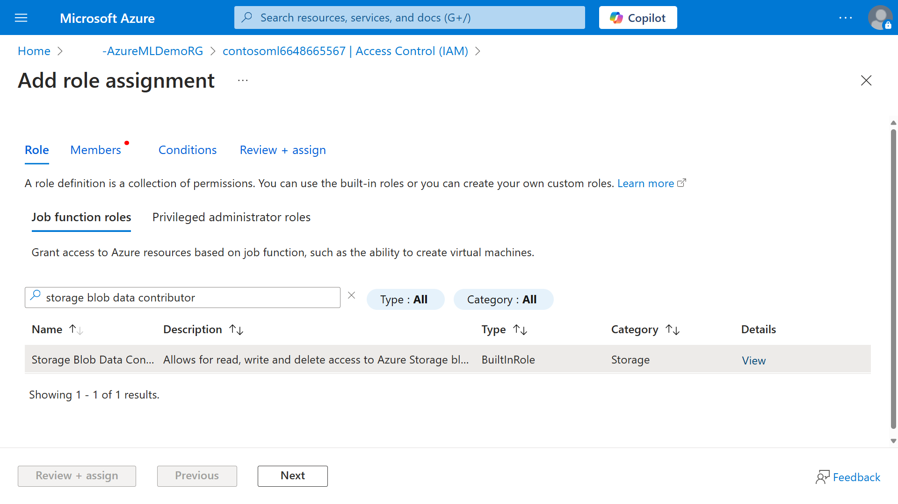
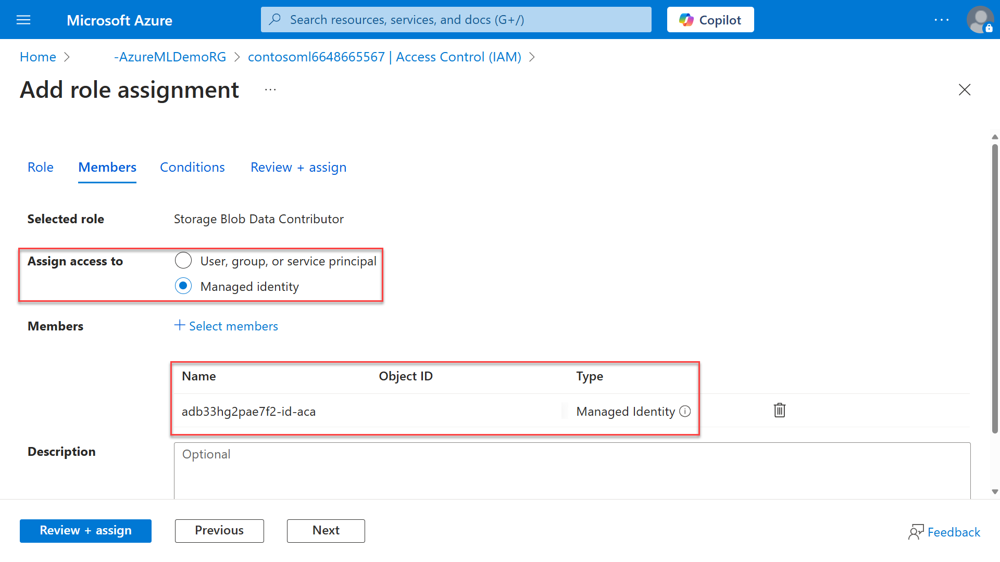

Azure Machine Learning leverages different Azure services to support an ML project from end to end. These services include:

- Azure Storage: Azure Machine Learning uses Azure Storage for several purposes. When you create an Azure Machine Learning workspace, an Azure blob container and an Azure file share are automatically registered as datastores. These are used for storing and managing data required for machine learning experiments. 
- Azure Key Vault: Where you can save security secrets, such as access information for storage accounts. This is a preferred method rather than adding security secrets into your python code. An Azure Key Vault instance is created during workspace deployment.
- Azure Container Registry: Your Azure Machine Learning can use prebuilt container images to deploy ML models to a compute instance or cluster.
- Azure Monitor: The Azure Monitor service collects and aggregates metrics and logs from every component of your system. You can use these insights to evaluate the performance of your models.

Just like when users access the Azure Machine Learning workspace, Azure services need to authenticate in order to access other Azure services. In the case of Azure Machine Learning, a system-assigned managed identity is created for the workspace resource. However, multiple identity types are supported for Azure Machine Learning:

| **Managed identity type** | **Role assignment creation** | **Purpose** |
|---|---|---|
| **System-assigned (SAI)** | Managed by Microsoft | Lifecycle tied to resource; single resource use; simple to get started |
| **System-assigned+user-assigned (SAI+UAI)** | Managed by you | Independent lifecycle for user-assigned identity, multi-resource use, controls least privileged access. Access data in training jobs. |

Once a workspace is created with SAI identity type, it can be updated to SAI+UAI, but not back from SAI+UAI to SAI. You may assign multiple user-assigned identities to the same workspace, or even assign additional user-assigned identities in addition to a system-assigned identity.

### System-assigned versus User-assigned identities ###

Choosing between system-assigned and user-assigned identities depends on your specific needs and how your company manages Azure resources:

- **System-assigned identities** are created and managed by Azure for a specific resource. When a resource is deleted, its associated system-assigned identity is also deleted, ensuring that the identity lifecycle is tightly coupled with the resource it belongs to. This type of identity is ideal for scenarios where the identity only needs to be used by a single resource, providing simplicity and reducing the administrative overhead since Azure manages the identity's credentials.

- **User-assigned identities** are created independently of any specific resource and can be shared across multiple resources. This makes them highly versatile for applications that require a consistent identity across different resources, enabling easier management of permissions and access controls. User-assigned identities persist even after the resources using them are deleted, allowing for greater flexibility in redeploying and reusing identities.

### User-assigned managed identity specific configuration ###

When you create an Azure Machine Learning workspace with the default settings (Azure Storage, Azure Container Registry, and Azure Key Vault are created for you), the system-assigned managed identity is configured with appropriate permissions. If instead you change to a user-assigned identity (or if you use existing resources for Storage, Key Vault, etc.) you need to set up the following access to that account:

| **Resource** | **Permission** |
|---|---|
| **Azure Machine Learning workspace** | Contributor |
| **Azure Storage** | Contributor (control plane) + Storage Blob Data Contributor (data plane, optional, to enable data preview in the Azure Machine Learning studio) |
| **Azure Key Vault (when using RBAC permission model)** | Contributor (control plane) + Key Vault Administrator (data plane) |
| **Azure Key Vault (when using access policies permission model)** | Contributor + any access policy permissions besides **purge** operations |
| **Azure Container Registry** | Contributor |
| **Azure Application Insights** | Contributor |

To assign the Azure Machine Learning workspace permissions to an Azure resource, such as storage, perform the following steps:

1. On the Azure portal, select the Azure Storage resource associated with your Azure Machine Learning workspace.
1. Select the Access Control (IAM) on the left-hand side menu.
1. Select the Add drop-down menu and select Add role assignment.
1. On the Role tab, search for the Storage Blob Data Contributor and select that role from the list:

   

1. Select Next. 
1. On the Members tab, select Managed identity from the Assign access to option and select the + Select members link.
1. On the right-hand side pane, select the Managed identity drop-down menu and mark the User-assigned managed identity option. This shows all user-assigned managed identities from Microsoft Entra ID.
1. Select the appropriate identity and choose Select.
1. Confirm that the selected identity is listed:

   

1. Click Review + assign twice to confirm the assignment.

### Compute-related identities ###

Compute-related identities are used in the following scenarios:

- Compute cluster: The system uses an identity to set up the user's storage mounts, container registry, and datastores.
- Kubernetes cluster: The system uses an identity to set up the user's storage mounts, container registry, and datastores.

In both cases, the default managed identity is the system-assigned managed identity or the first user-assigned managed identity for that resource. Also, both Azure Machine Learning compute clusters and Kubernetes cluster support only one system-assigned identity or multiple user-assigned identities, not both concurrently. Finally, the scenarios in this unit don't consider if you apply an identity to access resources from within the code for a submitted job. In that case, the identity from within the code is used for access.

### Data Storage ###

When you create a datastore that uses identity-based data access, your Azure account is used to confirm you have permission to access the storage service. In the identity-based data access scenario, no authentication credentials are saved. Only the storage account information is stored in the datastore.

In contrast, datastores that use credential-based authentication, such as account key or SAS token, will have that connection information cached in the Azure Key Vault that's associated with the workspace. Other workspace users with sufficient permission can retrieve those cached credentials, which may be a security concern for some organizations.

> [!NOTE]
> No data is stored directly on the Azure Machine Learning workspace. For credential-based authentication scenarios, these credentials are stored on Azure Key Vault.