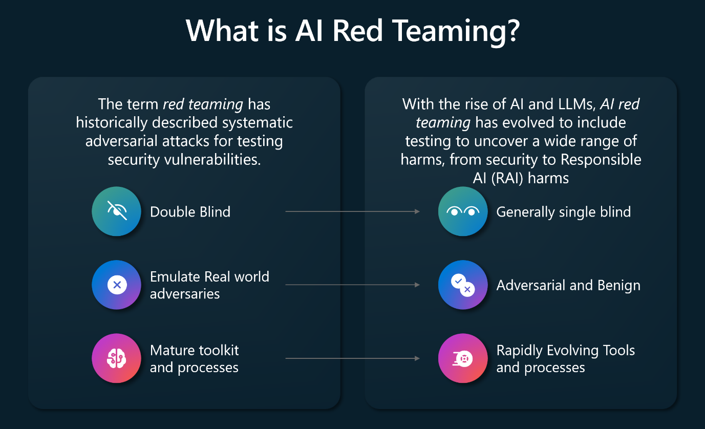

Red teaming is a term in the information security industry that is used to describe the process of testing security vulnerabilities using systematic adversarial attacks. Red teaming is performed to harden the security of an organization's systems. Red teaming is separate from unauthorized attacks by malicious third parties.

The introduction of Large Language Models (LLMs) into application ecosystems requires red teams to include adversarial techniques on probing, testing, and attacking AI systems. Adversarial and even benign usage of AI enabled applications can produce potentially harmful outputs. For example, having a company's social media chatbot corrupted to generate hate speech or to glorify violence. Adversarial usage can also lead to AI applications emitting private data, crafting attacks, and can lead to other downstream negative security effects.

The following diagram provides an overview of the expansion of scope that occurred with red teaming since the introduction of LLM into application ecosystems.

AI red teaming takes place at two levels: at the base LLM level, such as red team attacks against an LLM like GPT-4 or Phi-3, or at the application level where an AI enabled application uses an LLM as a part of its back end infrastructure. Taking this two layer approach leads to the following outcomes:

- Red teaming the model helps to identify early in the process how models can be misused, to scope capabilities of the model, and to understand the model's limitations. These insights can be fed into the model development process and can improve future model versions.
- Red teaming at the application-level takes a system wide approach, of which the base LLM is one part. For example, when Microsoft performed AI red teaming against Bing Chat, the GTP-4 LLM had to be probed as it was used by the entire Bing search experience. Taking a system wide approach helps to identify failures beyond just the model-level safety mechanisms, by including the overall application specific safety triggers.  

Microsoft has several AI Red Teams who run these adversarial tests against LLMs, AI enabled applications and services used by Microsoft. The teams learned the following:

- AI red teaming is more expansive than traditional red teaming
- AI red teaming focuses on failures from both malicious and benign personas
- Red teaming generative AI systems requires multiple attempts of the same test
- AI systems constantly evolve
- Mitigating AI failures requires defense in depth

## AI red teaming is more expansive than traditional red teaming

AI red teaming is now an umbrella term for probing both security and responsible AI (safety) outcomes. AI red teaming intersects with traditional red teaming goals but includes LLMs as an attack vector. AI red teaming checks defenses against new classes of security vulnerabilities including prompt injection and model poisoning. AI red teaming also includes probing for outcomes that may harm organizational reputations, such as fairness issues and harmful content. Performing AI red teaming before an LLM or AI enabled workload is released to the public helps organizations identify issues and prioritize defense investments.

## AI red teaming focuses on failures from both malicious and benign personas

Unlike traditional security red teaming, which mostly focuses on only malicious adversaries, AI red teaming considers broader set of personas and failures. Microsoft's AI red team learned many things when performing adversarial testing against an AI enabled new Bing. When testing the new Bing, AI red teaming not only focused on how a malicious adversary can subvert the AI system via security-focused techniques and exploits, but also on how the system can generate problematic and harmful content when regular users interact with the system. This is important because as Bing is a flagship Microsoft product, having Bing generate problematic content would trigger reputational harm to Microsoft. 

## Red teaming generative AI systems require multiple attempts of the same test

In a traditional red teaming engagement, using a tool or technique at two different time points on the same input, would always produce the same output. This is termed a deterministic output. Generative AI systems are probabilistic, which means that running the same input twice may provide different outputs. The probabilistic nature of generative AI allows for a wider range in creative output. This makes red teaming challenging as using the same test prompt may lead to success in one attempt and failure in another. One method to address this is to perform multiple iterations of red teaming in the same operation. To accomplish this, Microsoft invested in automation that helps to scale operations. Microsoft also developed a systemic measurement strategy that quantifies the extent of the risk.

## AI systems constantly evolve

As new models are released, the AI applications that use them are regularly updated. For example, developers may update an LLM or an AI enabled application's metaprompt (also known as the system message). Metaprompts provide the underlying instructions to the underlying language model. Changing the metaprompt leads to changes in how the model responds, result in red team exercises having to be performed again. As the responses from LLMs are probabilistic rather than deterministic, the outcomes of changes can't be predicted and can only really be understood through testing. AI red teams need to perform systematic, automated measurement and testing and monitor AI enabled systems over time.

## Mitigating AI failures requires defense in depth

AI red teaming requires a defense-in-depth approach. Defense in depth requires applying multiple security controls, each of which mitigates a different adversarial strategy. With AI enabled applications that can involve the use of classifiers to flag potentially harmful content to using metaprompt. By implementing classifiers, it's possible to guide the behavior or AI enabled applications and limit conversational drift in interactive scenarios.
