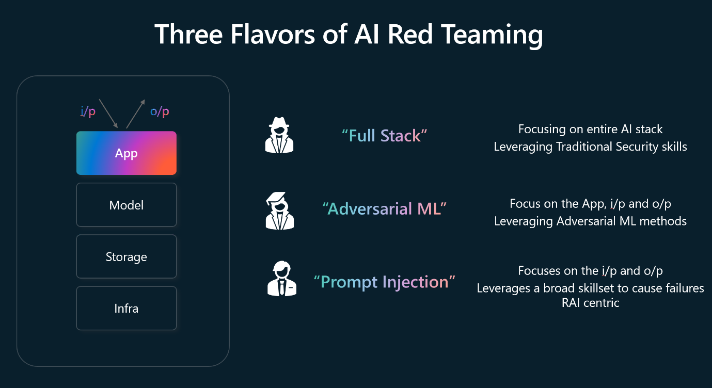

Through the process of performing AI red teaming against LLMs and AI enabled applications used by the organization, Microsoft has developed three different categories, termed flavors, to describe different types of AI red teaming. These flavors are:

- Full stack red teaming
- Adversarial machine learning
- Prompt injection

The diagram provides an overview of these three flavors:

## Full stack red teaming

Full stack red teaming involves probing for security harms across the entire AI system, with a focus on analyzing the entire tech stack. This includes performing tests against the developer's environment right up to the hosting infrastructure. The full stack red teaming methodology includes assessing vulnerabilities and potential attack vectors, such as identifying weaknesses in data pipelines, APIs, and deployment configurations.

## Adversarial machine learning

Adversarial machine learning (AML) is dedicated to studying machine learning model attacks to identify weak points and defend against malicious inputs. AML emphasizes vulnerability assessment and employs tactics like black-box attacks, where models are manipulated without access to their code, and white-box attacks, where models are controlled with access to their code. An example of its application is making slight modifications to road signs to fool self-driving vehicles' ML models.

## Prompt injection

Prompt injection aims to exploit LLMs by injecting carefully crafted prompts. This focus is on manipulating generative AI systems into leaking sensitive data or spreading misinformation. For example, crafting a prompt in such a way that the LLM emits sensitive company information. A significant challenge is distinguishing between developer instructions and user inputs, an example of this is tricking Bing Chat into divulging its programming only via questioning it via the prompts.
