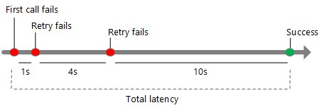

This section provides common resiliency strategies that can be implemented for your applications for various types of failures. Most of these aren't limited to a particular technology; each is intended to give you a general idea of how to plan and implement resiliency strategies. 

| **Failure type** | **Resiliency** **strategy** |
|:---|:---|
| **Hardware failure** | Build redundancy into the application by deploying components across different fault domains. For example, ensure your VMs are placed in two different racks. |
| **Datacenter failure** | Build redundancy into the application with fault isolation zones across data centers. |
| **Regional failure** | Replicate the data and components into another region so that application can be quickly recovered. |
| **Transient failure** | Retry transient failures. |
| **Heavy load** | Load balance across instances to handle spike in usage. |
| **Dependency service failure** | Degrade gracefully if a service fails and there's no failover path, providing an acceptable user experience.  |
| **Accidental data deletion or corruption** | Back up the data so that it can be restored if there's any deletion or corruption. |
| **Application deployment failure** | Automate deployments with rollback plan. |

## Build redundancy

Build redundancy into your application to avoid single point of failure. For example in an application dependent on IaaS VMs, ensure your VMs get deployed into different fault domains by creating an availability set and keeping load balancer in front of it. You can also deploy VMs across two or more availability zones with zone redundant load balancer in front of it.  

## Replicate data and components

Replicating data is a general strategy for handling non-transient failures in a data store. Many storage technologies provide built-in replication, including Azure Storage, Azure SQL Database, Cosmos DB, and Apache Cassandra. It's important to consider both the read and write paths. Depending on the storage technology, you might have multiple writable replicas, or a single writable replica and multiple read-only replicas.

To maximize availability, replicas can be placed in multiple regions. However, this increases the latency when replicating the data. Typically, replicating across regions is done asynchronously; this implies an eventual consistency model and potential data loss if a replica fails. 

## Retry transient failures

Transient failures can be caused by momentary loss of network connectivity, a dropped database connection, or a timeout when a service is busy. Often, a transient failure can be resolved simply by retrying the request. For many Azure services, the client SDK implements automatic retries, in a way that is transparent to the caller.

Each retry attempt adds to the total latency. Also, too many failed requests can cause a bottleneck, as pending requests accumulate in the queue. These blocked requests might hold critical system resources such as memory, threads, database connections, and so on; this can cause cascading failures. To avoid this, increase the delay between each retry attempt, and limit the total number of failed requests. The following diagram explains the relationship between retry attempts and total latency.

## Load balance across instances

For scalability, a cloud application should be able to scale out by adding more instances. This approach also improves resiliency because unhealthy instances can be removed from rotation. For example:

- Put two or more VMs behind a load balancer. The load balancer distributes traffic to all the VMs.
- Scale out an Azure App Service app to multiple instances. App Service automatically balances load across instances.
- Use Azure Traffic Manager to distribute traffic across a set of endpoints.

## Degrade gracefully

If a service fails and there's no failover path, the application might be able to degrade gracefully while still providing an acceptable user experience. For example:

- Put a work item on a queue, to be handled later.
- Return an estimated value.
- Use locally cached data.
- Show the user an error message. (This option is better than having the application stop responding to requests.)

## Back up the data

You should always configure backups for all your data sources. Accidental deletions or data corruptions can happen anytime and it could be days before such issues are noticed. For this reason, it is important to configure longer retention for your backup copies depending on the nature and criticality of the application.

## Key Azure services

Azure has several features to make an application redundant at every level of failure, from an individual VM to an entire region.

- **Single VM**. Azure provides an uptime SLA for single VMs. To qualify for this SLA, the VM must use premium storage for all Operating System Disks and Data Disks. Although you can get a higher SLA by running two or more VMs, a single VM can be reliable enough for some workloads. For production workloads, however, using two or more VMs for redundancy is recommended.
- **Availability sets**. To protect against localized hardware failures, such as a disk or network switch failing, deploy two or more VMs in an availability set. An availability set is a logical grouping of VMs that allows Azure to understand how your application is built to provide for redundancy and availability. Each virtual machine in your availability set is assigned an **update domain** and a **fault domain** by the underlying Azure platform. Each availability set can be configured with up to three fault domains and twenty update domains. Update domains indicate groups of virtual machines and underlying physical hardware that can be rebooted at the same time. Fault domains define the group of virtual machines that share a common power source and network switch. VMs in an availability set are distributed across the fault domains, so if a hardware failure affects one fault domain, network traffic can still be routed to the VMs in the other fault domains.  
- **Availability zones**. An availability zone is a physically separate zone within an Azure region. Each availability zone has a distinct power source, network, and cooling. Deploying VMs across availability zones helps to protect an application against datacenter-wide failures. Not all regions support availability zones. If you are planning to use availability zones in your deployment, first validate that your application architecture and code base can support this configuration. If you are deploying commercial off-the-shelf software, consult with the software vendor and test adequately before deploying into production. An application must be able to maintain state and prevent loss of data during an outage within the configured zone. The application must support running in an elastic and distributed infrastructure with no hard-coded infrastructure components specified in the code base.
- **Azure Site Recovery**. Azure Site Recovery helps to replicate Azure virtual machines to another Azure region for business continuity and disaster recovery. You can conduct periodic disaster recovery drills to ensure you meet the compliance needs. The VM will be replicated with the specified settings to the selected region so that you can recover your applications in the event of outages in the source region. You should factor in the RTO and RPO numbers for your solution here and ensure that when testing, the recovery time and recovery point are appropriate for your needs.
- **Paired regions**. To protect an application against a regional outage, you can deploy the application across multiple regions, using Azure Traffic Manager to distribute internet traffic to the different regions. Each Azure region is paired with another region. Together, these form a regional pair. Except for Brazil South, regional pairs are located within the same geography to meet data residency requirements for tax and law enforcement jurisdiction purposes.

When you design a multi-region application, remember that network latency across regions is higher than within a region. For example, if you are replicating a database to enable failover, use synchronous data replication within a region, but asynchronous data replication across regions.

When you select paired regions, ensure both regions have required Azure services. It's also critical to select the right deployment topology for disaster recovery, especially if your RPO/RTO requirements are low. To ensure the failover region has enough capacity to support your workload, select either an active/passive (full replica) topology or an active/active topology. Keep in mind these deployment topologies might increase complexity and cost as resources in the secondary region are pre-provisioned and can sit idle.
