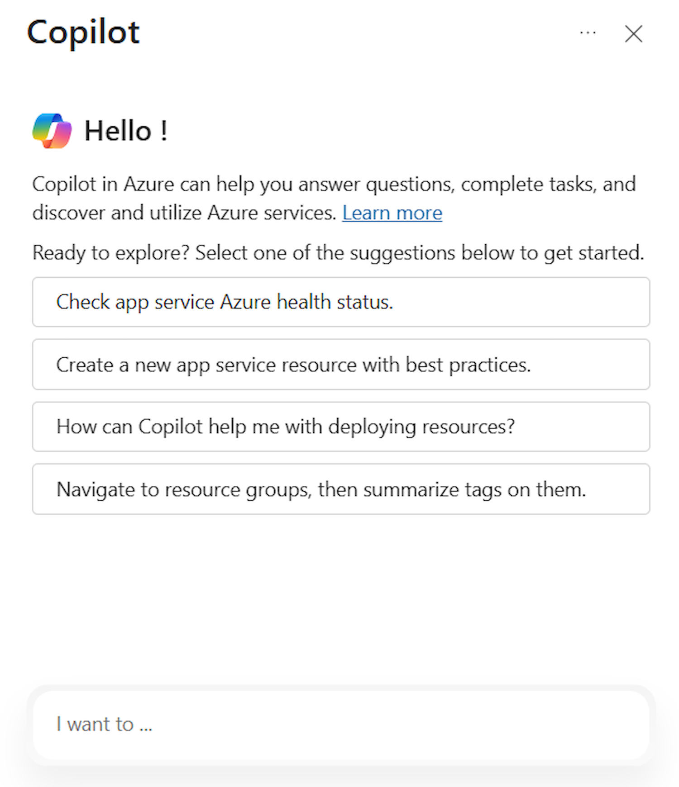
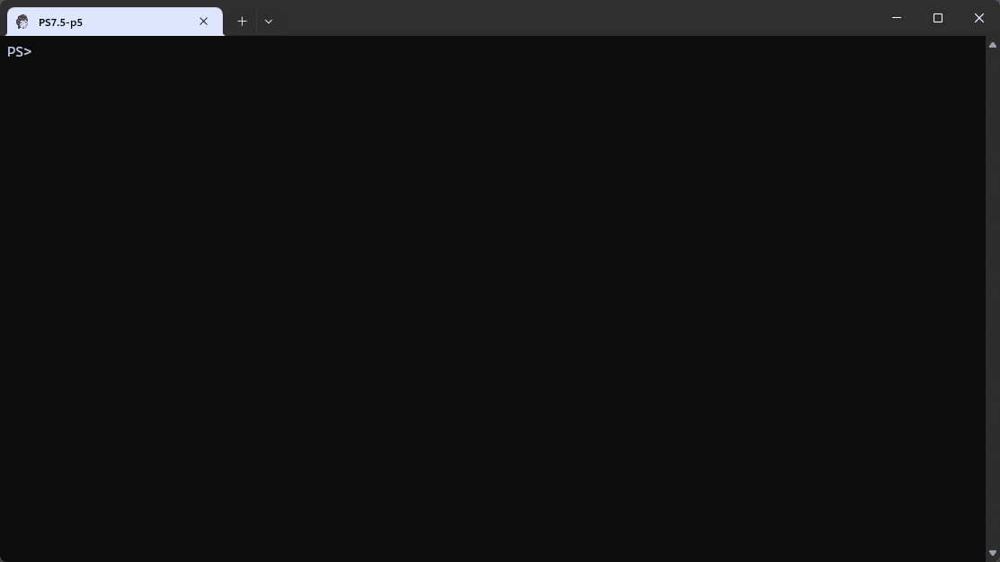

You can access Microsoft Copilot in Azure in the Azure portal, through the Azure mobile app, or through AI Shell. Throughout a conversation, Microsoft Copilot in Azure answers questions, generates queries, performs tasks, and safely acts on your behalf. It makes high-quality recommendations and takes actions while respecting your organization's policy and privacy. Microsoft Copilot in Azure can only access the resources that you have permission to and can only take actions that you have permission to perform, with your confirmation required for any actions.

To use Microsoft Copilot in Azure in the Azure portal:

1. Open the Azure portal on your preferred browser:
1. On the top bar, select the Copilot icon. The Copilot panel opens on the right-hand side.
1. From the Copilot panel, you can initiate a conversation with Copilot.

   

In addition to using the portal, you can access Microsoft Copilot in Azure through AI Shell. AI Shell is an interactive command line shell that provides a chat interface for AI language models. The shell provides agents that connect to different AI models and other assistance providers. Users can interact with the agents in a conversational manner. With AI Shell, you can access Copilot in Azure's AI-driven suggestions, using natural language prompts, directly in your CLI environment to:

- Quickly resolve common Azure CLI and PowerShell errors with guided suggestions
- Simplify your Azure workflows
- Automate complex setups
- Gain insights into best practices

