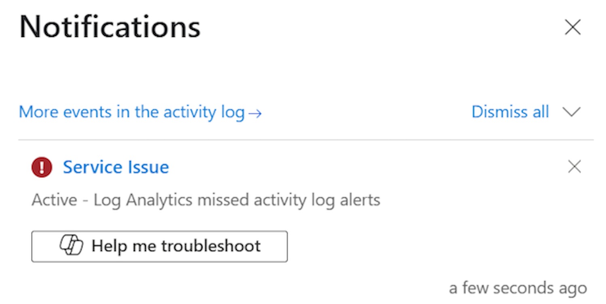
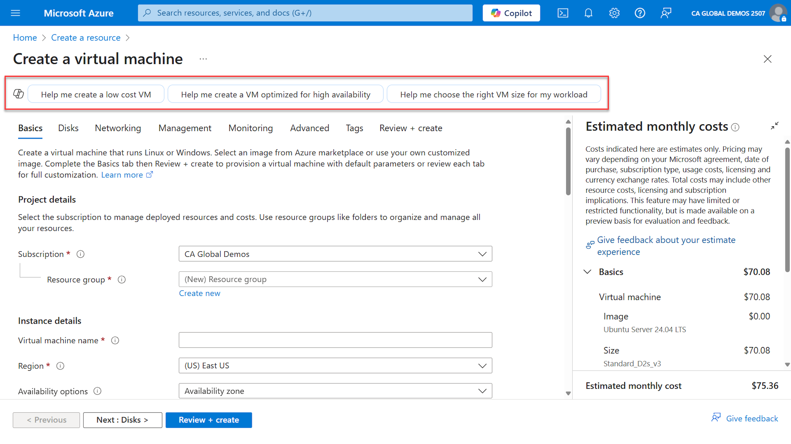
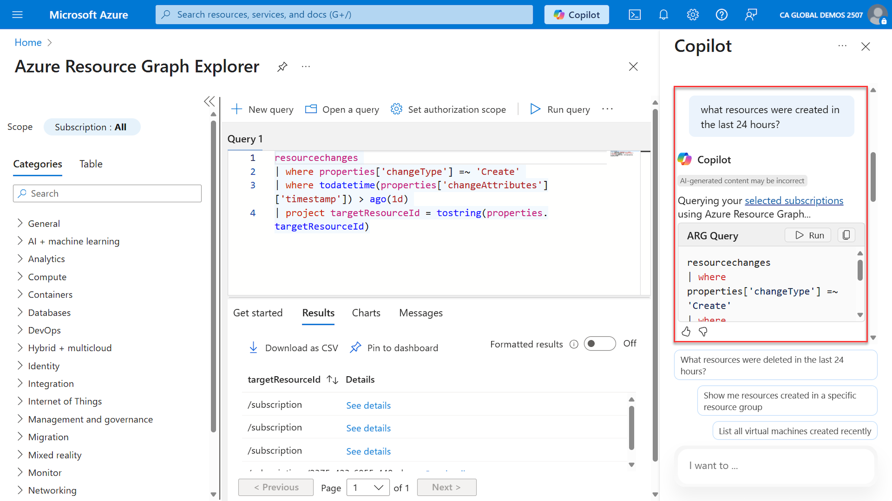
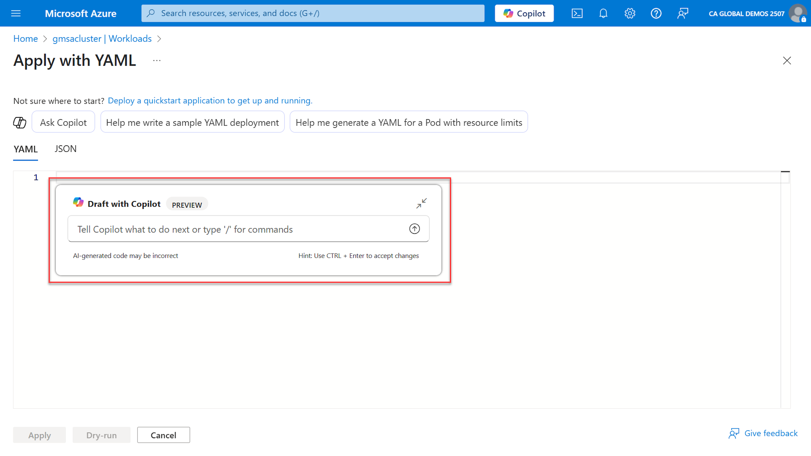

You can ask Microsoft Copilot in Azure questions about your Azure resources and cloud environment. From anywhere in the Azure portal, you can ask Microsoft Copilot in Azure to explain more about Azure concepts, services, or offerings. You can ask questions to learn how a feature works, or which configurations best meet your budgets, security, and scale requirements. Microsoft Copilot in Azure can guide you to the right user experience or even author scripts and other artifacts that you can use to deploy your solutions. Answers are grounded in the latest Azure documentation, so you can get up-to-date guidance just by asking a question.

You can ask Microsoft Copilot in Azure questions to learn which services are best suited for your workloads or get ideas about additional services that might help support your objectives. For instance, you can ask "What service would you recommend to implement distributed caching?" or "What are popular services used with Azure Container Apps?" Where applicable, Microsoft Copilot in Azure provides links to start working with the service or learn more. In some cases, you also see metrics about how often a service is used. You can also ask additional questions to find out more about the service and whether it's right for your needs.

## Troubleshoot Azure services

Microsoft Copilot in Azure can also help you troubleshoot services and understand more about information presented in Azure. This can be especially helpful when looking at diagnostic details. For example, when viewing diagnostics for a resource, you can say "Give me a summary of this page" or "What's the issue with my app?" You can ask what an error means or ask what the next steps would be to implement a recommended solution.

Microsoft Copilot in Azure can also help explain errors from the Notifications pane:

## Integration with Azure services

Microsoft Copilot in Azure is integrated into many assure services. For example, when deploying VMs, Microsoft Copilot in Azure can help you create resources that match your specific needs:

Some actions can be executed from the Copilot pane and will open the corresponding view in the Azure portal. For example, in the prompt below it was asked "what resources were created in the last 24 hours?". Microsoft Copilot in Azure created an Azure Resource Graph query and provided the option to Run the query. When you run the query, the Azure Resource Graph Explorer view opens and runs the query:

Microsoft Copilot in Azure is also integrated to aid you in creating scripts or reviewing existing code. For example, when you deploy a YAML specification to an Azure Kubernetes Service cluster, Microsoft Copilot in Azure can help you write or help editing the YAML code:

When using Copilot to author YAML files, you can also use commands for the following:

- /explain: Get more information about the YAML file or a highlighted section.
- /format: Apply standard indentation or fix other formatting issues.
- /fix: Resolve problems with invalid YAML.
- /chat: Open the full Microsoft Copilot in Azure chat window.
- /discard: Discard previously made changes.
- /close: Closes the inline Copilot control.
- /retry: Tries the previous prompt again.

## Limitations

While Microsoft Copilot in Azure can perform many types of tasks, there are some limitations and Microsoft Copilot in Azure might not be able to complete your request. In these cases, you'll generally see an explanation along with more information about how you can carry out the intended action. Present limitations include:

- You can't continue the same conversation beyond 24 hours.
- Any action taken on more than 10 resources must be performed outside of Microsoft Copilot in Azure.
- Some responses that display lists are limited to the top five items.
- For some tasks and queries, using a resource's name doesn't work, and the Azure resource ID must be provided.
- Excessive use of Copilot in Azure may result in temporary throttling of access to Copilot in Azure.
